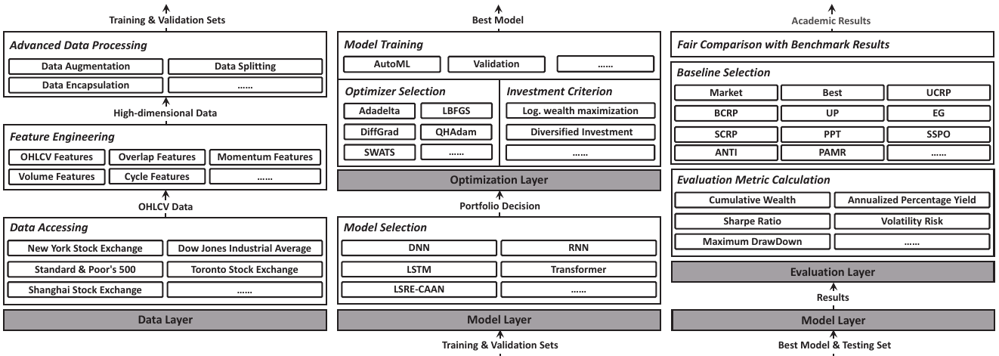
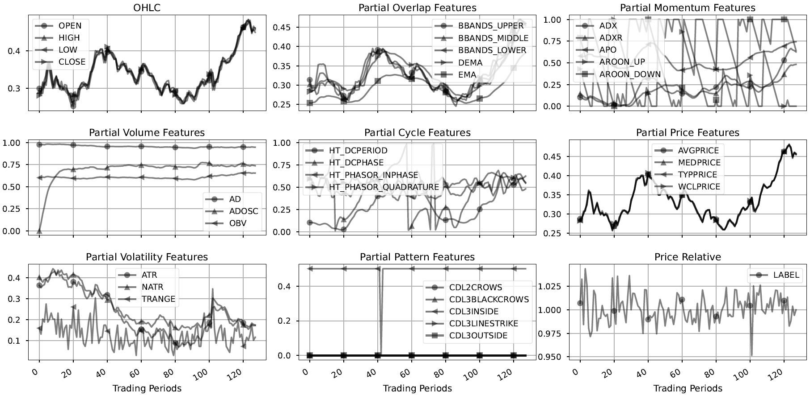
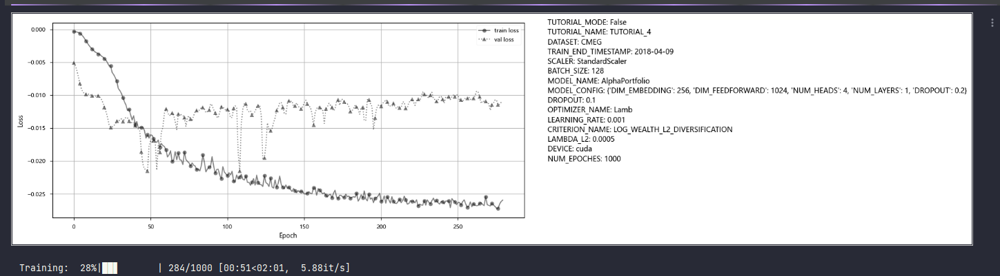
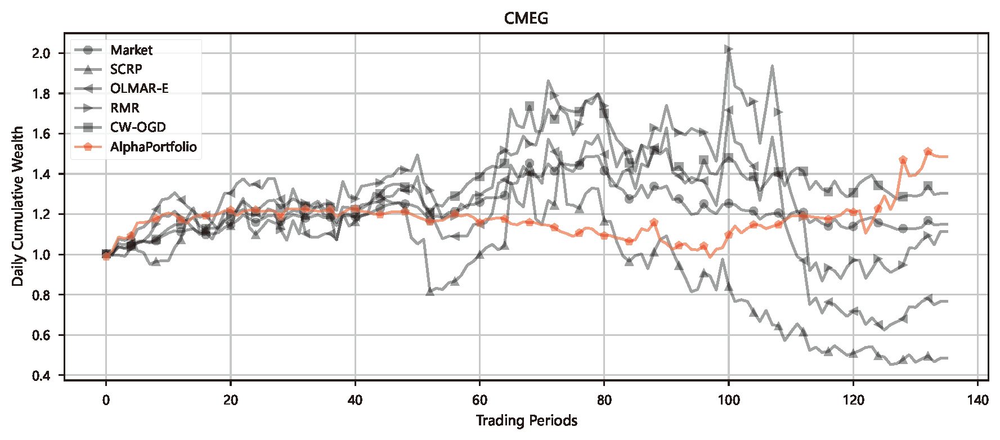
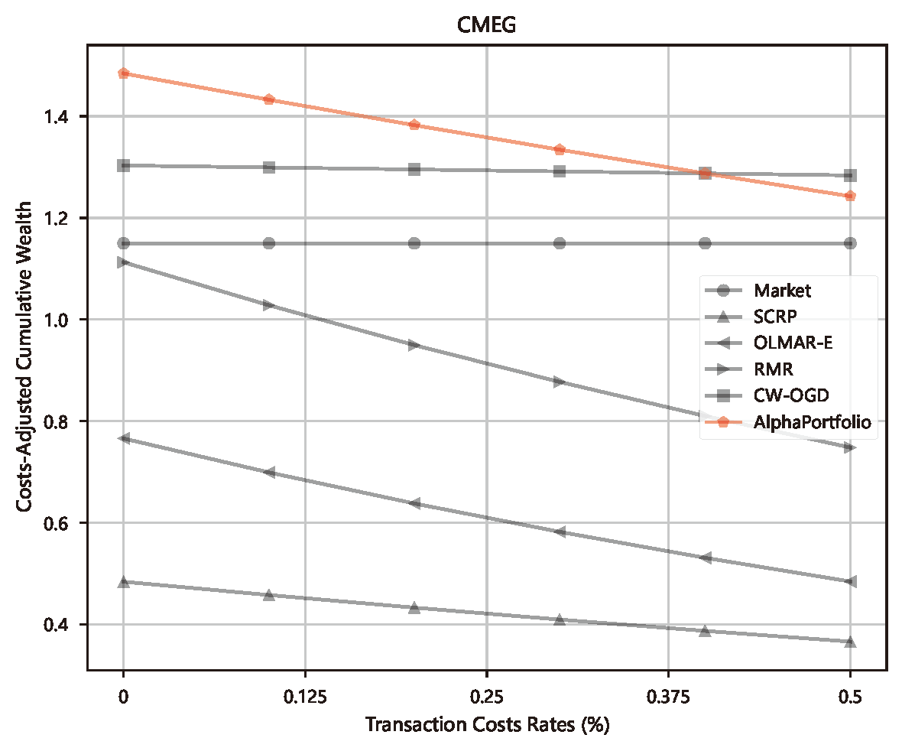
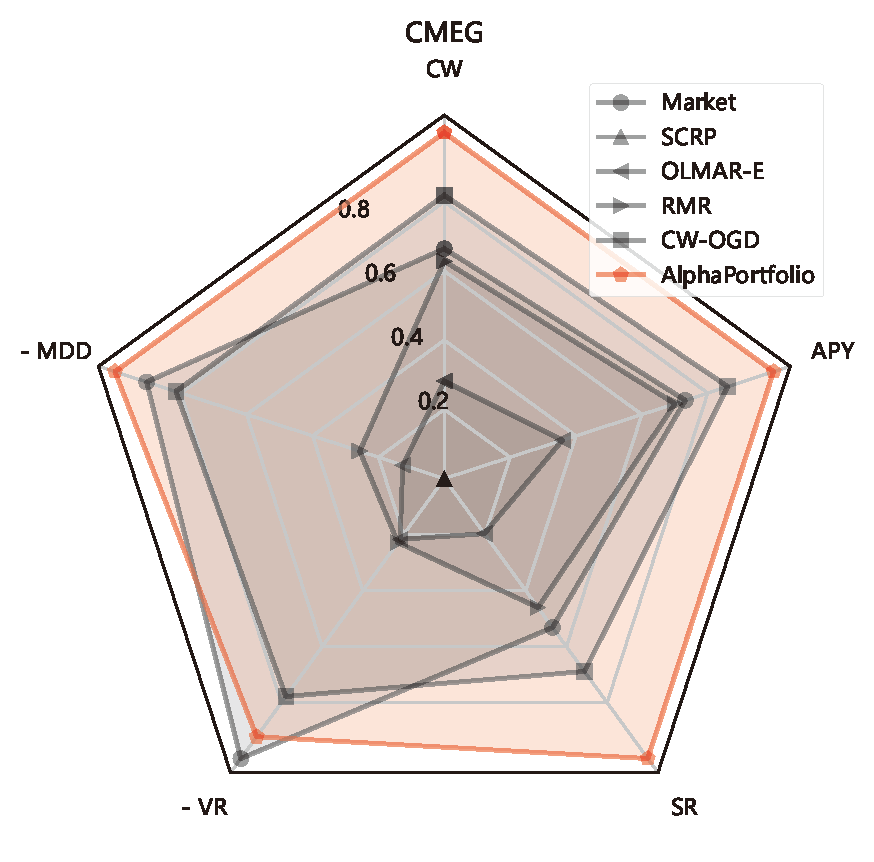

# FinOL: Towards Open Benchmarking for Data-Driven Online Portfolio Selection

<div align="center">
 

<div>&nbsp;</div>

[](https://www.python.org/downloads/release/python-3916/)
[](https://finol.readthedocs.io/en/latest/)
[](Platform)
[](LICENSE)
[](https://pypi.org/project/finol)

[//]: # ([![Discord]&#40;https://img.shields.io/discord/1201132123722104902&#41;]&#40;https://discord.gg/KCXQt7r3&#41;)
[//]: # ([![Document]&#40;https://img.shields.io/badge/docs-latest-red&#41;]&#40;https://finol.readthedocs.io/en/latest/&#41;)
[//]: # ([![]&#40;https://dcbadge.vercel.app/api/server/KCXQt7r3&#41;]&#40;https://discord.gg/KCXQt7r3&#41;)
[//]: # ([![GitHub stars]&#40;https://img.shields.io/github/stars/ai4finol/finol?color=orange&#41;]&#40;https://github.com/ai4finol/finol/stargazers&#41;)

[//]: # ()
</div>

***
``FinOL`` represents a pioneering open database for facilitating data-driven OLPS research. As an
ambitious project, it collects and organizes extensive assets from global markets over half a century,
it provides a long-awaited unified platform to advance data-driven OLPS research.

## :star: **What's NEW!** 


<div align="center">

| Update                                                                                                                                                                 | Status                        | Label        |
|------------------------------------------------------------------------------------------------------------------------------------------------------------------------|:------------------------------|:-------------|
| New release! ``FinOL`` is going to release the official website                                                                                                        | Coming soon......             | Release      |
| New metric! ``FinOL`` is going to support the [_t_-test](https://www.sciencedirect.com/science/article/pii/S0004370215000168) metric                                   | Coming soon......             | Enhancement  |
| New model! ``FinOL`` is going to support the [AlphaStock](https://dl.acm.org/doi/abs/10.1145/3292500.3330647) model                                                    | Coming soon......             | Enhancement  |
| New release! ``FinOL`` now releases the [official docs](https://finol.readthedocs.io/en/latest/)                                                                       | Released on 22 July 2024      | Release      |
| New feature! ``FinOL`` now supports the [Auto Hyperparameter Tuning](https://dl.acm.org/doi/10.1145/3292500.3330701) feature                                           | Supported since 22 July 2024  | Enhancement  |
| New feature! ``FinOL`` now supports the [Radar Chart](https://en.wikipedia.org/wiki/Radar_chart) evaluation                                                            | Supported since 10 June 2024  | Enhancement  |
| New model! ``FinOL`` now supports the [AlphaPortfolio](https://papers.ssrn.com/sol3/Papers.cfm?abstract_id=3554486) model                                              | Supported since 06 June 2024  | Enhancement  |
| New feature! ``FinOL`` now supports the [Economic Distillation](https://papers.ssrn.com/sol3/Papers.cfm?abstract_id=3554486) feature                                   | Supported since 15 May 2024   | Enhancement  |
| New feature! ``FinOL`` now supports the [Interpretability Analysis](https://dl.acm.org/doi/abs/10.1145/3292500.3330647) feature                                        | Supported since 16 April 2024 | Enhancement  |
| New feature! ``FinOL`` now supports the [Winner Assets Selection](https://dl.acm.org/doi/abs/10.1145/3292500.3330647) feature                                          | Supported since 14 April 2024 | Enhancement  |
| Release  ``FinOL`` [tutorials](finol/tutorials)                                                                                                                        | Released on 22 March 2024     | Release      |
| Release  ``FinOL`` [v0.0.1](https://github.com/jiahaoli57/finol/releases/tag/v0.0.1)                                                                                   | Released on 21 March 2024     | Release      |
</div>


## Outline

- [FinOL: Towards Open Benchmarking for Data-Driven Online Portfolio Selection](#finol)
  - [Outline](#outline)
  - [About](#about)
  - [Why should I use FinOL?](#why-should-i-use-finOL?)
  - [Installation](#installation)
  - [Examples and Tutorials](#examples-and-tutorials)
  - [Using FinOL](#using-FinOL)
  - [File Structure](#file-structure)
  - [Supported Datasets](#supported-datasets)
  - [Supported Baselines](#supported-baselines)
  - [Supported Metrics](#supported-metrics)
  - [License](#license)
  - [Contact Us](#contact-us)

## About

Online portfolio selection (OLPS) is an important issue in operations research community that studies how to dynamically
adjust portfolios according to market changes. In the past, OLPS research relied on a general database called ``OLPS`` 
containing price relatives data of financial assets across different markets. However, with the widespread adoption of 
data-driven technologies like machine learning in finance, ``OLPS`` can no longer meet the needs of OLPS research due 
to the lack of support for high-dimensional feature spaces. To solve 
this problem, we propose ``FinOL``, an open financial platform for advancing research in data-driven OLPS. ``FinOL`` expands 
and enriches the previous ``OLPS`` database, containing 9 benchmark financial datasets from 1962 to present across global 
markets. To promote fair comparisons, we evaluate a large number of past classic OLPS methods on ``FinOL``, providing 
reusable benchmark results for future ``FinOL`` users and effectively supporting OLPS research. More importantly, to 
lower the barriers to research, ``FinOL`` provides a complete data-training-testing suite with just three lines of 
command. We are also committed to regularly updating ``FinOL`` with new data and benchmark results reflecting the latest 
developments and trends in the field. This ensures ``FinOL`` remains a valuable resource as data-driven OLPS methods 
continue evolving.

<p align="center">

<em>Overall Framework of FinOL</em>
</p>

## Why should I use FinOL?

1. ``FinOL`` contributes comprehensive datasets spanning diverse market conditions and asset classes to enable large-scale empirical validation;
2. ``FinOL`` contributes the most extensive benchmark results to date for portfolio selection methods, providing the academic community an unbiased performance assessment;
3. ``FinOL`` contributes a user-friendly Python library for data-driven OLPS research, providing a comprehensive toolkit for academics to develop, test, and validate new OLPS methods.


## Installation

[//]: # (### Installing from source &#40;PRIORITY OPTION&#41;)

[//]: # (For Windows users, to install the bleeding edge version, clone this repository with:)

[//]: # (```bash)

[//]: # (> git clone https://github.com/jiahaoli57/finol.git)

[//]: # (> mv finol finol_)

[//]: # (> mv -force finol_/finol .)

[//]: # (> Remove-Item -Recurse -Force finol_)

[//]: # (```)

[//]: # (For Linux users, use:)

[//]: # (```bash)

[//]: # (> git clone https://github.com/jiahaoli57/finol.git)

[//]: # (> mv finol finol_)

[//]: # (> mv -force finol_/finol .)

[//]: # (> rm -rf finol_)

[//]: # (```)

### Installing via PIP
``FinOL`` is available on [PyPI](https://pypi.org/project/finol), we recommend to install ``FinOL`` via pip:
```bash
> pip install --upgrade finol
```

You can also install the development version of ``FinOL``
from master branch of Git repository:
```bash
> pip install git+https://github.com/jiahaoli57/finol.git
```

## Examples and Tutorials
You can find useful tutorials on how to use ``FinOL`` in the [tutorials](finol/tutorials/README.md) folder.

Here we show a simple application (taken from [tutorial_2](tutorials/tutorial_2.ipynb)): we transform asset "AA" into a 
richer representation.

<p align="center">

<em>Visualization of Train Normalization Data for Asset "AA"</em>
</p>


## Using FinOL
To lower the barriers for the research community, ``FinOL`` provides a complete data-training-testing suite with just 
three lines of command.

```python3
from finol.data_layer.dataset_loader import DatasetLoader
from finol.optimization_layer.model_trainer import ModelTrainer
from finol.evaluation_layer.model_evaluator import ModelEvaluator


load_dataset_output = DatasetLoader().load_dataset()
train_model_output = ModelTrainer(load_dataset_output).train_model()
evaluate_model_output = ModelEvaluator(load_dataset_output, train_model_output).evaluate_model()
```

## Supported Datasets

<div align="center">

| Name                                                                           |     Market     |  Country/Region  | Data Frequency | # of Assets  |              Data Range               |         # of Periods         |
|--------------------------------------------------------------------------------|:--------------:|:----------------:|:--------------:|:------------:|:-------------------------------------:|:----------------------------:|
| [NYSE(O)](https://github.com/ai4finol/FinOL_data/tree/main/datasets/NYSE(O))   |     Stock      |  United States   |     Daily      |      26      | 03/July./1962 <br>-<br> 31/Dec./1984  | 5,651:<br> 3,390/1,130/1,131 |
| [NYSE(N)](https://github.com/ai4finol/FinOL_data/tree/main/datasets/NYSE(N))   |     Stock      |  United States   |     Daily      |     403      | 02/Jan./1985 <br>-<br> 30/June./2010  | 6,430:<br> 3,858/1,286/1,286 |
| [DJIA](https://github.com/ai4finol/FinOL_data/tree/main/datasets/DJIA)         |     Stock      |  United States   |     Daily      |      28      |  14/Jan./2001 <br>-<br> 14/Jan./2003  |     500:<br> 300/100/100     |
| [SP500](https://github.com/ai4finol/FinOL_data/tree/main/datasets/SP500)       |     Stock      |  United States   |     Daily      |     339      |  02/Jan./1998 <br>-<br> 31/Jan./2003  |    1,268:<br> 756/256/256    |
| [TSE](https://github.com/ai4finol/FinOL_data/tree/main/datasets/TSE)           |     Stock      |      Canada      |     Daily      |      48      |  12/Jan./1995 <br>-<br> 31/Dec./1998  |    1,001:<br> 600/200/200    |
||
| [SSE](https://github.com/ai4finol/FinOL_data/tree/main/datasets/SSE)           |     Stock      |      China       |     Weekly     |      30      | 05/July./2010 <br>-<br> 26/June./2023 |     678:<br> 406/136/136     |
| [HSI](https://github.com/ai4finol/FinOL_data/tree/main/datasets/HSI)           |     Stock      | Hong Kong, China |     Weekly     |      53      | 05/July./2010 <br>-<br> 26/June./2023 |     678:<br> 406/136/136     |
| [CMEG](https://github.com/ai4finol/FinOL_data/tree/main/datasets/CMEG)         |    Futures     |  United States   |     Weekly     |      25      | 05/July./2010 <br>-<br> 26/June./2023 |     678:<br> 406/136/136     |
| [CRYPTO](https://github.com/ai4finol/FinOL_data/tree/main/datasets/CRYPTO)     | Cryptocurrency |      World       |     Daily      |      43      |  09/Nov./2017 <br>-<br> 01/Mar./2024  |   2,305:<br> 1,421/442/442   |

</div>

## Supported Baselines

<div align="center">

| Name             |             Category             |                                                                             Source                                                                             |                              Journal/Conference                               |
|------------------|:--------------------------------:|:--------------------------------------------------------------------------------------------------------------------------------------------------------------:|:-----------------------------------------------------------------------------:|
| Market           | Classic OLPS: Benchmark baseline |                                                                               --                                                                               |                                      --                                       |
| Best             | Classic OLPS: Benchmark baseline |                                                                               --                                                                               |                                      --                                       |
| UCRP             | Classic OLPS: Benchmark baseline | [Kelly 1956](https://ieeexplore.ieee.org/abstract/document/6771227/); [Cover 1991](https://onlinelibrary.wiley.com/doi/abs/10.1111/j.1467-9965.1991.tb00002.x) |          _The Bell System Technical Journal_; _Mathematical Finance_          |
| BCRP             | Classic OLPS: Benchmark baseline |                                    [Cover 1991](https://onlinelibrary.wiley.com/doi/abs/10.1111/j.1467-9965.1991.tb00002.x)                                    |                            _Mathematical Finance_                             |
||
| UP               | Classic OLPS: Follow-the-winner  |                                    [Cover 1991](https://onlinelibrary.wiley.com/doi/abs/10.1111/j.1467-9965.1991.tb00002.x)                                    |                            _Mathematical Finance_                             |
| EG               | Classic OLPS: Follow-the-winner  |                                    [Helmbold et al. 1998](https://onlinelibrary.wiley.com/doi/abs/10.1111/1467-9965.00058)                                     |                            _Mathematical Finance_                             |
| SCRP             | Classic OLPS: Follow-the-winner  |                                    [Gaivoronski and Stella 2000](https://link.springer.com/article/10.1023/A:1019271201970)                                    |                        _Annals of Operations Research_                        |
| PPT              | Classic OLPS: Follow-the-winner  |                                            [Lai et al. 2018](https://ieeexplore.ieee.org/abstract/document/7942104)                                            |          _IEEE Transactions on Neural Networks and Learning Systems_          |
| SSPO             | Classic OLPS: Follow-the-winner  |                                                 [Lai et al. 2018](https://www.jmlr.org/papers/v19/17-558.html)                                                 |                  _The Journal of Machine Learning Research_                   |
||
| ANTI<sup>1</sup> |  Classic OLPS: Follow-the-loser  |                [Borodin et al. 2004](https://proceedings.neurips.cc/paper_files/paper/2003/hash/8c9f32e03aeb2e3000825c8c875c4edd-Abstract.html)                |              _Advances in Neural Information Processing Systems_              |
| ANTI<sup>2</sup> |  Classic OLPS: Follow-the-loser  |                [Borodin et al. 2004](https://proceedings.neurips.cc/paper_files/paper/2003/hash/8c9f32e03aeb2e3000825c8c875c4edd-Abstract.html)                |              _Advances in Neural Information Processing Systems_              |
| PAMR             |  Classic OLPS: Follow-the-loser  |                                         [Li et al. 2012](https://link.springer.com/article/10.1007/s10994-012-5281-z)                                          |                            _Machine Learning_                                 |
| CWMR-Var         |  Classic OLPS: Follow-the-loser  |                                              [Li et al. 2013](https://dl.acm.org/doi/abs/10.1145/2435209.2435213)                                              |              _ACM Transactions on Knowledge Discovery from Data_              | 
| CWMR-Stdev       |  Classic OLPS: Follow-the-loser  |                                              [Li et al. 2013](https://dl.acm.org/doi/abs/10.1145/2435209.2435213)                                              |              _ACM Transactions on Knowledge Discovery from Data_              | 
| OLMAR-S          |  Classic OLPS: Follow-the-loser  |                                     [Li et al. 2015](https://www.sciencedirect.com/science/article/pii/S0004370215000168)                                      |                           _Artificial Intelligence_                           | 
| OLMAR-E          |  Classic OLPS: Follow-the-loser  |                                     [Li et al. 2015](https://www.sciencedirect.com/science/article/pii/S0004370215000168)                                      |                           _Artificial Intelligence_                           | 
| RMR              |  Classic OLPS: Follow-the-loser  |                                           [Huang et al. 2016](https://ieeexplore.ieee.org/abstract/document/7465840)                                           |             _IEEE Transactions on Knowledge and Data Engineering_             | 
| RPRT             |  Classic OLPS: Follow-the-loser  |                                           [Lai et al. 2020](https://ieeexplore.ieee.org/abstract/document/8411138/)                                            |         _IEEE Transactions on Systems, Man, and Cybernetics: Systems_         | 
|                  |
| AICTR            |  Classic OLPS: Pattern-matching  |                                            [Lai et al. 2018](https://ieeexplore.ieee.org/abstract/document/8356708)                                            |          _IEEE Transactions on Neural Networks and Learning Systems_          | 
| KTPT             |  Classic OLPS: Pattern-matching  |                                         [Lai et al. 2018](https://link.springer.com/article/10.1007/s10618-018-0579-5)                                         |                     _Data Mining and Knowledge Discovery_                     | 
|                  | 
| SP               |   Classic OLPS: Meta-learning    |                                        [Singer 1997](https://www.worldscientific.com/doi/abs/10.1142/s0129065797000434)                                        |                   _International Journal of Neural Systems_                   | 
| ONS              |   Classic OLPS: Meta-learning    |                                           [Agarwal et al. 2006](https://dl.acm.org/doi/abs/10.1145/1143844.1143846)                                            |                _International Conference on Machine Learning_                 | 
| GRW              |   Classic OLPS: Meta-learning    |                                  [Levina and Shafer 2008](https://www.worldscientific.com/doi/abs/10.1142/S0218488508005364)                                   | _International Journal of Uncertainty, Fuzziness and Knowledge-Based Systems_ | 
| WAAS             |   Classic OLPS: Meta-learning    |                                       [Zhang and Yang 2017](https://link.springer.com/article/10.1007/s10614-016-9585-0)                                       |                           _Computational Economics_                           | 
| CW-OGD           |   Classic OLPS: Meta-learning    |                       [Zhang et al. 2021](https://www.sciencedirect.com/science/article/pii/S0950705121007954)                                                 |                           _Knowledge-Based Systems_                           | 
</div>


## Supported Metrics

<div align="center">

| Name                                                | Abbreviation |     Category     |
|-----------------------------------------------------|:------------:|:----------------:|
| Cumulative Wealth                                   |      CW      |  Profit Metric   |
| Annualized Percentage Yield                         |     APY      |  Profit Metric   |
| Sharpe Ratio                                        |      SR      |  Profit Metric   |
|                                                     |
| Volatility Risk                                     |      VR      |   Risk Metric    |
| Maximum DrawDown                                    |     MDD      |   Risk Metric    |
|                                                     | 
| Average Turnover                                    |     ATO      | Practical Metric |
| Transaction Costs-Adjusted Cumulative Wealth        |     TCW      | Practical Metric |
| Running Time                                        |      RT      | Practical Metric |
</div>

## Supported Visualization
The FInOL project provides a suite of visualization tools to facilitate a comprehensive evaluation of data-driven OLPS 
research. Here are some examples:

1. Dynamic Training/Validation Loss Visualization
<p align="center">


[//]: # (<em>Visualization of Train Normalization Data for Asset "AA"</em>)
</p>

2. Daily Cumulative Wealth Visualization
<p align="center">


3. Daily DrawDown
<p align="center">


4. Transaction Cost-Adjusted Cumulative Wealth
<p align="center">


5. Comprehensive Radar Chart
<p align="center">


## File Structure
```
FinOL
├─ LICENSE
├─ MANIFEST.in
├─ README.md
├─ TA_Lib-0.4.24-cp39-cp39-win_amd64.whl
├─ figure
│    ├─ FinOL.png
│    ├─ logo.png
│    └─ tutorial_2.png
├─ finol
│    ├─ __init__.py
│    ├─ config.py
│    ├─ data
│    │    ├─ benchmark_results
│    │    │    ├─ __init__.py
│    │    │    ├─ other
│    │    │    │    └─ price_relative
│    │    │    │           ├─ price_relative_CMEG.mat
│    │    │    │           ├─ price_relative_CRYPTO.mat
│    │    │    │           ├─ price_relative_DJIA.mat
│    │    │    │           ├─ price_relative_HSI.mat
│    │    │    │           ├─ price_relative_NYSE(N).mat
│    │    │    │           ├─ price_relative_NYSE(O).mat
│    │    │    │           ├─ price_relative_SP500.mat
│    │    │    │           ├─ price_relative_SSE.mat
│    │    │    │           └─ price_relative_TSE.mat
│    │    │    ├─ practical_metrics
│    │    │    │    ├─ CMEG
│    │    │    │    │    ├─ final_practical_result.xlsx
│    │    │    │    │    └─ transaction_costs_adjusted_cumulative_wealth.xlsx
│    │    │    │    ├─ CRYPTO
│    │    │    │    │    ├─ final_practical_result.xlsx
│    │    │    │    │    └─ transaction_costs_adjusted_cumulative_wealth.xlsx
│    │    │    │    ├─ DJIA
│    │    │    │    │    ├─ final_practical_result.xlsx
│    │    │    │    │    └─ transaction_costs_adjusted_cumulative_wealth.xlsx
│    │    │    │    ├─ HSI
│    │    │    │    │    ├─ final_practical_result.xlsx
│    │    │    │    │    └─ transaction_costs_adjusted_cumulative_wealth.xlsx
│    │    │    │    ├─ NYSE(N)
│    │    │    │    │    ├─ final_practical_result.xlsx
│    │    │    │    │    └─ transaction_costs_adjusted_cumulative_wealth.xlsx
│    │    │    │    ├─ NYSE(O)
│    │    │    │    │    ├─ final_practical_result.xlsx
│    │    │    │    │    └─ transaction_costs_adjusted_cumulative_wealth.xlsx
│    │    │    │    ├─ SP500
│    │    │    │    │    ├─ final_practical_result.xlsx
│    │    │    │    │    └─ transaction_costs_adjusted_cumulative_wealth.xlsx
│    │    │    │    ├─ SSE
│    │    │    │    │    ├─ final_practical_result.xlsx
│    │    │    │    │    └─ transaction_costs_adjusted_cumulative_wealth.xlsx
│    │    │    │    └─ TSE
│    │    │    │           ├─ final_practical_result.xlsx
│    │    │    │           └─ transaction_costs_adjusted_cumulative_wealth.xlsx
│    │    │    ├─ profit_metrics
│    │    │    │    ├─ CMEG
│    │    │    │    │    ├─ daily_cumulative_wealth.xlsx
│    │    │    │    │    ├─ daily_return.xlsx
│    │    │    │    │    └─ final_profit_result.xlsx
│    │    │    │    ├─ CRYPTO
│    │    │    │    │    ├─ daily_cumulative_wealth.xlsx
│    │    │    │    │    ├─ daily_return.xlsx
│    │    │    │    │    └─ final_profit_result.xlsx
│    │    │    │    ├─ DJIA
│    │    │    │    │    ├─ daily_cumulative_wealth.xlsx
│    │    │    │    │    ├─ daily_return.xlsx
│    │    │    │    │    └─ final_profit_result.xlsx
│    │    │    │    ├─ HSI
│    │    │    │    │    ├─ daily_cumulative_wealth.xlsx
│    │    │    │    │    ├─ daily_return.xlsx
│    │    │    │    │    └─ final_profit_result.xlsx
│    │    │    │    ├─ NYSE(N)
│    │    │    │    │    ├─ daily_cumulative_wealth.xlsx
│    │    │    │    │    ├─ daily_return.xlsx
│    │    │    │    │    └─ final_profit_result.xlsx
│    │    │    │    ├─ NYSE(O)
│    │    │    │    │    ├─ daily_cumulative_wealth.xlsx
│    │    │    │    │    ├─ daily_return.xlsx
│    │    │    │    │    └─ final_profit_result.xlsx
│    │    │    │    ├─ SP500
│    │    │    │    │    ├─ daily_cumulative_wealth.xlsx
│    │    │    │    │    ├─ daily_return.xlsx
│    │    │    │    │    └─ final_profit_result.xlsx
│    │    │    │    ├─ SSE
│    │    │    │    │    ├─ daily_cumulative_wealth.xlsx
│    │    │    │    │    ├─ daily_return.xlsx
│    │    │    │    │    └─ final_profit_result.xlsx
│    │    │    │    └─ TSE
│    │    │    │           ├─ daily_cumulative_wealth.xlsx
│    │    │    │           ├─ daily_return.xlsx
│    │    │    │           └─ final_profit_result.xlsx
│    │    │    └─ risk_metrics
│    │    │           ├─ CMEG
│    │    │           │    ├─ daily_drawdown.xlsx
│    │    │           │    └─ final_risk_result.xlsx
│    │    │           ├─ CRYPTO
│    │    │           │    ├─ daily_drawdown.xlsx
│    │    │           │    └─ final_risk_result.xlsx
│    │    │           ├─ DJIA
│    │    │           │    ├─ daily_drawdown.xlsx
│    │    │           │    └─ final_risk_result.xlsx
│    │    │           ├─ HSI
│    │    │           │    ├─ daily_drawdown.xlsx
│    │    │           │    └─ final_risk_result.xlsx
│    │    │           ├─ NYSE(N)
│    │    │           │    ├─ daily_drawdown.xlsx
│    │    │           │    └─ final_risk_result.xlsx
│    │    │           ├─ NYSE(O)
│    │    │           │    ├─ daily_drawdown.xlsx
│    │    │           │    └─ final_risk_result.xlsx
│    │    │           ├─ SP500
│    │    │           │    ├─ daily_drawdown.xlsx
│    │    │           │    └─ final_risk_result.xlsx
│    │    │           ├─ SSE
│    │    │           │    ├─ daily_drawdown.xlsx
│    │    │           │    └─ final_risk_result.xlsx
│    │    │           └─ TSE
│    │    │                  ├─ daily_drawdown.xlsx
│    │    │                  └─ final_risk_result.xlsx
│    │    └─ datasets
│    │           ├─ CMEG
│    │           ├─ CRYPTO
│    │           ├─ DJIA
│    │           ├─ HSI
│    │           ├─ NYSE(N)
│    │           ├─ NYSE(O)
│    │           ├─ SP500
│    │           ├─ SSE
│    │           └─ TSE
│    ├─ data_layer
│    │    ├─ __init__.py
│    │    ├─ data_loader.py
│    │    └─ scaler_selector.py
│    ├─ evaluation_layer
│    │    ├─ __init__.py
│    │    ├─ benchmark_loader.py
│    │    ├─ metric_caculator.py
│    │    └─ model_evaluator.py
│    ├─ main
│    │    ├─ main.ipynb
│    │    └─ main.py
│    ├─ model_layer
│    │    ├─ __init__.py
│    │    ├─ CNN.py
│    │    ├─ DNN.py
│    │    ├─ LSRE_CAAN.py
│    │    ├─ LSTM.py
│    │    ├─ RNN.py
│    │    ├─ Transformer.py
│    │    └─ model_selector.py
│    ├─ optimization_layer
│    │    ├─ __init__.py
│    │    ├─ criterion_selector.py
│    │    ├─ model_trainer.py
│    │    └─ optimizer_selector.py
│    ├─ setup.py
│    ├─ tutorials
│    │    ├─ README.md
│    │    ├─ _.ipynb
│    │    ├─ tutorial_1.ipynb
│    │    ├─ tutorial_2.ipynb
│    │    ├─ tutorial_3.ipynb
│    │    └─ tutorial_4.ipynb
│    ├─ update
│    │    └─ __init__.py
│    └─ utils.py
├─ logdir
├─ requirements.txt
└─ setup.py
```

[//]: # (## Related Publications)


## License

Released under the [MIT License](https://github.com/jiahaoli57/finol/blob/main/LICENSE).

## Contact Us

For inquiries, please get in touch with us at finol.official@gmail.com (Monday to Friday, 9:00 AM to 6:00 PM)


[//]: # (## Useful Links)

 
