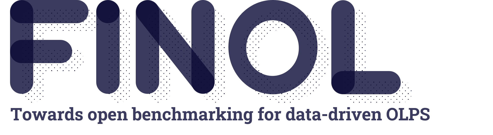

.. FinOL documentation master file, created by
   sphinx-quickstart on Mon Jul 22 13:30:51 2024.
   You can adapt this file completely to your liking, but it should at least
   contain the root `toctree` directive.

|finol_logo|

=====================================================
FinOL: Towards open benchmarking for data-driven OLPS
=====================================================

``FinOL`` represents a pioneering open database for facilitating data-driven OLPS research. As an
ambitious project, it collects and organizes extensive assets from global markets over half a century,
it provides a long-awaited unified platform to advance data-driven OLPS research.

What's NEW!
-----------

.. container::

   +-------------------------------------------------------+----------------+----------------+
   | Update                                                | Status         | Label          |
   |                                                       |                |                |
   +=======================================================+================+================+
   | New release! ``FinOL`` is going to release the        | Coming         | Release        |
   | official website                                      | soon......     |                |
   |                                                       |                |                |
   +-------------------------------------------------------+----------------+----------------+
   | New metric! ``FinOL`` is going to support the         | Coming         | Enhancement    |
   | `t-test <https://www.scienc                           | soon......     |                |
   | edirect.com/science/article/pii/S0004370215000168>`__ |                |                |
   | metric                                                |                |                |
   |                                                       |                |                |
   +-------------------------------------------------------+----------------+----------------+
   | New model! ``FinOL`` is going to support the          | Coming         | Enhancement    |
   | `AlphaStock <h                                        | soon......     |                |
   | ttps://dl.acm.org/doi/abs/10.1145/3292500.3330647>`__ |                |                |
   | model                                                 |                |                |
   |                                                       |                |                |
   +-------------------------------------------------------+----------------+----------------+
   | New release! ``FinOL`` now releases the `official     | Released       | Release        |
   | docs <https://finol.readthedocs.io/en/latest/>`__     | on             |                |
   |                                                       | 22 July        |                |
   |                                                       | 2024           |                |
   |                                                       |                |                |
   +-------------------------------------------------------+----------------+----------------+
   | New feature! ``FinOL`` now supports the `Auto         | Supported      | Enhancement    |
   | Hyperparameter Tuning                                 | since          |                |
   | <https://dl.acm.org/doi/10.1145/3292500.3330701>`__   | 22 July        |                |
   | feature                                               | 2024           |                |
   |                                                       |                |                |
   +-------------------------------------------------------+----------------+----------------+
   | New feature! ``FinOL`` now supports the `Radar        | Supported      | Enhancement    |
   | Chart <https://en.wikipedia.org/wiki/Radar_chart>`__  | since          |                |
   | evaluation                                            | 10 June        |                |
   |                                                       | 2024           |                |
   |                                                       |                |                |
   +-------------------------------------------------------+----------------+----------------+
   | New model! ``FinOL`` now supports the                 | Supported      | Enhancement    |
   | `AlphaPortfolio <https://pa                           | since          |                |
   | pers.ssrn.com/sol3/Papers.cfm?abstract_id=3554486>`__ | 06 June        |                |
   | model                                                 | 2024           |                |
   |                                                       |                |                |
   +-------------------------------------------------------+----------------+----------------+
   | New feature! ``FinOL`` now supports the `Economic     | Supported      | Enhancement    |
   | Distillation <https://pa                              | since          |                |
   | pers.ssrn.com/sol3/Papers.cfm?abstract_id=3554486>`__ | 15 May         |                |
   | feature                                               | 2024           |                |
   |                                                       |                |                |
   +-------------------------------------------------------+----------------+----------------+
   | New feature! ``FinOL`` now supports the               | Supported      | Enhancement    |
   | `Interpretability                                     | since          |                |
   | Analysis <h                                           | 16 April       |                |
   | ttps://dl.acm.org/doi/abs/10.1145/3292500.3330647>`__ | 2024           |                |
   | feature                                               |                |                |
   |                                                       |                |                |
   +-------------------------------------------------------+----------------+----------------+
   | New feature! ``FinOL`` now supports the `Winner       | Supported      | Enhancement    |
   | Assets                                                | since          |                |
   | Selection <h                                          | 14 April       |                |
   | ttps://dl.acm.org/doi/abs/10.1145/3292500.3330647>`__ | 2024           |                |
   | feature                                               |                |                |
   |                                                       |                |                |
   +-------------------------------------------------------+----------------+----------------+
   | Release ``FinOL`` `tutorials <finol/tutorials>`__     | Released       | Release        |
   |                                                       | on             |                |
   |                                                       | 22 March       |                |
   |                                                       | 2024           |                |
   |                                                       |                |                |
   +-------------------------------------------------------+----------------+----------------+
   | Release ``FinOL``                                     | Released       | Release        |
   | `v0.0.1 <https:                                       | on             |                |
   | //github.com/jiahaoli57/finol/releases/tag/v0.0.1>`__ | 21 March       |                |
   |                                                       | 2024           |                |
   |                                                       |                |                |
   +-------------------------------------------------------+----------------+----------------+

Outline
-------

-  `FinOL: Towards Open Benchmarking for Data-Driven Online Portfolio
   Selection <#finol>`__

   -  `Outline <#outline>`__
   -  `About <#about>`__
   -  `Why should I use FinOL? <#why-should-i-use-finOL?>`__
   -  `Installation <#installation>`__
   -  `Examples and Tutorials <#examples-and-tutorials>`__
   -  `Using FinOL <#using-FinOL>`__
   -  `File Structure <#file-structure>`__
   -  `Supported Datasets <#supported-datasets>`__
   -  `Supported Baselines <#supported-baselines>`__
   -  `Supported Metrics <#supported-metrics>`__
   -  `License <#license>`__
   -  `Contact Us <#contact-us>`__

About
-----

Online portfolio selection (OLPS) is an important issue in operations
research community that studies how to dynamically adjust portfolios
according to market changes. In the past, OLPS research relied on a
general database called ``OLPS`` containing price relatives data of
financial assets across different markets. However, with the widespread
adoption of data-driven technologies like machine learning in finance,
``OLPS`` can no longer meet the needs of OLPS research due to the lack
of support for high-dimensional feature spaces. To solve this problem,
we propose ``FinOL``, an open financial platform for advancing research
in data-driven OLPS. ``FinOL`` expands and enriches the previous
``OLPS`` database, containing 9 benchmark financial datasets from 1962
to present across global markets. To promote fair comparisons, we
evaluate a large number of past classic OLPS methods on ``FinOL``,
providing reusable benchmark results for future ``FinOL`` users and
effectively supporting OLPS research. More importantly, to lower the
barriers to research, ``FinOL`` provides a complete
data-training-testing suite with just three lines of command. We are
also committed to regularly updating ``FinOL`` with new data and
benchmark results reflecting the latest developments and trends in the
field. This ensures ``FinOL`` remains a valuable resource as data-driven
OLPS methods continue evolving.

.. image:: ../images/finol.png
    :align: center
.. centered:: *Overall Framework of FinOL*

Why should I use FinOL?
-----------------------

1. ``FinOL`` contributes comprehensive datasets spanning diverse market
   conditions and asset classes to enable large-scale empirical
   validation;
2. ``FinOL`` contributes the most extensive benchmark results to date
   for portfolio selection methods, providing the academic community an
   unbiased performance assessment;
3. ``FinOL`` contributes a user-friendly Python library for data-driven
   OLPS research, providing a comprehensive toolkit for academics to
   develop, test, and validate new OLPS methods.

Examples and Tutorials
----------------------

You can find useful tutorials on how to use ``FinOL`` in the
`tutorials <finol/tutorials/README.md>`__ folder.

Here we show a simple application (taken from
`tutorial_2 <tutorials/tutorial_2.ipynb>`__): we transform asset “AA”
into a richer representation.

.. raw:: html

   

Visualization of Train Normalization Data for Asset “AA”

.. raw:: html

   

Using FinOL
-----------

To lower the barriers for the research community, ``FinOL`` provides a
complete data-training-testing suite with just three lines of command.

.. code:: python3

   from finol.data_layer.DatasetLoader import DatasetLoader
   from finol.optimization_layer.ModelTrainer import ModelTrainer
   from finol.evaluation_layer.ModelEvaluator import ModelEvaluator

   load_dataset_output = DatasetLoader().load_dataset()
   train_model_output = ModelTrainer(load_dataset_output).train_model()
   evaluate_model_output = ModelEvaluator(load_dataset_output, train_model_output).evaluate_model()

Supported Datasets
------------------

.. container::

   +--------------------------+----------------+-----------------+-----------+--------+---------------+--------------------+
   | Name                     | Market         | Country/Region  | Data      | # of   | Data Range    | # of               |
   |                          |                |                 | Frequency | Assets |               | Periods            |
   +==========================+================+=================+===========+========+===============+====================+
   | `NYSE(O)                 | Stock          | United States   | Daily     | 26     | 03/July./1962 | 5,651:             |
   | <https://github.com/ai   |                |                 |           |        | -             | 3,390/1,130/1,131  |
   | 4finol/FinOL_data/tree/m |                |                 |           |        | 31/Dec./1984  |                    |
   | ain/datasets/NYSE(O)>`__ |                |                 |           |        |               |                    |
   |                          |                |                 |           |        |               |                    |
   +--------------------------+----------------+-----------------+-----------+--------+---------------+--------------------+
   | `NYSE(N)                 | Stock          | United States   | Daily     | 403    | 02/Jan./1985  | 6,430:             |
   | <https://github.com/ai   |                |                 |           |        | -             | 3,858/1,286/1,286  |
   | 4finol/FinOL_data/tree/m |                |                 |           |        | 30/June./2010 |                    |
   | ain/datasets/NYSE(N)>`__ |                |                 |           |        |               |                    |
   |                          |                |                 |           |        |               |                    |
   +--------------------------+----------------+-----------------+-----------+--------+---------------+--------------------+
   | `DJIA                    | Stock          | United States   | Daily     | 28     | 14/Jan./2001  | 500:               |
   | <https://github.com      |                |                 |           |        | -             | 300/100/100        |
   | /ai4finol/FinOL_data/tre |                |                 |           |        | 14/Jan./2003  |                    |
   | e/main/datasets/DJIA>`__ |                |                 |           |        |               |                    |
   |                          |                |                 |           |        |               |                    |
   +--------------------------+----------------+-----------------+-----------+--------+---------------+--------------------+
   | `SP500                   | Stock          | United States   | Daily     | 339    | 02/Jan./1998  | 1,268:             |
   | <https://github.com/     |                |                 |           |        | -             | 756/256/256        |
   | ai4finol/FinOL_data/tree |                |                 |           |        | 31/Jan./2003  |                    |
   | /main/datasets/SP500>`__ |                |                 |           |        |               |                    |
   |                          |                |                 |           |        |               |                    |
   +--------------------------+----------------+-----------------+-----------+--------+---------------+--------------------+
   | `TSE <https://github.co  | Stock          | Canada          | Daily     | 48     | 12/Jan./1995  | 1,001:             |
   | m/ai4finol/FinOL_data/tr |                |                 |           |        | -             | 600/200/200        |
   | ee/main/datasets/TSE>`__ |                |                 |           |        | 31/Dec./1998  |                    |
   |                          |                |                 |           |        |               |                    |
   +--------------------------+----------------+-----------------+-----------+--------+---------------+--------------------+
   |                          |                |                 |           |        |               |                    |
   +--------------------------+----------------+-----------------+-----------+--------+---------------+--------------------+
   | `SSE <https://github.co  | Stock          | China           | Weekly    | 30     | 05/July./2010 | 678:               |
   | m/ai4finol/FinOL_data/tr |                |                 |           |        | -             | 406/136/136        |
   | ee/main/datasets/SSE>`__ |                |                 |           |        | 26/June./2023 |                    |
   |                          |                |                 |           |        |               |                    |
   +--------------------------+----------------+-----------------+-----------+--------+---------------+--------------------+
   | `HSI <https://github.co  | Stock          | Hong Kong, China| Weekly    | 53     | 05/July./2010 | 678:               |
   | m/ai4finol/FinOL_data/tr |                |                 |           |        | -             | 406/136/136        |
   | ee/main/datasets/HSI>`__ |                |                 |           |        | 26/June./2023 |                    |
   |                          |                |                 |           |        |               |                    |
   +--------------------------+----------------+-----------------+-----------+--------+---------------+--------------------+
   | `CMEG                    | Futures        | United States   | Weekly    | 25     | 05/July./2010 | 678:               |
   | <https://github.com      |                |                 |           |        | -             | 406/136/136        |
   | /ai4finol/FinOL_data/tre |                |                 |           |        | 26/June./2023 |                    |
   | e/main/datasets/CMEG>`__ |                |                 |           |        |               |                    |
   |                          |                |                 |           |        |               |                    |
   +--------------------------+----------------+-----------------+-----------+--------+---------------+--------------------+
   | `CRYPTO                  | Cryptocurrency | World           | Daily     | 43     | 09/Nov./2017  | 2,305:             |
   | <https://github.com/a    |                |                 |           |        | -             | 1,421/442/442      |
   | i4finol/FinOL_data/tree/ |                |                 |           |        | 01/Mar./2024  |                    |
   | main/datasets/CRYPTO>`__ |                |                 |           |        |               |                    |
   |                          |                |                 |           |        |               |                    |
   +--------------------------+----------------+-----------------+-----------+--------+---------------+--------------------+

Supported Baselines
-------------------

.. container::

   +-------------------+---------------------+--------------------------------------+----------------------------------+
   | Name              | Category            | Source                               | Journal/Conference               |
   |                   |                     |                                      |                                  |
   +===================+=====================+======================================+==================================+
   | Market            | Classic OLPS:       | –                                    | –                                |
   |                   | Benchmark baseline  |                                      |                                  |
   |                   |                     |                                      |                                  |
   +-------------------+---------------------+--------------------------------------+----------------------------------+
   | Best              | Classic OLPS:       | –                                    | –                                |
   |                   | Benchmark baseline  |                                      |                                  |
   |                   |                     |                                      |                                  |
   +-------------------+---------------------+--------------------------------------+----------------------------------+
   | UCRP              | Classic OLPS:       | `Kelly                               | *The Bell System                 |
   |                   | Benchmark baseline  | 1956 <https://ieeexplore.ieee        | Technical                        |
   |                   |                     | .org/abstract/document/6771227/>`__; | Journal*;                        |
   |                   |                     | `Cover                               | *Mathematical                    |
   |                   |                     | 1991 <https:                         | Finance*                         |
   |                   |                     | //onlinelibrary.wiley.com/doi/abs/10 |                                  |
   |                   |                     | .1111/j.1467-9965.1991.tb00002.x>`__ |                                  |
   |                   |                     |                                      |                                  |
   +-------------------+---------------------+--------------------------------------+----------------------------------+
   | BCRP              | Classic OLPS:       | `Cover                               | *Mathematical                    |
   |                   | Benchmark baseline  | 1991 <https:                         | Finance*                         |
   |                   |                     | //onlinelibrary.wiley.com/doi/abs/10 |                                  |
   |                   |                     | .1111/j.1467-9965.1991.tb00002.x>`__ |                                  |
   |                   |                     |                                      |                                  |
   |                   |                     |                                      |                                  |
   +-------------------+---------------------+--------------------------------------+----------------------------------+
   |                   |                     |                                      |                                  |
   +-------------------+---------------------+--------------------------------------+----------------------------------+
   | UP                | Classic OLPS:       | `Cover                               | *Mathematical                    |
   |                   | Follow-the-winner   | 1991 <https:                         | Finance*                         |
   |                   |                     | //onlinelibrary.wiley.com/doi/abs/10 |                                  |
   |                   |                     | .1111/j.1467-9965.1991.tb00002.x>`__ |                                  |
   |                   |                     |                                      |                                  |
   +-------------------+---------------------+--------------------------------------+----------------------------------+
   | EG                | Classic OLPS:       | `Helmbold et al.                     | *Mathematical                    |
   |                   | Follow-the-winner   | 1998                                 | Finance*                         |
   |                   |                     | <https://onlinelibrary.wiley.com     |                                  |
   |                   |                     | /doi/abs/10.1111/1467-9965.00058>`__ |                                  |
   |                   |                     |                                      |                                  |
   +-------------------+---------------------+--------------------------------------+----------------------------------+
   | SCRP              | Classic OLPS:       | `Gaivoronski and Stella              | *Annals of                       |
   |                   | Follow-the-winner   | 2000 <https://link.springer.com      | Operations                       |
   |                   |                     | /article/10.1023/A:1019271201970>`__ | Research*                        |
   |                   |                     |                                      |                                  |
   +-------------------+---------------------+--------------------------------------+----------------------------------+
   | PPT               | Classic OLPS:       | `Lai et                              | *IEEE                            |
   |                   | Follow-the-winner   | al. 2018 <https://ieeexplore.ie      | Transactions on                  |
   |                   |                     | ee.org/abstract/document/7942104>`__ | Neural Networks                  |
   |                   |                     |                                      | and Learning                     |
   |                   |                     |                                      | Systems*                         |
   |                   |                     |                                      |                                  |
   +-------------------+---------------------+--------------------------------------+----------------------------------+
   | SSPO              | Classic OLPS:       | `Lai et                              | *The Journal of                  |
   |                   | Follow-the-winner   | al. 2018 <https://www                | Machine Learning                 |
   |                   |                     | .jmlr.org/papers/v19/17-558.html>`__ | Research*                        |
   |                   |                     |                                      |                                  |
   +-------------------+---------------------+--------------------------------------+----------------------------------+
   |                   |                     |                                      |                                  |
   +-------------------+---------------------+--------------------------------------+----------------------------------+
   | ANTI\ :sup:`1`\   | Classic OLPS:       | `Borodin et                          | *Advances in                     |
   |                   | Follow-the-loser    | al. 2004 <h                          | Neural                           |
   |                   |                     | ttps://proceedings.neurips.cc/paper_ | Information                      |
   |                   |                     | files/paper/2003/hash/8c9f32e03aeb2e | Processing                       |
   |                   |                     | 3000825c8c875c4edd-Abstract.html>`__ | Systems*                         |
   |                   |                     |                                      |                                  |
   +-------------------+---------------------+--------------------------------------+----------------------------------+
   | ANTI\ :sup:`2`\   | Classic OLPS:       | `Borodin et                          | *Advances in                     |
   |                   | Follow-the-loser    | al. 2004 <h                          | Neural                           |
   |                   |                     | ttps://proceedings.neurips.cc/paper_ | Information                      |
   |                   |                     | files/paper/2003/hash/8c9f32e03aeb2e | Processing                       |
   |                   |                     | 3000825c8c875c4edd-Abstract.html>`__ | Systems*                         |
   |                   |                     |                                      |                                  |
   +-------------------+---------------------+--------------------------------------+----------------------------------+
   | PAMR              | Classic OLPS:       | `Li et al.                           | *Machine                         |
   |                   | Follow-the-loser    | 2012                                 | Learning*                        |
   |                   |                     | <https://link.springer.com/a         |                                  |
   |                   |                     | rticle/10.1007/s10994-012-5281-z>`__ |                                  |
   |                   |                     |                                      |                                  |
   +-------------------+---------------------+--------------------------------------+----------------------------------+
   | CWMR-Var          | Classic OLPS:       | `Li et                               | *ACM                             |
   |                   | Follow-the-loser    | al. 2013 <https://dl.acm.org         | Transactions on                  |
   |                   |                     | /doi/abs/10.1145/2435209.2435213>`__ | Knowledge                        |
   |                   |                     |                                      | Discovery from                   |
   |                   |                     |                                      | Data*                            |
   |                   |                     |                                      |                                  |
   +-------------------+---------------------+--------------------------------------+----------------------------------+
   | CWMR-Stdev        | Classic OLPS:       | `Li et                               | *ACM                             |
   |                   | Follow-the-loser    | al. 2013 <https://dl.acm.org         | Transactions on                  |
   |                   |                     | /doi/abs/10.1145/2435209.2435213>`__ | Knowledge                        |
   |                   |                     |                                      | Discovery from                   |
   |                   |                     |                                      | Data*                            |
   |                   |                     |                                      |                                  |
   +-------------------+---------------------+--------------------------------------+----------------------------------+
   | OLMAR-S           | Classic OLPS:       | `Li et                               | *Artificial                      |
   |                   | Follow-the-loser    | al. 2015                             | Intelligence*                    |
   |                   |                     | <https://www.sciencedirect.com/scien |                                  |
   |                   |                     | ce/article/pii/S0004370215000168>`__ |                                  |
   |                   |                     |                                      |                                  |
   +-------------------+---------------------+--------------------------------------+----------------------------------+
   | OLMAR-E           | Classic OLPS:       | `Li et                               | *Artificial                      |
   |                   | Follow-the-loser    | al. 2015                             | Intelligence*                    |
   |                   |                     | <https://www.sciencedirect.com/scien |                                  |
   |                   |                     | ce/article/pii/S0004370215000168>`__ |                                  |
   |                   |                     |                                      |                                  |
   +-------------------+---------------------+--------------------------------------+----------------------------------+
   | RMR               | Classic OLPS:       | `Huang et                            | *IEEE                            |
   |                   | Follow-the-loser    | al. 2016 <https://ieeexplore.ie      | Transactions on                  |
   |                   |                     | ee.org/abstract/document/7465840>`__ | Knowledge and                    |
   |                   |                     |                                      | Data                             |
   |                   |                     |                                      | Engineering*                     |
   |                   |                     |                                      |                                  |
   +-------------------+---------------------+--------------------------------------+----------------------------------+
   | RPRT              | Classic OLPS:       | `Lai et                              | *IEEE                            |
   |                   | Follow-the-loser    | al. 2020 <https://ieeexplore.iee     | Transactions on                  |
   |                   |                     | e.org/abstract/document/8411138/>`__ | Systems, Man,                    |
   |                   |                     |                                      | and Cybernetics:                 |
   |                   |                     |                                      | Systems*                         |
   |                   |                     |                                      |                                  |
   +-------------------+---------------------+--------------------------------------+----------------------------------+
   |                   |                     |                                      |                                  |
   +-------------------+---------------------+--------------------------------------+----------------------------------+
   | AICTR             | Classic OLPS:       | `Lai et                              | *IEEE                            |
   |                   | Pattern-matching    | al. 2018 <https://ieeexplore.ie      | Transactions on                  |
   |                   |                     | ee.org/abstract/document/8356708>`__ | Neural Networks                  |
   |                   |                     |                                      | and Learning                     |
   |                   |                     |                                      | Systems*                         |
   |                   |                     |                                      |                                  |
   +-------------------+---------------------+--------------------------------------+----------------------------------+
   | KTPT              | Classic OLPS:       | `Lai et                              | *Data Mining and                 |
   |                   | Pattern-matching    | al.                                  | Knowledge                        |
   |                   |                     | 2018 <https://link.springer.com/a    | Discovery*                       |
   |                   |                     | rticle/10.1007/s10618-018-0579-5>`__ |                                  |
   |                   |                     |                                      |                                  |
   +-------------------+---------------------+--------------------------------------+----------------------------------+
   |                   |                     |                                      |                                  |
   +-------------------+---------------------+--------------------------------------+----------------------------------+
   | SP                | Classic OLPS:       | `Singer                              | *International                   |
   |                   | Meta-learning       | 1997                                 | Journal of                       |
   |                   |                     | <https://www.worldscientific.com/d   | Neural Systems*                  |
   |                   |                     | oi/abs/10.1142/s0129065797000434>`__ |                                  |
   |                   |                     |                                      |                                  |
   +-------------------+---------------------+--------------------------------------+----------------------------------+
   | ONS               | Classic OLPS:       | `Agarwal et                          | *International                   |
   |                   | Meta-learning       | al. 2006 <https://dl.acm.org         | Conference on                    |
   |                   |                     | /doi/abs/10.1145/1143844.1143846>`__ | Machine                          |
   |                   |                     |                                      | Learning*                        |
   |                   |                     |                                      |                                  |
   +-------------------+---------------------+--------------------------------------+----------------------------------+
   | GRW               | Classic OLPS:       | `Levina and Shafer                   | *International                   |
   |                   | Meta-learning       | 2008                                 | Journal of                       |
   |                   |                     | <https://www.worldscientific.com/d   | Uncertainty,                     |
   |                   |                     | oi/abs/10.1142/S0218488508005364>`__ | Fuzziness and                    |
   |                   |                     |                                      | Knowledge-Based                  |
   |                   |                     |                                      | Systems*                         |
   |                   |                     |                                      |                                  |
   +-------------------+---------------------+--------------------------------------+----------------------------------+
   | WAAS              | Classic OLPS:       | `Zhang and Yang                      | *Computational                   |
   |                   | Meta-learning       | 2017 <https://link.springer.com/a    | Economics*                       |
   |                   |                     | rticle/10.1007/s10614-016-9585-0>`__ |                                  |
   |                   |                     |                                      |                                  |
   |                   |                     |                                      |                                  |
   +-------------------+---------------------+--------------------------------------+----------------------------------+
   | CW-OGD            | Classic OLPS:       | `Zhang et                            | *Knowledge-Based                 |
   |                   | Meta-learning       | al. 2021                             | Systems*                         |
   |                   |                     | <https://www.sciencedirect.com/scien |                                  |
   |                   |                     | ce/article/pii/S0950705121007954>`__ |                                  |
   |                   |                     |                                      |                                  |
   |                   |                     |                                      |                                  |
   +-------------------+---------------------+--------------------------------------+----------------------------------+

Supported Metrics
-----------------

.. container::

   +-------------------------------------------+------------------+--------------+
   | Name                                      | Abbreviation     | Category     |
   |                                           |                  |              |
   +===========================================+==================+==============+
   | Cumulative Wealth                         | CW               | Profit       |
   |                                           |                  | Metric       |
   +-------------------------------------------+------------------+--------------+
   | Annualized Percentage Yield               | APY              | Profit       |
   |                                           |                  | Metric       |
   +-------------------------------------------+------------------+--------------+
   | Sharpe Ratio                              | SR               | Profit       |
   |                                           |                  | Metric       |
   +-------------------------------------------+------------------+--------------+
   |                                           |                  |              |
   +-------------------------------------------+------------------+--------------+
   | Volatility Risk                           | VR               | Risk Metric  |
   +-------------------------------------------+------------------+--------------+
   | Maximum DrawDown                          | MDD              | Risk Metric  |
   +-------------------------------------------+------------------+--------------+
   |                                           |                  |              |
   +-------------------------------------------+------------------+--------------+
   | Average Turnover                          | ATO              | Practical    |
   |                                           |                  | Metric       |
   +-------------------------------------------+------------------+--------------+
   | Transaction Costs-Adjusted Cumulative     | TCW              | Practical    |
   | Wealth                                    |                  | Metric       |
   +-------------------------------------------+------------------+--------------+
   | Running Time                              | RT               | Practical    |
   |                                           |                  | Metric       |
   +-------------------------------------------+------------------+--------------+

Supported Visualization
-----------------------

The FInOL project provides a suite of visualization tools to facilitate
a comprehensive evaluation of data-driven OLPS research. Here are some
examples:

1. Dynamic Training/Validation Loss Visualization

   .. raw:: html

      

.. raw:: html

   

2. Daily Cumulative Wealth Visualization

   .. raw:: html

      

3. Daily DrawDown

   .. raw:: html

      

4. Transaction Cost-Adjusted Cumulative Wealth

   .. raw:: html

      

5. Comprehensive Radar Chart

   .. raw:: html

      

File Structure
--------------

::

   FinOL
   ├─ LICENSE
   ├─ MANIFEST.in
   ├─ README.md
   ├─ TA_Lib-0.4.24-cp39-cp39-win_amd64.whl
   ├─ figure
   │    ├─ FinOL.png
   │    ├─ logo.png
   │    └─ tutorial_2.png
   ├─ finol
   │    ├─ __init__.py
   │    ├─ config.py
   │    ├─ data
   │    │    ├─ benchmark_results
   │    │    │    ├─ __init__.py
   │    │    │    ├─ other
   │    │    │    │    └─ price_relative
   │    │    │    │           ├─ price_relative_CMEG.mat
   │    │    │    │           ├─ price_relative_CRYPTO.mat
   │    │    │    │           ├─ price_relative_DJIA.mat
   │    │    │    │           ├─ price_relative_HSI.mat
   │    │    │    │           ├─ price_relative_NYSE(N).mat
   │    │    │    │           ├─ price_relative_NYSE(O).mat
   │    │    │    │           ├─ price_relative_SP500.mat
   │    │    │    │           ├─ price_relative_SSE.mat
   │    │    │    │           └─ price_relative_TSE.mat
   │    │    │    ├─ practical_metrics
   │    │    │    │    ├─ CMEG
   │    │    │    │    │    ├─ final_practical_result.xlsx
   │    │    │    │    │    └─ transaction_costs_adjusted_cumulative_wealth.xlsx
   │    │    │    │    ├─ CRYPTO
   │    │    │    │    │    ├─ final_practical_result.xlsx
   │    │    │    │    │    └─ transaction_costs_adjusted_cumulative_wealth.xlsx
   │    │    │    │    ├─ DJIA
   │    │    │    │    │    ├─ final_practical_result.xlsx
   │    │    │    │    │    └─ transaction_costs_adjusted_cumulative_wealth.xlsx
   │    │    │    │    ├─ HSI
   │    │    │    │    │    ├─ final_practical_result.xlsx
   │    │    │    │    │    └─ transaction_costs_adjusted_cumulative_wealth.xlsx
   │    │    │    │    ├─ NYSE(N)
   │    │    │    │    │    ├─ final_practical_result.xlsx
   │    │    │    │    │    └─ transaction_costs_adjusted_cumulative_wealth.xlsx
   │    │    │    │    ├─ NYSE(O)
   │    │    │    │    │    ├─ final_practical_result.xlsx
   │    │    │    │    │    └─ transaction_costs_adjusted_cumulative_wealth.xlsx
   │    │    │    │    ├─ SP500
   │    │    │    │    │    ├─ final_practical_result.xlsx
   │    │    │    │    │    └─ transaction_costs_adjusted_cumulative_wealth.xlsx
   │    │    │    │    ├─ SSE
   │    │    │    │    │    ├─ final_practical_result.xlsx
   │    │    │    │    │    └─ transaction_costs_adjusted_cumulative_wealth.xlsx
   │    │    │    │    └─ TSE
   │    │    │    │           ├─ final_practical_result.xlsx
   │    │    │    │           └─ transaction_costs_adjusted_cumulative_wealth.xlsx
   │    │    │    ├─ profit_metrics
   │    │    │    │    ├─ CMEG
   │    │    │    │    │    ├─ daily_cumulative_wealth.xlsx
   │    │    │    │    │    ├─ daily_return.xlsx
   │    │    │    │    │    └─ final_profit_result.xlsx
   │    │    │    │    ├─ CRYPTO
   │    │    │    │    │    ├─ daily_cumulative_wealth.xlsx
   │    │    │    │    │    ├─ daily_return.xlsx
   │    │    │    │    │    └─ final_profit_result.xlsx
   │    │    │    │    ├─ DJIA
   │    │    │    │    │    ├─ daily_cumulative_wealth.xlsx
   │    │    │    │    │    ├─ daily_return.xlsx
   │    │    │    │    │    └─ final_profit_result.xlsx
   │    │    │    │    ├─ HSI
   │    │    │    │    │    ├─ daily_cumulative_wealth.xlsx
   │    │    │    │    │    ├─ daily_return.xlsx
   │    │    │    │    │    └─ final_profit_result.xlsx
   │    │    │    │    ├─ NYSE(N)
   │    │    │    │    │    ├─ daily_cumulative_wealth.xlsx
   │    │    │    │    │    ├─ daily_return.xlsx
   │    │    │    │    │    └─ final_profit_result.xlsx
   │    │    │    │    ├─ NYSE(O)
   │    │    │    │    │    ├─ daily_cumulative_wealth.xlsx
   │    │    │    │    │    ├─ daily_return.xlsx
   │    │    │    │    │    └─ final_profit_result.xlsx
   │    │    │    │    ├─ SP500
   │    │    │    │    │    ├─ daily_cumulative_wealth.xlsx
   │    │    │    │    │    ├─ daily_return.xlsx
   │    │    │    │    │    └─ final_profit_result.xlsx
   │    │    │    │    ├─ SSE
   │    │    │    │    │    ├─ daily_cumulative_wealth.xlsx
   │    │    │    │    │    ├─ daily_return.xlsx
   │    │    │    │    │    └─ final_profit_result.xlsx
   │    │    │    │    └─ TSE
   │    │    │    │           ├─ daily_cumulative_wealth.xlsx
   │    │    │    │           ├─ daily_return.xlsx
   │    │    │    │           └─ final_profit_result.xlsx
   │    │    │    └─ risk_metrics
   │    │    │           ├─ CMEG
   │    │    │           │    ├─ daily_drawdown.xlsx
   │    │    │           │    └─ final_risk_result.xlsx
   │    │    │           ├─ CRYPTO
   │    │    │           │    ├─ daily_drawdown.xlsx
   │    │    │           │    └─ final_risk_result.xlsx
   │    │    │           ├─ DJIA
   │    │    │           │    ├─ daily_drawdown.xlsx
   │    │    │           │    └─ final_risk_result.xlsx
   │    │    │           ├─ HSI
   │    │    │           │    ├─ daily_drawdown.xlsx
   │    │    │           │    └─ final_risk_result.xlsx
   │    │    │           ├─ NYSE(N)
   │    │    │           │    ├─ daily_drawdown.xlsx
   │    │    │           │    └─ final_risk_result.xlsx
   │    │    │           ├─ NYSE(O)
   │    │    │           │    ├─ daily_drawdown.xlsx
   │    │    │           │    └─ final_risk_result.xlsx
   │    │    │           ├─ SP500
   │    │    │           │    ├─ daily_drawdown.xlsx
   │    │    │           │    └─ final_risk_result.xlsx
   │    │    │           ├─ SSE
   │    │    │           │    ├─ daily_drawdown.xlsx
   │    │    │           │    └─ final_risk_result.xlsx
   │    │    │           └─ TSE
   │    │    │                  ├─ daily_drawdown.xlsx
   │    │    │                  └─ final_risk_result.xlsx
   │    │    └─ datasets
   │    │           ├─ CMEG
   │    │           ├─ CRYPTO
   │    │           ├─ DJIA
   │    │           ├─ HSI
   │    │           ├─ NYSE(N)
   │    │           ├─ NYSE(O)
   │    │           ├─ SP500
   │    │           ├─ SSE
   │    │           └─ TSE
   │    ├─ data_layer
   │    │    ├─ __init__.py
   │    │    ├─ data_loader.py
   │    │    └─ scaler_selector.py
   │    ├─ evaluation_layer
   │    │    ├─ __init__.py
   │    │    ├─ benchmark_loader.py
   │    │    ├─ metric_caculator.py
   │    │    └─ model_evaluator.py
   │    ├─ main
   │    │    ├─ main.ipynb
   │    │    └─ main.py
   │    ├─ model_layer
   │    │    ├─ __init__.py
   │    │    ├─ CNN.py
   │    │    ├─ DNN.py
   │    │    ├─ LSRE_CAAN.py
   │    │    ├─ LSTM.py
   │    │    ├─ RNN.py
   │    │    ├─ Transformer.py
   │    │    └─ model_selector.py
   │    ├─ optimization_layer
   │    │    ├─ __init__.py
   │    │    ├─ criterion_selector.py
   │    │    ├─ model_trainer.py
   │    │    └─ optimizer_selector.py
   │    ├─ setup.py
   │    ├─ tutorials
   │    │    ├─ README.md
   │    │    ├─ _.ipynb
   │    │    ├─ tutorial_1.ipynb
   │    │    ├─ tutorial_2.ipynb
   │    │    ├─ tutorial_3.ipynb
   │    │    └─ tutorial_4.ipynb
   │    ├─ update
   │    │    └─ __init__.py
   │    └─ utils.py
   ├─ logdir
   ├─ requirements.txt
   └─ setup.py

License
-------

Released under the `MIT
License <https://github.com/jiahaoli57/finol/blob/main/LICENSE>`__.

Contact Us
----------

For inquiries, please get in touch with us at finol.official@gmail.com
(Monday to Friday, 9:00 AM to 6:00 PM)

.. toctree::
   :maxdepth: 2
   :caption: Contents:

   installation
   quickstart
   tutorials/index
   user_guide/index
   contributing
   api/index
   changelog
   faq

Indices and tables
==================

* :ref:`genindex`
* :ref:`modindex`
* :ref:`search`

.. https://encrypted-tbn0.gstatic.com/images?q=tbn:ANd9GcTzacvkmaQqRmyrY4zoTauNs8UjqLQd0oEzYBnJiCTpMs4Gm4cr
.. data:image/png;base64,iVBORw0KGgoAAAANSUhEUgAAAZYAAAB8CAMAAAB9jmb0AAAAkFBMVEX///8jHyAAAAAgHB0cFxgaFRYMAAQYExQRCgwUDg8IAAAeGRq7u7sGAAClpKSQj5HHx8dVU1OEg4TS0tNgX2Hp6erx8fLi4uJ8e3y0tLV2dXb29vatra5lZGZZWFktKixGREXc3N00MjNNTE1ubG07OTwzMTKenp+XlpfNzc7BwcKCgYJHRkctKywnIyVPTU6AHSgjAAAgAElEQVR4nO19CbuqOpMuVIAkREFBUUZBwVn8///uVnAgCK7hnL1u7+516un+9jrImDc1Vyqa9h/9R//R30+L4+5UInnOcfE//S7/R6nYOR/Rrni94BhdACxOkbgFcIkmA3cNu3dJEvk/4WHeO3Ein+HHt5fY7ZxEWzR/7wJ/52vy35/46L+fRmB9RDDqnB3va6BEV4hwWO3i17tmyl3Bgmo7xn/HEEXRoXuiBymF3QEsGwDcAP/OwYYN1FoAZoXHfi0s+kcER/Vkx7JI/xxic+flrjPz+au5NHWCVxmZyd1oDNtQPdGr5xFlY1Nn4dKOipowZMVEc8GbcbFNrvqPD8DfSd+AZVHBACgNMFB1lYwCiy7/NLnO4xXhyGncmykc4FqGoRN9ZkB8HFOwBRQ+zPyNYHoFoVZAX+79Cvo6LCMw3p9ndKWdCguOOtsdbb3BdE3o8crasXY5MTlztcw0mSCrZAPzBZjIMfZcm+aH9D9YPoFl945VHmfulLu2sBCdbFZkW+HFjJrlAnTbMOiTXzxbsscqpbpY5yzS9mwMlpHPHZgEFYWK/QfLh7DsPj5PnqoomBaWNdG3tU5QKNmTiArSYMtnjxMXG3vvcbQbGBQaM2fIPFlCUs1HAwFYrs3/g+UjWD45rQvhAxaJwZXIf8nWocYMWYYAsY+hBQ+9H2cGQztii0o+dbnOziuEJ7XPnPFlUP4Hy8dDvfhEgjVE7OcYNrCQq8RB10W+FVVIdcNEjb9YkRq552FheUCMLGHEX1LUKHStzeG6p8RaunDQQtj+p1uGYblp8tzsHiYGZ4yLl5Pp9XHXllsIOiTJDh0Q4EYWUe6udGLahN1P9DZra6fVBMacRvHUOjqWCTnDn6vVHmVbOPTOv4BUWATv0Q0Wp4udAHb1dntvw+wuEz1H8aFbEJggiCUFhQunhOmcCmM24Wx/O9HTDsAY1Smyx1KboYlMmIdskiRgwL6E/6FR+R8nBRYzjYMeSQc+Jp3Rty7h3a0PkhXrMBG53/UOS30l4vIUQwWgM2qWV54euVjdjnkZ2gRiSkGLYa+10YK4Fzj4XaTAQss35zjjDkt46m+nDiNBcjsqYUEDTEflooRPEkCVv9gx06aE3Q67YIOx0U7sXHUs7N9OX4FlKwZG/kEdy1lsbwcRFnK9IPsIFRbtqhnoPSJflghPc8SFcGERpyKGke///Nf9r6UvwHJQBx56g+fZ6s9+c0xyixR85CpUWLKL9CpBnLUMbjFLF9wDIxbyzFE7vt75F9MXYDnxdtiNc//3tcJMzG0O3Qxkg+SBocISMdtgzhzEyrzDsmfoSRKjCGHpv8Y7fzN9AZaLovDv3NChiWrMVc2hmSl0UpUGgY4Qm7HjjF9TlHDsfiOPkcrRSTwB2ufDX0yfwzJXRz0fOkNlF7tBYcZTyS3yv1VYamuSCUEZahbnplv2kr8iDsCMa6DdTOnGDJN//GJr7HNYVGawBgXNXrGSb1wwo7mUYly3/bz10wvQx1SQ3FmxXXkfc5RoM0bM2d4+oXskaaP5MEHhB8tfrGxUv2U2X3TodoZjKYPeyyFLUm0Cu/EoZyaRUmzPjch6cosP6KJcc5oVKzLOb8fCJdetnCBLndnUpsxdXDOtGI+hQu/yF5Pq5ZvQpdsZrsoLg/eIVX5qvA/ULedaTNGrN5uoVqwFhQcCPXf/MDZs836ajImBudGOkOFTLE+mV/ZQjWGcaOF18Fm/hN7HxB5xq2VriD29+BeqW6OANc5mZoLvccGQPbIcqGvZNoBY43G6IjqdPtwWzXODrYGnGrAdo5Fn5C4YbHRAUXiA+hf7l9+CZVjja1re6nx+kgdCWwe8jKwE3+2ZTBbTKLTISZ7AjEpLsvuV3g4vBhij0tpDuLMNvsvRmCtrF9nol0aPJf1hWMgNlgz9Fsp0I64I48gy6Yp7oYWHTO7FF14+4/U4+rZgx8N4qZUUrC0kaAQ4IdB1kbx52A/QYuQsXNd1Rv7fYvx9T4ithm+yeggxsr4JsdmY0NPIIrWQJRaELVKTWqbOdynLElMJ4Hhstc8h1tD3B8YWWpZqOws2ewvPWI+Gn/YpHcJDiAahP9EOo9GAo9WhybIufLDBYnZeAiSn4wc1UPNwpNBnt/4X9DksruLkf6byjfIWcMzcyshnhk4s0ywD9Cml158KmLhc2Bacnpe6IMP4VWWLS7FDhTOzwBAI0+gcHP9x7BIdUx8NhhTq+pNCs7k71SI7r5Ch14Q5BRCLgf0uNqhpUcck2v7D9/sCfQ7LTjWQB4tbi/Yeht0wQhZeBTGozsKSElleYY3NVFsTmwtycVR3fkt2laBnF52mAMgarEqLmY+KBtLlP4Qllq4SpKUc3zksPpBL8yOswpwQDmjMeJxKdbiujXNSDToCeNfOCA27C3+EPoflqHolydA9Op5NE+uagZReJ0qjTOhiLOzjAcwtcs+2orl6qW8S27Tw+/bgzmbZsjihECyzaJpFmvZPKyr9DK1xcOKZiwPJYKgaV1Ihdj5D9jDMcm4bU5neBgLFngvL7GYv3gzWPQD4E6Q+iQiVzLvEWihnGNOhe5wfGh8hqJrJOaNoTFcLplNTkHqS0xQlmrA4Gr7dUToBXeGUjvy1gD8Wqlw2eWoZnzidgUfv2GVvMxSu3J3xbM90QZGvA5yMFD+E6zAbuCLr5s7J5U+9cY8UWMjlulEpv5+i5iaHpJj/uIWYEvRNJM0gTBhBr55UGVh+BZyjDxO41mZmReq14SIzggNQuDDzD31RqHsGisnUK6Yc3ATehHCWNb4RmZnMd5hAc5F6S0pKaUFaOtlxnVU9OOevkgUOQ3f+E/SFCHJE2xehaf/36WMOkZzwG/PPmksIMbl72CVOElZTh4twZgi0uFSJXGguHgG2xBf5Q5Ia9UKRafEKLYsKLcd0dRqSYksQlPClVglAeEwPLXiP6ibCs0RLXlo5PH+9RtWyDfEfCxB9AZZjJw3Wq0VJFH57zJ+ZqZvoUQalSW+m0GhW2LplcWMW5GpUxbuODbb3Vy5KnD8U2EeFv4AarQcH/w0nVAxZdC4Iu0DDS4olshUrLTMoOljUzY1csowUy9breFSvpT6E/JSf85WksVCkGBm/MK4aYNaFcTuYUWN2ZKKqEceb51ihEYATkk3nZ1WseOBtELhyvIE/lcvfrfYEUNhGJ+04tmENAwx+vCyuzEPT3wDTSuboZUmORxv5iBakRGWKb26uuoNe9K2jdxLyX9NXYFGDlTrpJvOTtrAPOSS9D62zFZWLap/Sh5FwhJzCfDE2wKKKve9JuzjDucsmyZ/hlgNj1fzIZJGBjOocNVc/vCrEmOXBzOSMoY1b8iqX1Z42pOh/2ZIhhE7OtW4YL8EfT3HgPhuyf0tfgSXo1lTC9One+ht4sLNOliaB+/wqIhTcpk5PHmf3Q1P8LGssdNPNFUHo8ZHLKHF1NAQGje/vkr+ZrPFGl6kLVC8OOJ09BvnLSTEixgnJ9wZPMmQP9PEniedlBBiyjZArchCVV/u8Dci2wgx+SIp9BRbNVasoZAJg7SXHY+KtHmsrmrpWs60On6JyJCWqT48+wl9Hma8klanjI9uPQYVvo/OvHSDcbdxEK5DdRq67d/HfRdFEmL/3PQjvYe07wPNJhkqMjldAxy/6cLFCS/665ss52sPcYNvkYW0UJwcVvhRoBnkNlLYq1tg8cfmpss8vwaKtXpSd4DaAzZ/Th1Rb/N9x9Th/xgip4y2hvK18WQNjO62m2UWwp7OGfstc0z1tyWGzlJIakhAg0uboNvj2Poy+KyUq6ZnCuUQPyYdlORbVsbdIJgJigCaXOSE82bRUkQ9KaMRx3Qtflw+D1MjC5zQ1s9fT/gx9DZbD21jAAxeJ1f5p4mb7w5g0om/6hGV0dMZ5QnVar+yndp8vUcitGVBG0b8rYwfAKzK0KqL9ZCaZ77tWcwbbiqPzNE21EFi+BBdVNenU6wQIe8Y3axRUazHuxUMdoBHroxI8h8By2r/1H1rc+TVYcAZ+ggvKW2VSzmQ9pW4z7mrtUem3jcG05wG7PD16H7Zr4BnasoEMBJYlR6wy9DCRdXzUYcfvaRwPYdV8GmtVjd4fPnvJ9ldTrNTBm0AeXgh6UGSNKPbtvyOQPipa8iwtxbu2pvJwdcO/pi/CgkP2ASQGKvxIiQujOynQylk4jFza6TQCSqrFDJIRI48QzGjNWeTn6JZRYy2ll5YWOM1h5EsLzgvi82Bw6h3Nk/g8Qo1OKXIJQr0rLsJe1d0VhKEtbEtw7wAi40NCKBlavrF5LFGUSafWNhVV/9Q/QF+F5T0uQjdKFAigBlVmvEoEXZ7xN+UTo4hdNVeu5jfX90OndIYnjMDLAQ3vUSTjNrmX4xQ++Djd8bRvpShRASfWPgfmBXhdYTEALjTNqhSeCNBOoU7GSod13k6hAcHURgblYgNfkWI/0jHiy7CgYzy49EjMcOwJ6froJV+HeEPOSdX57toEMGjkV+v4dhyHSy8PawrhEdkqhmXKZKAAWSSEqDh+187Jk6KiMk7ZjJUPNEWj4oCOrRK9mlhTusLZYTKqsy+7sG3RVRMkao1l9iNVh1+HRTsaTO8T2ci6YtKNOyUWYeiiRHt2UXsplEynyxmKlIjBuDnuLgrOYVmhLetmqOTZQvNwSKs02esI3DdnImoTOK3QiKvyxv12xp7mIHOC2LZvsd9rdRMIq5ffyJjoDxxuwdg2ZfsuY/vv6BuwaHEE9BUVaYRROL14VZmJxn3N9gcgqpgYCWrLgr0revVOIylQRRtocAXgB1t7dXBShCI/uLapNcsm3em3DB13hTrLH/vHR5JlY23GBl0eVKaNZCAMQUHbtrK/eufWFL0lWZQ44VD977+mETwTLOxzH6FIgb26MBaUvUmdgcHRvbbw5l0LskRfghuWV1GtWWTkoXTJ5JIwuHjSNZv6QQpZHMtvRzvZG4hnfUCxNk3QZAKobrkiVAFseUWbbkPb6NXGNNHJP/gg6KDCH6SWO24oxK3Pxr5llHyRjqvqQeuvhKnn+zWMmSmjl0SYqFKr/cCEdoJttVnjPc+VrjJSfK6262qLNqweyTyklpBA29fTbVUH2gQPnPXSl4H4yUEL6Xdjl4WM11cA40K7XRqv7Uo6HDnTracKuAh9kVEZltC/Xrn5ZA5S3w4onQfqb77mD9E8dDNU0mhOzdzR31TLVZYnMFfzI2qMx2t54KaUsJy3stRlq9FZoDjFif/V2ppW1PO7G5C08ai3Wen/SFIM9uxY4bCBJe4sGm/Qa2S81PZW/Ri8ORCbCjE9MjP9qhXVZosfGCiZShp9fLF2W4nwz4Oa//Ly/2E6yMzNCNnDfuZQ50DtMCC6k4unHhmjQT+70tmE6uMvCrEWA2I8hkcpWaQfDVmxK3Miy5dsPS93L+bBXKHBmyyS6FrL/C0Y68z7B7Lpb0Bz7c4zOp5GbVx3UkLo68SC55JzbbsyYJEwYyy7NX3tvm22uLVWldUj8FYWxqiJLXpPIxJBLdA7bfHUqrN+Rm2+q8Dmxv1qYnKpyV9Mene1Xa/Xzf/XvTjQ9VJPqm2O+nzbWCp0K2m6u6z96LK+iMtW842re9leysgcaWFd1aReaqM/GefDe60YVByNMMWsnoCFPgqbuHZ2/6Ao2AjCm1wx/2JFURsCawdPyVUOFTg0tGd2L8/MYd06yUrkpKeh5ksUxi9X6yiTsw7HeYw8qF86lHLLqaUaFbxhRiBmpduuRgyEm079CiauZcgee5rGaremtnskjrb4k7DsiSlLNSZwLKbzRSCX58wXB4uQakfsRWjzexh5meHHosKn2lR8zZ1UEOD+Y/HPXFmmMBxGDt70XxPwrA78AJY99JOhDZlQKpJJSZn2o6YjW2cGEVeH06V8JGpVbTKm0tNPSzbTMgO5FCfVDnaJRSBaox/njd0/WqGwAieovFtvJSA4ltke/1jVKKmmpmUZj0ziDmz0MCc4y8QXfQ41W2w/hY4y5OOhMPeCvXRkUYG52/5vYZlXH4SGOW0Z5kNYKkMX162xSfjN3ZqsqeyHZNQmzAMwkRvZfsJnaJwyVMJLNJrcERPvZfI/oHgJMm5XgcWX8YwgeyDzcIhjYFOqk1VG77HeA4QpzZt1tdT40tqmenDSKzR0m8DoSSCF7lWb72Dx7beQSiLtyH0IS86J7btcIHs0sIRcN2wQGxR91dXUqZejuDjLlatWoqV5MAJGl8YfrrKyZjsmbMdBhe/ho2wz006wdLlOCcWPNujN74thkprEpDpzTnQ8yC5lx5GdfJpr0gcC0deBOFUPhDewTD5tSPXUcR/Cksa0WWdkbkgDCyBCssDXqVAT1XwjP20zJsZoh09fosEnx+nQS5f/C4qL0Zhyb3vRNJ1fAbV5aE21JUW3F93wvVWhW37XJJlsTlt71CxRywxxrAug2gLlhwN8G5FeQCL5EMuPhZj/eZsw8ojEfcwtspsbt8lKS2+wuBt7d0ALCA1TR7tyd4pm3hK5RwMzB07nwSXBN/+DdSNHGQhLUEK5rmyyVCEEWzpusgiEhjMDGYbcYQmhrsllURPTNHSW9LS+h4Ol5PSCz5nlHlZWSXRG1mSMKY2K2cN0G4QloB+Jv/sD6WOVYwuL3ZsbZ8oIdydjIzdusGg71CJ47OjC0pcrFcB2NAei1BL5ZLnFKWtVKNL+HRQqZShH8jLwONrIdokTbnXm6JdkaA6uiYVjUhUVvdesQXK0mwLp9czgjtGdZHHajBU8HZRk/HZwlEF9AbdTiUohc3f7qJbZBEnGE8RBWKafc+dz7akCC6l7E+w8dnKjklX5cBdinJDaJTCX7SnAtBYxmx5ywSp073D+pREwmb//12g8yZHuCkpH2TxmZuwyg9hXdGF8oBbVaXRi+WhLHo1mGu8QTDM6oAVJ4NzKj9jh9+8cP2b05oOGtk96XVOhCj6W3u3n+d6UDdjI+Cm8h2B5FX8EmX4slwS3txTWE4GPuQWSmSAm0+2DJz8dbSATllqGN+Ns66Nkm6PbYjOUWuX6gIejwxon6R8UYjEYazCr+Qh2860l4XG1CLYXxllWg1/IQBi5e/oxyALpeWSakhHwvXkaOZPDJNxn0Pbftm681VlH0u2Bp1hLxOi+jtLGu7PgdMe4WiE7AEs87ioWxsqwmAdBMSrte2BB8JYvPtQtZ8FMQi57ne9TCUsZFfMoSqLlcnmKdloiM4RUKv5Qc6MyWkax5i+D458rFU0yRmfH/KzNLZgtl5HvR/vAW0oq0dm2cJaaacXutp9TjShZy9FEMyTa4m+y7k0mLDoDkstZowRZjGzZoVQ5vbumQtVH3cR0UKrp9QFY9p1lAQKU+sXgBE0tLlWk1SewkBWK7nhL+ECyruIGLSfrmVaMf6YgAaf0LMWBceC8tcTLb8f0QnRRC9Bc/pios71A4cDJKjB0463Zw9BEUVf3vL682iaiu6aieAuL1unPNQALU1/HvHT1hb/iHV5RYCGkD8uaNuk+WaW46Vu9kF5xzE6Qs5+CxUMjYrsJL4LjhH75LUbTgpbxVuj8Gb2ao6Cmpz0TqXHrdDpEjRGqFC72zS1ldVhXiimVMR+WLPVh6awDFJfXqE6MYraD1A0WKqtD+zGxuBJblAWk5tZAsQposV15QKxd+EOwhOD7pgGVXE3Ts0emR8dalXLZM5DHYoHDVYokqktU8ukgLjcDQVn+3l8q6Si12Z0IcGfNxQfJ+D4snTb4Q+VSUff7GljoCXERfW5xG4OBMCkn+kIMQpyXEOno6uU/A8tIBsJ4isprYHmyk7icUFtYoQ9tyH8lhPQkVvh/2yFY7mabIlP6X6au2usUqHSX8/E6eWPb9GCJ1S0/vlJ3fuMWaSyafW7J5XLdSW1mWzIEiw22LWuBf4pbXBnUCfJz7DDopwrngKq8Hp1pmhptKfcEDLImZnRv3/hK9KZX1aWlA5VH59bxI0wd+o6GQMsCyuMQMj1YDl+Ufk+66xaCTkCyPEwkHSeTwJd/+Oso5VnCdAPt6yFYjnEu21NYdPojsEDooj8XyU4YQ4n18zalK/8qDEqVGPxincdMHw4JEshuo6hoj6GcWaeTmjq3l69ReQpWGfbi/z1Y1OWZw6vtX+gGC1mvxCa6Rbfz4h7iXgMUOyYsTqwwHIAlwjHLcMzGP1JShdbxVH5gBoQ6uyEPdbcPgIDsChB11rogk0m3pQ+KJe4jogqjoWXFqg7prKkYWNBHEJn0JQXZg0V1Q7+0GEDCglblZqsL05T+iVnLfBJjRiabHEmuddcwGg0MPX5cBaY+L35oqaEDzpIJw11z/K6B3xcgCCE1MTcFN3P1hwjG2eYFFwO4+xA4O/uZ+xODGy+tBWmzg6qCjgYrUCnUe1WY9WBRQgqis/rDSV7IucVYERYzMhprkpaUu2haGowwx2HkjPcSAr3ZiNpDHHGh5vl4xqds6eoHhFicWXIfMQ8VQTXcvmfLTBMmDnCgZjd6Nd+vwH6GBomBPH1V9HOFF97JGqxv8eB5Qlflxqs34tFiymk9WNbtHOkU1MSonbt07+cguUU+CZ2wS8B1buINnItxbbqHUCuM0WkxUS+WfV7Xp/jMCUSZNJb+OiqcqLpLY2Pq/bHygrn5JpNFYPrEvQfLSgkzq9VScS+DfHfBGt1i6Kg9rCb6eskFPeZEmMhFkyWvZT8kJpfh9fkh0PKNP6WwDOnfWukWzxd/tLAAab5+7a7wIP4sVP8Ilo7G/wAWohulILVMoXKTu4VcLk3Ies95MjMIRydfkyt5+txynNcmTGXZsbP6G+qW/n/REt4wzCN//UdgyYkuO1ULpo+L1KAga3ouPIpt3WKmOBe5tS/NoQJ2AGuMqhiOwfmHvPy/lPzp0BIHOeR3Y7sHi9IKvBNUeA+LKQ0vZI/coUI2y5cdweehRUEGZ0t+neeC2WPSCxzhw504yrQAhXf6HVjmUjfi+V4eagdH9slLkjddC518pHnX6XUzncXlZpdcp9N8swk1/Bfpmp3vl802jnudls2xwRu5tyskNQGJ/Wba0rkX18nUX4fcDD8Feyhfczc8erAo/Uu6Kv89t0hUsrU4O/ze5ckWeROcpeDPmwYE9HQE0hfRiIUDuS0LBw/fXTmcZ8eRLI2IFvMKzvMjHW4zBiRjJs9OcNZKhuYUGlweVCUzDACexY/Ezmrs4TFqGnRTD0U2FmAaD2pGLlAOGOy1wCWB9kf6pnA/SKYDyNwHtQeL4r52nPyPVL6pWyNUMUwIq4wsa8koZzavtVTqGJnPsB0NBoRYnXtAoQjWvuZ/B5YgmhQZsvvioMUXWE4qtH7zZfKy0auknUWssxzImlJGxMZBWbqkhNvEPiSW2D5hIVQGwmqdVCvj9SZIqerNNR/S2QflNYSgVip94JMFyRVe3Zibr9iDRY0OqH5Q/Cie7MNiLokum6CJPJ+FkyydpenMHc1m+zStGYhaG9lsbA7pFrMOUxRuJ+J+XYgtYpyMkyY9sYDsVCKbLKbBAezzJOu1YCtvSbZVRtHZ3lqOtiXABNmOan5C2ftseiL14YUYkVwOZvUrXf0OBjfbRd285iW0r243RD9ewbTwXookbxU3PVjURoZqOU1s6nVDT1zusLi3+BG6kFTr+Wz5XrvwbCtb6w6lwWT3HnBGwK5fN0IznE8+nr53w5ksdivnOO4wPSGwAezcuoNvEedkVFIihRYOLrNkOWFu5kWF7GHq9uOFwaTRAm6BMNIPm+ed/YNu07+7e01Hf3SivZ8VVwXdpdo3r6QHizoxyGtCT5MR5h634L0EjSa23m8xkF8TlHFcboP7use3pOU03o1hNqq+0ftgISXVLi5kgF0qfI+Va9nnculpO9veut38hnY2xsBQS254KtvPXMzxpAACstN/aj4c6/kxQiFG9FtGkr/67Z1ylaeBWirTnKgRmJ2SbRlgvR7t1c45tzxAP7Cvhp4Hbjp/3qOFhTkbYz0VA8VqZ26DgQPBVns+EI4sLchzmaGqvuGyxVJ61QvZ/UWrk70sqStkQ3GAbY33crnCsyWMhZU4sDlUxGy2U1pSE30AssKJ5LNH+fFcdhRBn7hpJNCvIupstvWEZa4W09mt6x0r2wgOdbkPehENNa9jNoK4nwbrtMMcyPD0YCESFkEMNrAqLTdXh9l4P5L7SfW5xQRAyZsfUH9+Y3vPcLXzPdk3wYkTgDCW7bJ4fgUrw5E6xhlVJErEd/ktbW0Z3PUZ2a/lAmiUU8ge+CX2DZZCjrCRGvfOUy99dF62cXzm4HeKCnlsNad1ayGG9H0O1cvHqiUZt2f3YQnVlyDWq4UUvAqxE7qKzCBkuxtIBERsq8nKORCXAcdiqe1xbmzYOvt8PdudFmG8l8bKTq4oWB33Z3RbViNkClcrUy020NpmyqPKSEssbpo63c9sd2LpjFFaxqijhd5s2PuARe4Qm5OXobjRyzaOSkxK5SL2KLdUxY050PC2tHTjJV+oqq43QqxTttHrqaf2Cn9wy1h69TXZTmq7334GTQFGjNmxXg3sUVTIlrozkOvvv7ri2p9JPa5p0zzy5FTMDrKheJIgVBPIasCv8qxF8XhWxFITRzXjK1lCC5zKrUQrz6JyM9m19hBiPkw3RElGdiwr9yWE1XrZ3Wadd1ujs39K37689S6Ci8JGHUZ4o/KlDu28BZzbO8QOad/xAQuzBJNVovZA5QuqRWOzHSdyn9W+EKsOGbqS8Qx/YV80kGN8yWA62dcs1gp83LVeuTpCNc2OFY75SDaIwfF/VLlEnHJZ7VyZFkyjMirTYpKWkva7snTLu5ifwEvSS5mMwUvZnFpiNOv3tlVPH1DNj2SzgJV7aObE4mWHzskbWF5Lng2cgrvRZJR46JYqr/iABRa5aNqdr/rcUlmmhSxhZtZgLh8cb4VKYjvxvuy3TBb4xKzppvck2bKVgZej4TizS4rG7iMMXzIrCMdrlALEjFIAAApUSURBVLPko0Uzctp31Dqxnr/107xtRm3RYZfmA5VJTfSegChaM4GgaK+ryuj6Lff6paFi1/1rzTOhck2rzbuhggcsVlpL7NBCL3uW2FLL2LKkujXVrYHgC8J4PgYZrBbFV02xFMLAwTdNopEquA+Vh/C7CSP2Uu5deZf/RW6Hcp8YGGLWlpKxfsk6uDwlVT/LqxoEqoAzZFHfXPFZ+hMhIN2aeyJeU9P37g2DpeHVV4qeWwPZoIbIcB6sWI9bZoupoCjTI5QTfW5xSi2uoQpnX2+JFo9kynQZzLeQdpFMgtBmkNsVasd1+XDfU9OyGVnPSzb7ILxz7MdzH6bhrPdTp3E9eQmznFpmGdD3+Wc194/9CwZhWXy+vEWFhXozc+VRlBN9dxLG1A7jy+oQDcAygW0l3RaZaP9yvuU4l/WQ3mT1OswRMnQod911GYE8vB8jRra3qkVqflRc5fQT7Pwmqga6PnZChZ2tCFbd0oueXE7t3s1e6IHB8LKj41dwufcZcC25qE2G+ni/2+qZ7SJUnxcBQ6FKkO3aTjJoontfhmUCy32Wy3D+6y9FgfMionbDnbenlRs5h9FPYeS1jatK7kDdw82n7DUEl2aneulVLQMPlYJsduo9ZgSfrBt6Voe/WaQ3+hwXpt+nq1wCSnThrdmpJyfyC843C90WazHpC/dFOJMtxrxpPbTNwyDFx6u0kmbSyeuHeleWXOZ3DOrKv90x0kK5/F4mHj7iFm8AFvOqDW+X0gm0dLW+Ul1GhpZOFat3+eLmknYJ4NslrfRjMSierdClNBUXsUIx3hdiGZsaBqnCnGvBkM7dOqHs7al9uVOdX2hHFOFpVVbQqzFKgZDDEg7xxbiHDaKyQq++NqFIwDuORqNicd8oKhwpCjmqZv15LFXF0FrilyUrQ5DqbwtSvTdpSV0W8rVW+dsF4Ggfvec4Aetj+yCTejL6Zw4upKDVGeQyvDXrwxKgi7cLPJQ37teFGAqW407WDE96LBYumVyGZ6Edz2+VitHYltspZWZdozl2GcsNQm4lhq7atSPiz29tPxp9yjZCr4wFMTvv+hoEuJG5efPyRQp88ALIFF30QbuE4xYGLTL8vkqZCstJaurbpryi77esLdTol9V+JXg2YCC7eykQrrH/yVZdLfkT2WW6mK/nWjBQ+5vaZWWQ9U5nN0MKFdvEvuyalyZEK00ueft6MTKHKfZrGwcUWTub7f2zsEFMV+0AsO67hgOC7qOuisVJ9i/tnG1Y0K1AgXZpWT/QOLqC9bKPj8mALTt3WKYVyFbhcAj7Qiz2wA3l5BxslYpS6OTjZ9Ei+GpMzIfz0cOTnelk1s/GHi+Eb9f2XvbPb6ZIBOHRIowZ3F2MhYw9SQerKE3BVP+ybcJuJYr72E5r8BVxZr98yqZfx/JJF4yJJyvQxhZDkgvirruXW5bt0rJyIPI+d2bSkWyulwXGLH1tsaQdmnLLSZL4R6d/hyJx8PdQWzgD02cirz46if/17b4WEt7NXNvYEPa9HQYc2Y7XnnEfGJdZNv69m/EMLXjBqchiS2dy9YraBFntKh0PTH46UyuCXmdY3+Ns21h98CWH0NkjOcd/tm0QXr/Dy3fO0f+ZBuXfoolUxMBdPtQZMUJN54TIHha9NWOPOFllBvc9Krjc7iuiYirkjrDoY7AWljZKaSedLFYrkpScSM8hWfYS8j+08cHfSwuINiucr5PpQIPqk7aX5S2iRq+yMTYjiy7RnGq0bImmSWTqKL74PmGEKtxittJqNGB+ySiYEnzv6Y34RYm/1ff/ZymoZZyyDmR3ir5uIZZMyh8ubHK697Q5julWoP+9FnVwK2+hTmXkMgCmwKJ0yR0NOCuSPZSFRH0l/LJk/gf3nfxLKQgcHO/lKgK5k8jrj8BPKXrKuYDxzfxIZsgeYNhHacHfCqR5WBG5I6mYDsIih/za1eFNbl9J2g6kHDvBAPZjG7b9zcTCENg0DvvrSiYgswis5jpdLhvfrJQufpzSqskVA5RFYzXafInM9oQlfoHlRYc3Kl5ZUjoQxukUpvDfVE99o1huS1EeLjgyVj9C60KUGWg3UUBvXh6Isp1JnS2yB6PR4tiYhZJGmpM4T82tBBhvkbtIzYHc0l7KcqyhRXLKzz/TXP/vJh/KmSn3EUHt8bqyMz5sBAXbmKJdbN6s2HIZon1MDZInH6TBVFgatRCo6b57GKcd96GtWT5sGvF/n/wTCnJfKxmU5etG2y56z3YYA3ErIm7710ZjS+hmiVIs+cBoLV5hUY3ku2eorsMfsM1/OyyeLMaEykIb9KUg2wdx8ODky2Qkuyfc0U+pCPiJ7GD2HhZ115W7HfH0Hol9c9aU2P+QlPrlsCygPMsNQkd6HLwIMY9VWmhzsIg9euxYXLKrbAckA2H5e1gOfVieRvIjjKIs6eb9TMpvh8UHOATVCOWOgE7F4iHUUl5bgqyTFRyS+3rvI5CrbKMLOsTvnQl1d4+HFXW+hWmfzQ6U2uyhorZfDkscbeUihiWx7E5jjgAqueVtXvFSS83xI80nN1Zngi6LMflAiCn+43P5fgGWpGdmStnSYKjr9C+HRZbLHKkB4R7FTRzHQRDH2iQ7OozYwKEIwCS0TQ1GoDMnM7eyJ+h7WJTOOW1XhWTX0AP7sC0HMgZqJX87LAWMddcoNU2vTugf7nfgaU33DGOjueN0ie67YTz98KVL2W5myAJp5uzXzy1plo8/VhKsVkAR+u65CkcNdTf+5bAUcEGPL2RHZyy4u8VRvNgrEPzk820RUdMCoWvhczo7cU2aTgG72sg2phBgmufKEPSxk1OTqG3VOTHfPVjRP0OtcH47LIG2TeSOx6xCe+wAacl07l5hIrdbwzFPFyu6byvIIhkI21aiPtZEGKbOjnk3x9t47K3xS159oScpvaiHVuf+clhkVTjUYPO5Nt0ge1C6QbsYXRbCEZ7SioKt2iYk4mBwuWGvLdvoRibfy5XU5AUWpTntW1gU32aoU9Uvh8XPUqDnOIGFtuEycTrSSsubCsJSNo4LoMCYYglH4/nMEHLRhC7MdGLf8sA56cLSBrQ63VY7pEQCyMDODL8clgLKycpDe9iyQbC5D6eiEogPungpvdREh7TTj6gpkBYyf+9RQ2p2dEdqpdy4gaVdR9ztPqSSEjcbSgn/clh89Pcc8M7M2Exyhk4/QmLa/oLp+xUhnEJ37UJEDRmnLBgxJRSmbkarTnVRA0tbYfF+Jwq1jPW1xkL79bBo4PqVGKcRjGRTL8ZI5afoyjRt+2H/6sqjbRalpo5ms065TiLztateA0ubEDbfdmoK1NVE/8HyQgEwyCk6fdXFRXM286yZ5si2/QYUp2VvuFyLuyeqU0rMaDe0S1ADS1s+Yb6tuv0Plo/Ih6ZtW3gEG3Jpc1VQwRiq/Xl4pbWsSkbUSh2uS2B9avyWcfufb3vgxupF/fDaqb15v1ruF9DcO2gLz/Ncd68VXuK7+EcyeVcpFbo30hL3DclSROU/3zcIUE7y+kvXRi+3/I/+V9D/A7kmCQYh74m1AAAAAElFTkSuQmCC
.. data:image/png;base64,iVBORw0KGgoAAAANSUhEUgAAAXAAAACGCAMAAADzeyG9AAAA8FBMVEX///8COJRPZK7zp6zw8/kbTJ7vpK0pVqRzkcT4+fzg5/JQdrX7+PrEkK7J1ehpicBhg7xafbmAm8nZ4e/P2usLP5jfnK4QQ5qfs9aRqNDo7fX58vVxbq/moK1eaa5JcLJBaq+yiK6YpM+Zfa6Om8vQla6vwN3AzeTuqbCDksaQea/oqbQxXah8cq+kt9jSqr+zqs2/qsikgq/Ika744uZna65vgL1gc7b23eL1ztOYj8CpstfYqb3r3+jSv9a7w+Dyu8KfiLetocna0+X0uL3LyODmsb7SsMTkydj42t3btsm3lLfZw9S6o8bovMm5uNhBWNr4AAAWa0lEQVR4nO1di1biSBCNGIRAeEhAhCgiIgz4QFCJioDKyEMd+f+/2ap+J0RhdnR3nMk9Zx3SSbqT29XVt6obVtMCBAgQIECAAAECBAgQIECAAAECBAgQIECAAAECBAgQIECAAAECBAgQIECAAAFUNELdSl3/P1qOzauOY/0fLf+vCIVCpcudm3n/P21VHzw0T3ZKodDwP232d4ADhO/snDSbnfZ/xbk9eO4cNCnh9f+ozd8HXU74QWf/efD5nJvT1v5+RxD+97mUKiP8AAjfTyRurz61NfvpMJFQCTc+tbnfET0kfH7DCT8/3JqZn9XWxfjwkBN+f3YDhDuf1dTviyESHtOMUZsQDoxsHc0+pSV7vLW1dXh4Dow/D2xNQ8K7n9LSbw0LCR+Rj/0JJXxrd3zx4e2Y17u7lPDW1CYlTSC8+uHt/PbQiUuhn21O+O7u9Qc3c/ENKt0lhE9piYE+vPLBzXwFlIDwM/pxAIQ/jQnhu9/tj2zkemMD+T6aokuhRTEk/O+T4agLSzs39OMzqBSc2oCbjY1vH+dWzLsNJPwIpuMpEE615wgJz35YG18HDSD8hDjxEUyahIyrIyB8Y/2jGDe/ryPh10T93J4nWqTwAQkvflATXwkVosPPQBBP9ikXzCTX1z9GkwPf63LAXIBKAW81uic6/EMa+GLoYS7lpHnfN0EWikjzGgn/EBtHvtc35JTQSiQGZpsGPn+hKtS0JCW8efBjf78li2dI+Ecwfof13Mlgqp9IPJNcys5OqfHr1X89FEOhS5ZL2VdTKTMk6tsvR53XWM13tYTlUk6A8L9RFWoGCnGWvFKkIPEEHqr+BUi3uUfKExB+gIRflnq/WPvXhIO68AEI7yg+XLvboFT9WphvrzPIrnzCXMrB/RwJT/5S5V8VDSLER/dIeIITM9vYWKDqX+COVbIhRkqLJK/axuPfqgqpLjzRtHaHZK/o4LeJEJ/deZyKPbv7KYu/Iu7kG8pClitonRPCdW2OhH9+clb/X1YP3wfRhYZ2jzIFYnvC+B0Sfq2ZwBVX4+bV9bef9THfyPU2Er5LRsoYk4Wt585Iw7jn3eRsrBBNp6OFWjKbrNcKhW0ss9xlBUMztrfr2ZhezMJxNFpj92Zr24VCLatrRjiMx/VCDa4CwGWncN9pVunq4jap9DSZpWfZsIudRtMpaKte3z5VHssonNaTFlRlwSNAK4Wae5jS2jKndaytUNN8UCcJWqPZ0UbPmL0CZmYY29/BuQtm4uaMO4f19dXzWjhjYi1XGGiO4cMrplIm2qAz0G7eV4VGas2DuqZvesu2tZq7AF/eSuX5Yfh4LY+1hb03ruU3+fwR9Z6KErr31CJlXWp7oaq1skJrNOc+57eiRRO0sWabaORzYNw8AsKpIryjJj77pmBlxr/xKYDkrmba69bhYWIKzRy0tSbMme+oQiAyHBGPHS5vRg2tsLYWCbvKdE2Pxjm9kc1oAe7MuN/4mNQWX6R8LU5Msw7kqw3FU4QjbIsX5zLKg+nR8mJVxzwnlCSdLIrjGc0HRBfOH5uYT7GR8K1XzBcyZ05N3Jx9/3nGr+Rw+I65K+T7nDiozj1Jzr6jCvVMXdOYlYeT/F3hQ5yxK9NeBVKQYrZEDTYSLWSojZbZSxY4panoJmMyjHUYGbBPNnTycklb345pfPiEPc8W45RG0lE2EPLsEUltrMvzsbdeDnTh5dm8SSzavMWE+JZMiF9zKwWvcrSMcXN2oURKqOTZoc2z4VR3tu9JcnbZkn2dPnlULTulZQX5+nmV/5pytp6XhAu3Qi5MUisNx1x3raW8D5BX7ll8hmOcCLK098KKJ7fo6c033wt04WX17J4eUMaJxyWwFa9tXlx/OyJ4g/FrOHXHgxxT9fczut7DdP6gOQIXvnTJPkuffFstY50g3KaB5lYWWoS8fka5f4+fobaYZ3dtqubPKZK9yBD2L0/SYtpMMeztLEM97YcK+JRu9YEdAeNAuAwNvzNlOKPkXVyPkXHfJIuNZ8ac5JlLxI93Jd9arDkHF75UFcY85CovKwYHMlc23GcF/RnFwinFEXZkRNRqdH9iWTGdBxRYruei02hO0Z9vdJ8AWbi/eeSHr2jikqkZdQymJNmejY98M7d3QLd9dweeZTwm862i4ckKMvc3RnOlJfuYh1xE1j3K0V8ey3elHlwc6vm1Mv+cdtk08yJx9jy0UlX+yWsWfYruei4j5zULn4HpAurCyxPuz0ycNrfGwhebNBUC1gsKfEbLL3wJvwJ/Ymp34zsYA2MyNKTnmREPPuWHN+jCl+YKi0sJr7n5tnKeV01J64y7Cac05djY8BlKGu+jNc8s4iVcK3sNOr+EcAv3F+7wx57SheRXcfo7CXbs8Rj+jscXmmlrF77L+uQKIHx8N8MBsqHkrC7oin2CHz+gR1maK2Qv5sq4sOFMzSMJrEUE33qGi78IZ6gmJIYR9niHstpx/oSH13KUc49O8RC+6e2UvO94kTAI4fwIpfgV0CPIuiNx+cUYnTMSfjU2fQmfjYkfstkpE6Id7phM8OBjcFUiOTbHXVdLc4W6z4DOKoRb+GZhEcJkhZ4Wylln/sUoMP0mXe2mynFucSiR+TnunTLU5+Ltpv0J940yKXBDJ198gdgHYpPp1tYRdyrXnPApEn6FbsX2EG6+wvHULV1sIJx/vgYDN00SZVLMV9rIafgQXpOEFwnB4bg8rzPlnhYlBTrSYyLwEdohrbKS9yM8hW4h4qnQ57ni7opXILwLJs4Jn+wnEiaZ47hTYYTf3iLht0D4rW3fugmf3YLPnrqzLED4Ov8ImhCM/TVBqkY8Xq60kZO+mOs6FqOAoeooCPfcJDHHsRZdEEA88BFOpbyU8DA2U/AMDOW5OOHHXn7DywivSsLNzn5igP8Kp4KJkDsg7RUt/Naf8OktFEzdE+kFvQ8BvYedYScS+wNa8gh8r5ArVNwHAxcOumYAY7mFl+K8HnuDFabD16J0LkuycPAdwutkimVKyT0DughnDkaJfJYSDrqQa7RRZ3+feN4LUCrkX4wR7/iVM/AdnPCpJH18e/uqXbkz5/JGUCh0tEz295/pyXkptMpGTi/hlkhf6TiQ84sLGIbIZKQ8yXbKMNOBnH4+s4VdJkuRosqDjoSyz3OxywuuimVt73hM0IX8uwg/Oh3mZ1+JWZKYXBKOMC9M89bW7FuxPGTfArwLFYRwzBCYR+DASVGfZMIBMXRiK6wgr3l42C7zLBTJHEZ9bpHeOl9wDSHKC3fGLNTkMWrOh/Awtdpt70NobkOI5RfOLyUcdSFMmyN4joNOh/OI86Y5JrSNPTcg4VP06RAEwZ8+Ej71XHNF7ty9wp7jY+G50wGfop/hlLnCvkI2WCOZqByeTBam3nwnS+b+Iup5N+HC92DGo8gOXNXVmVnrtDNcnasQzppzxfGRNx+OAXUhKsOqPmoedHgpOJUp8j3zJdxu3T7Bp2nLRBd+NblteRb4gfBruH3rQtH0g87BD+0RVzNDK6hCnjcBJbIQxrFyvzU6PS4vSEkj9xDOZjoDL+COyuWo0zyWoWfz6nARhGdZ/tud9jpeRjjqQvLdqpOb5kFblIJpbqFfOVogXGvZ01YLd7FMWn38Y/ZbLc/XVaCfLuyjXTWi1+zOQfMB90dge8tXkDlzm6pGUAlXsigqtsUKxNqxmADchG+rZmuwhvaUOgyoo5ZFMPNX50BakufN5DxpkwXZsoAGM3HcLiF5Q6WC1jn2I7z1Mm3ZGvD8pMFnzZy0uMY2Kb9IOI6SrS1FvTyTHVfEwJevIPO1mIiLVRfhHoHMocv1ojAXlS7Ck3lXdxV5z8oqPEtJ7t5wn/FOz4zwt7OFJF8Ychy6A0uZ/G4PD5Hq8dYROTT7cr/ay8S+AJt+mfRbF300bmHiaPqTF1ubkQwYxKyHSo0/mmQDEM6Zy1RhUvhit/0wapK+JwWyYl0mzIYHJzy7naxTR3AsiaLTXFg6aql2BBR1ygyBi35v46y27bdtfIiiweg5aOL3I156dUjTTa9bh3gIlLY4d5MWzIOTqQ0kT6bEj4OJP/GrACRYhUMT6rjlFZoPTSS8atWVSOstJFMZRprb99AyXSwuvuUqa1yuMLPlhIt+VB0VLZQExdBxx+PpdCqd3mQSUrFY1gM6q8uTpjJ4C/KO+ump6zmTVIjr1Z0TsHEWnJhkuQ0+UOoIky/shgla8/Rl+oQWPSGlcN4kf1/6L+jZp6SbpoeHIklo3xOHMqLCfwVV6JdLEYRzj5NXT6ujpsi1Nr2AE16g05w7RA27e5bM1jlxli3qyMppvRZN5ix0unfwGYV8eG8vrMrUIg5x+LdKv7FJGX9KJKYtXDMASwe22gTMw0/QTxcnyLvNC5+Ad3vS5n3ySix767B/yAJ6m35XcKdIXdgq+wrz7MVUCMJ58KJIlZrbcabUIS/iEyNZq3m/7O5VzmT4lPlR1E2gEh8wHRX2yz7wHIJePiYV14/lwhR+ATwER06pesYZ7+NucfscWOsfgs4AXicv8B+dEekESU37pS1z55O2kOOvhy3sqydtmiDJgj7yfT/fuRzSSXqVb5ssxhTc6tGh8hEtpUrdnQdw5cDdkaYHXsKRyLTIrzKdIlaFlYURdiqsJNC4tuJ9H98zMvHN1LZm7MnWcRazND1UmmujJmV8QjbTts4hpkTCtX5fM5/ajFBq03QStaWueYHTJuuAJ+Bau4XbtVZi36Z8nxkG2TKLza3ybRMfl1KUhIsRLcVF2D2D0YtpNpuaqao1FHjzeym5GKfsXOFL1RnF4hm9uUyMdXsxza5nnr0Gs3b8uJCCJ9NlPEFNLkkyePoNMt7vkERTH6zTPj9nkyVYcPsdNTdF5wLDgFz9dD6Fu3EihYh+YuOGWVzF6+L2nxIdUMtg+HjImNoJPDISjmTTs1ZApt2IQlvZvyXPKhmKcNlz+qnQ9egmdL7Zh2zfUPYRiTdyrfjEoV/ioEY3oemCMPEKifx6oRJ2k/GAm5c7z8RQWwlck+DqBHw00SL6YLC4c7yPfJttRngrMdUGdMVh0OkA3/cx2pKDX1UMlfzf3IXlS2w8QOejP+PRNHFJcuodwg2XTVIRrrbKOzaPRh2TitEQCl69W3Mt9OUtJNxIoua08vySIZnFKlyrzYHxA/ZtWeAsIbcx6+32COgGVhcZH6Dx25JwuJF+pcJ8Rr513pJhraAKEWy6d8nZursTeITDjrc9qrgs7Z+O/Yjmh5jiI9htrlCea0k2klg375E3KnIbF3frrovR8LFtzDLoYn3bIjqtIaQDMs6s+nlCuOMoAtVUsPjYuIbRUZ9eDDf1+VcqfhwcPHAXByEmyvBVvoNc87yJ8rJiQuNbn2L8DkW94ar9Grd5ylle84NnxxF2tHt2ZaSW6VHW/VxsX1BO2e+GYPkVYuFxK43PJS1cJzbXFdIBZ857SuhgH+ZPJU8yarfnj30b/hm4nsnW3R3Q2rcHLPs9AP/Nt72A/872Vkpdidd0ZYbSbm7ous8aX0veXnMFKKR3qDzje0x8pyDWi+pikDuC5T6FDiTGqDfzmLf8atujPlzPgYspyDkblzU1uRfq5uS+2fxBPtr7/YFKeP+M7mDRB2eScXM0Pzs7w44QRc/72jO9YHTQhNr4m0KvVlZUhWwgq27AyLtsTRM7n6g4LLhGRC0nDZyZof9aOvfKSojkDm/Z3hO6u21xzyHfBEmHGc8q0KPTiEEmzVREMyKydaILRX7D2jnRH3nI+TwYdBTCi2c89h9xxu3RmcB81KeW/vzcp7fZ980H4+GEfb0cJopeI7TSL9OIZUhl/hJ7Y6VWtDjjOlfm5RqYu1HfVAY+1+xrZZ+GRKWYXWHbPj07MXmXxHEg8XSunFyYOCRbZMSGZjYKy2kthRNmuJ5WGsdlzaGYySr47fs5yxwOOoPOSF5JCR/N4a9NbX1wNh8AzeZowEgf4BWdZ+ZRHpr3hhbb4RtfeqFKd5UFzayS8atnt8ndWbE1Zy2SZGVQyqw+r2xKDkeYTRIHo9fkqkQ0VlMFiFHPKHmqXHmP1bFZk5QbVkFs+87vyVbCtXqBXsUd27GhPPZaxsK3LEb2iHXF4hHFn6FbrfD8hu6U8F3OmmRHrXngQ/jjmXQoReFHzP7jnFAOPdX58UCugH7DyqqXzInUQ1Vn6YKmnvJu6IawYdNbxn1HUpzIReOuK8iaT21hR7eMAYp57znlZt71ubev4WbMHZvn0lyRvEyunEqVcyk19EDhIERKj314oFPdQ/tAIVwnhA+BVdUrFIHoASG+iO4c2jloH2Dv95tNGhXynS9WqLE8dYWTFO64z2Siqb1IHozXIp5TluWgTNignqFbVDLwSlamzEgMb9IxD0ImdxxP4Y2bx0BMRJkQi+F8ZG8zFYWTEtFoOl6O5PgcauXz4eNyPA1XRdn51CZcEM5BE/wZ+DDDRyRNpfG52bYwvZbJ1NyRHqavHC4dumxxwLghv3oweGgqgoQSjt5DmffM+Rxse86PcGA0H3ADtNFsss5qsGDeCDkrpK4W0ktvlMnHSialDyhm6/WsuDhWs/6Dn9aqM+N+e1u4G2TNhzo3S4jk2Am6g1hzkXAiSmRhcW4D6WeKjzKa9zhNnonJMstrdUIripQvBr5GtLda75JFGOokKlJCPO6gU2k2FW5tQrhp27aiu/vz4XzucjLUtGMnN7KFkiFb+hN/KIUrz+OVvn7aEMuMhqOE3dUdIPHhZIFwD0zdGo0eh8pimn5yoqOel40PmVk3Qqulrr4euI1HVvk1xopYZkyq413v3uDWyzNZYld8CF+Ejrb9uPMoSwyHzpTV0Eq7rr4i6kyr5N/eqiwwFBm8akl1QsnLRxDRCuHmioTvVDXjxJUxqVC7rqyYuvqKiHEFWibTYfEdU7e43RmOW0FUHcO4dBG+0s+XFi/nWs9xeQ6LDp3eiqmrr4kCl4cQIR37fzGWwuB2l/VE3brT07pKH6xIuFWydMejRbrEpwxXTF19UehRJZY6fmeuchjhFa9/HTpGVbXI4UoTnhUyKl7H0SPOarjSrqsvDP2UfTu6XHhPITZY+OcsxCTdXu/nXYDl6CXvUCgSouur7Lr66ohlk8uirQolvLiYx8s6w39BeKOyeBNxTdnV1tf+eAypSxn6KDY/7pYhW3UWzZg4meGfK1J+ChZVKQ0fbovOz//8WnbRNWEbOlEpf65I+QkYdPOVV1kQVP8F4SW/udWpE9/1B4uUn4CDAXfRN+jWf/737ixfUhsVMjv/ff/nBz80MHnl58I/EL0uSV798SJlJVTQ8rzTozGs/gI7lZ5H8ligxJ3QX/mTs4sYYpa663LhyUZjtTDnLViVbs9VAWjzQKQwWLgOU5L2rPec1aL4d2EMuw2lFujAQKQwIBOWcOFW1al8UNJ62O0OedTVq1iBSOFwQo0h03/Jbuij6EYMHYd5lmS3HogUDvz/4BH9N+yGGh8rJIxeqUR6UC8NA5HCUQmVGnU0x1D347N5ejVEBo3TCEQKB/4/lIr1bqjU+5RdBRbUXNEbTiBSOMi2bZg5P22BF8aO0w1EigD5yr3zmWsD6FcCkSIBMWDlk/coJZ1ApEhUnM/fn6NXnT9yT0qAAAECBAgQIECAAAECBAgQIECAAAECBAgQIECAAAECBAgQ4DfHP6LpfTbYXrN+AAAAAElFTkSuQmCC
.. https://upload.wikimedia.org/wikipedia/commons/thumb/4/45/KDDI_logos.svg/2560px-KDDI_logos.svg.png
.. https://www.foresightacademy.com/ForesightInclude/img/logo.png
