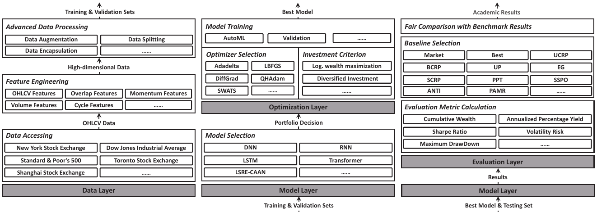

.. FinOL documentation master file, created by
   sphinx-quickstart on Mon Jul 22 13:30:51 2024.
   You can adapt this file completely to your liking, but it should at least
   contain the root `toctree` directive.

=====================================================
FinOL: Towards open benchmarking for data-driven OLPS
=====================================================

``FinOL`` represents a pioneering open database for facilitating data-driven OLPS research. As an
ambitious project, it collects and organizes extensive assets from global markets over half a century,
it provides a long-awaited unified platform to advance data-driven OLPS research.

What's NEW!
-----------

.. container::

   +-------------------------------------------------------+----------------+----------------+
   | Update                                                | Status         | Label          |
   |                                                       |                |                |
   +=======================================================+================+================+
   | New release! ``FinOL`` is going to release the        | Coming         | Release        |
   | official website                                      | soon......     |                |
   |                                                       |                |                |
   +-------------------------------------------------------+----------------+----------------+
   | New metric! ``FinOL`` is going to support the         | Coming         | Enhancement    |
   | `t-test <https://www.scienc                           | soon......     |                |
   | edirect.com/science/article/pii/S0004370215000168>`__ |                |                |
   | metric                                                |                |                |
   |                                                       |                |                |
   +-------------------------------------------------------+----------------+----------------+
   | New model! ``FinOL`` is going to support the          | Coming         | Enhancement    |
   | `AlphaStock <h                                        | soon......     |                |
   | ttps://dl.acm.org/doi/abs/10.1145/3292500.3330647>`__ |                |                |
   | model                                                 |                |                |
   |                                                       |                |                |
   +-------------------------------------------------------+----------------+----------------+
   | New release! ``FinOL`` now releases the `official     | Released       | Release        |
   | docs <https://finol.readthedocs.io/en/latest/>`__     | on             |                |
   |                                                       | 22 July        |                |
   |                                                       | 2024           |                |
   |                                                       |                |                |
   +-------------------------------------------------------+----------------+----------------+
   | New feature! ``FinOL`` now supports the `Auto         | Supported      | Enhancement    |
   | Hyperparameter Tuning                                 | since          |                |
   | <https://dl.acm.org/doi/10.1145/3292500.3330701>`__   | 22 July        |                |
   | feature                                               | 2024           |                |
   |                                                       |                |                |
   +-------------------------------------------------------+----------------+----------------+
   | New feature! ``FinOL`` now supports the `Radar        | Supported      | Enhancement    |
   | Chart <https://en.wikipedia.org/wiki/Radar_chart>`__  | since          |                |
   | evaluation                                            | 10 June        |                |
   |                                                       | 2024           |                |
   |                                                       |                |                |
   +-------------------------------------------------------+----------------+----------------+
   | New model! ``FinOL`` now supports the                 | Supported      | Enhancement    |
   | `AlphaPortfolio <https://pa                           | since          |                |
   | pers.ssrn.com/sol3/Papers.cfm?abstract_id=3554486>`__ | 06 June        |                |
   | model                                                 | 2024           |                |
   |                                                       |                |                |
   +-------------------------------------------------------+----------------+----------------+
   | New feature! ``FinOL`` now supports the `Economic     | Supported      | Enhancement    |
   | Distillation <https://pa                              | since          |                |
   | pers.ssrn.com/sol3/Papers.cfm?abstract_id=3554486>`__ | 15 May         |                |
   | feature                                               | 2024           |                |
   |                                                       |                |                |
   +-------------------------------------------------------+----------------+----------------+
   | New feature! ``FinOL`` now supports the               | Supported      | Enhancement    |
   | `Interpretability                                     | since          |                |
   | Analysis <h                                           | 16 April       |                |
   | ttps://dl.acm.org/doi/abs/10.1145/3292500.3330647>`__ | 2024           |                |
   | feature                                               |                |                |
   |                                                       |                |                |
   +-------------------------------------------------------+----------------+----------------+
   | New feature! ``FinOL`` now supports the `Winner       | Supported      | Enhancement    |
   | Assets                                                | since          |                |
   | Selection <h                                          | 14 April       |                |
   | ttps://dl.acm.org/doi/abs/10.1145/3292500.3330647>`__ | 2024           |                |
   | feature                                               |                |                |
   |                                                       |                |                |
   +-------------------------------------------------------+----------------+----------------+
   | Release ``FinOL`` `tutorials <finol/tutorials>`__     | Released       | Release        |
   |                                                       | on             |                |
   |                                                       | 22 March       |                |
   |                                                       | 2024           |                |
   |                                                       |                |                |
   +-------------------------------------------------------+----------------+----------------+
   | Release ``FinOL``                                     | Released       | Release        |
   | `v0.0.1 <https:                                       | on             |                |
   | //github.com/jiahaoli57/finol/releases/tag/v0.0.1>`__ | 21 March       |                |
   |                                                       | 2024           |                |
   |                                                       |                |                |
   +-------------------------------------------------------+----------------+----------------+

Outline
-------

-  `FinOL: Towards Open Benchmarking for Data-Driven Online Portfolio
   Selection <#finol>`__

   -  `Outline <#outline>`__
   -  `About <#about>`__
   -  `Why should I use FinOL? <#why-should-i-use-finOL?>`__
   -  `Installation <#installation>`__
   -  `Examples and Tutorials <#examples-and-tutorials>`__
   -  `Using FinOL <#using-FinOL>`__
   -  `File Structure <#file-structure>`__
   -  `Supported Datasets <#supported-datasets>`__
   -  `Supported Baselines <#supported-baselines>`__
   -  `Supported Metrics <#supported-metrics>`__
   -  `License <#license>`__
   -  `Contact Us <#contact-us>`__

About
-----

Online portfolio selection (OLPS) is an important issue in operations
research community that studies how to dynamically adjust portfolios
according to market changes. In the past, OLPS research relied on a
general database called ``OLPS`` containing price relatives data of
financial assets across different markets. However, with the widespread
adoption of data-driven technologies like machine learning in finance,
``OLPS`` can no longer meet the needs of OLPS research due to the lack
of support for high-dimensional feature spaces. To solve this problem,
we propose ``FinOL``, an open financial platform for advancing research
in data-driven OLPS. ``FinOL`` expands and enriches the previous
``OLPS`` database, containing 9 benchmark financial datasets from 1962
to present across global markets. To promote fair comparisons, we
evaluate a large number of past classic OLPS methods on ``FinOL``,
providing reusable benchmark results for future ``FinOL`` users and
effectively supporting OLPS research. More importantly, to lower the
barriers to research, ``FinOL`` provides a complete
data-training-testing suite with just three lines of command. We are
also committed to regularly updating ``FinOL`` with new data and
benchmark results reflecting the latest developments and trends in the
field. This ensures ``FinOL`` remains a valuable resource as data-driven
OLPS methods continue evolving.

.. centered:: *Overall Framework of FinOL*

Why should I use FinOL?
-----------------------

1. ``FinOL`` contributes comprehensive datasets spanning diverse market
   conditions and asset classes to enable large-scale empirical
   validation;
2. ``FinOL`` contributes the most extensive benchmark results to date
   for portfolio selection methods, providing the academic community an
   unbiased performance assessment;
3. ``FinOL`` contributes a user-friendly Python library for data-driven
   OLPS research, providing a comprehensive toolkit for academics to
   develop, test, and validate new OLPS methods.

Installation
------------

``FinOL`` is available on `PyPI <https://pypi.org/project/finol>`__,
we recommend to install ``FinOL`` via pip:

.. code:: bash

   > pip install finol

Examples and Tutorials
----------------------

You can find useful tutorials on how to use ``FinOL`` in the
`tutorials <finol/tutorials/README.md>`__ folder.

Here we show a simple application (taken from
`tutorial_2 <tutorials/tutorial_2.ipynb>`__): we transform asset “AA”
into a richer representation.

.. raw:: html

   

Visualization of Train Normalization Data for Asset “AA”

.. raw:: html

   

Using FinOL
-----------

To lower the barriers for the research community, ``FinOL`` provides a
complete data-training-testing suite with just three lines of command.

.. code:: python3

   from finol.data_layer.DatasetLoader import DatasetLoader
   from finol.optimization_layer.ModelTrainer import ModelTrainer
   from finol.evaluation_layer.ModelEvaluator import ModelEvaluator

   load_dataset_output = DatasetLoader().load_dataset()
   train_model_output = ModelTrainer(load_dataset_output).train_model()
   evaluate_model_output = ModelEvaluator(load_dataset_output, train_model_output).evaluate_model()

Supported Datasets
------------------

.. container::

   +--------------------------+----------------+-----------------+-----------+--------+---------------+--------------------+
   | Name                     | Market         | Country/Region  | Data      | # of   | Data Range    | # of               |
   |                          |                |                 | Frequency | Assets |               | Periods            |
   +==========================+================+=================+===========+========+===============+====================+
   | `NYSE(O)                 | Stock          | United States   | Daily     | 26     | 03/July./1962 | 5,651:             |
   | <https://github.com/ai   |                |                 |           |        | -             | 3,390/1,130/1,131  |
   | 4finol/FinOL_data/tree/m |                |                 |           |        | 31/Dec./1984  |                    |
   | ain/datasets/NYSE(O)>`__ |                |                 |           |        |               |                    |
   |                          |                |                 |           |        |               |                    |
   +--------------------------+----------------+-----------------+-----------+--------+---------------+--------------------+
   | `NYSE(N)                 | Stock          | United States   | Daily     | 403    | 02/Jan./1985  | 6,430:             |
   | <https://github.com/ai   |                |                 |           |        | -             | 3,858/1,286/1,286  |
   | 4finol/FinOL_data/tree/m |                |                 |           |        | 30/June./2010 |                    |
   | ain/datasets/NYSE(N)>`__ |                |                 |           |        |               |                    |
   |                          |                |                 |           |        |               |                    |
   +--------------------------+----------------+-----------------+-----------+--------+---------------+--------------------+
   | `DJIA                    | Stock          | United States   | Daily     | 28     | 14/Jan./2001  | 500:               |
   | <https://github.com      |                |                 |           |        | -             | 300/100/100        |
   | /ai4finol/FinOL_data/tre |                |                 |           |        | 14/Jan./2003  |                    |
   | e/main/datasets/DJIA>`__ |                |                 |           |        |               |                    |
   |                          |                |                 |           |        |               |                    |
   +--------------------------+----------------+-----------------+-----------+--------+---------------+--------------------+
   | `SP500                   | Stock          | United States   | Daily     | 339    | 02/Jan./1998  | 1,268:             |
   | <https://github.com/     |                |                 |           |        | -             | 756/256/256        |
   | ai4finol/FinOL_data/tree |                |                 |           |        | 31/Jan./2003  |                    |
   | /main/datasets/SP500>`__ |                |                 |           |        |               |                    |
   |                          |                |                 |           |        |               |                    |
   +--------------------------+----------------+-----------------+-----------+--------+---------------+--------------------+
   | `TSE <https://github.co  | Stock          | Canada          | Daily     | 48     | 12/Jan./1995  | 1,001:             |
   | m/ai4finol/FinOL_data/tr |                |                 |           |        | -             | 600/200/200        |
   | ee/main/datasets/TSE>`__ |                |                 |           |        | 31/Dec./1998  |                    |
   |                          |                |                 |           |        |               |                    |
   +--------------------------+----------------+-----------------+-----------+--------+---------------+--------------------+
   |                          |                |                 |           |        |               |                    |
   +--------------------------+----------------+-----------------+-----------+--------+---------------+--------------------+
   | `SSE <https://github.co  | Stock          | China           | Weekly    | 30     | 05/July./2010 | 678:               |
   | m/ai4finol/FinOL_data/tr |                |                 |           |        | -             | 406/136/136        |
   | ee/main/datasets/SSE>`__ |                |                 |           |        | 26/June./2023 |                    |
   |                          |                |                 |           |        |               |                    |
   +--------------------------+----------------+-----------------+-----------+--------+---------------+--------------------+
   | `HSI <https://github.co  | Stock          | Hong Kong, China| Weekly    | 53     | 05/July./2010 | 678:               |
   | m/ai4finol/FinOL_data/tr |                |                 |           |        | -             | 406/136/136        |
   | ee/main/datasets/HSI>`__ |                |                 |           |        | 26/June./2023 |                    |
   |                          |                |                 |           |        |               |                    |
   +--------------------------+----------------+-----------------+-----------+--------+---------------+--------------------+
   | `CMEG                    | Futures        | United States   | Weekly    | 25     | 05/July./2010 | 678:               |
   | <https://github.com      |                |                 |           |        | -             | 406/136/136        |
   | /ai4finol/FinOL_data/tre |                |                 |           |        | 26/June./2023 |                    |
   | e/main/datasets/CMEG>`__ |                |                 |           |        |               |                    |
   |                          |                |                 |           |        |               |                    |
   +--------------------------+----------------+-----------------+-----------+--------+---------------+--------------------+
   | `CRYPTO                  | Cryptocurrency | World           | Daily     | 43     | 09/Nov./2017  | 2,305:             |
   | <https://github.com/a    |                |                 |           |        | -             | 1,421/442/442      |
   | i4finol/FinOL_data/tree/ |                |                 |           |        | 01/Mar./2024  |                    |
   | main/datasets/CRYPTO>`__ |                |                 |           |        |               |                    |
   |                          |                |                 |           |        |               |                    |
   +--------------------------+----------------+-----------------+-----------+--------+---------------+--------------------+

Supported Baselines
-------------------

.. container::

   +-------------------+---------------------+--------------------------------------+----------------------------------+
   | Name              | Category            | Source                               | Journal/Conference               |
   |                   |                     |                                      |                                  |
   +===================+=====================+======================================+==================================+
   | Market            | Classic OLPS:       | –                                    | –                                |
   |                   | Benchmark baseline  |                                      |                                  |
   |                   |                     |                                      |                                  |
   +-------------------+---------------------+--------------------------------------+----------------------------------+
   | Best              | Classic OLPS:       | –                                    | –                                |
   |                   | Benchmark baseline  |                                      |                                  |
   |                   |                     |                                      |                                  |
   +-------------------+---------------------+--------------------------------------+----------------------------------+
   | UCRP              | Classic OLPS:       | `Kelly                               | *The Bell System                 |
   |                   | Benchmark baseline  | 1956 <https://ieeexplore.ieee        | Technical                        |
   |                   |                     | .org/abstract/document/6771227/>`__; | Journal*;                        |
   |                   |                     | `Cover                               | *Mathematical                    |
   |                   |                     | 1991 <https:                         | Finance*                         |
   |                   |                     | //onlinelibrary.wiley.com/doi/abs/10 |                                  |
   |                   |                     | .1111/j.1467-9965.1991.tb00002.x>`__ |                                  |
   |                   |                     |                                      |                                  |
   +-------------------+---------------------+--------------------------------------+----------------------------------+
   | BCRP              | Classic OLPS:       | `Cover                               | *Mathematical                    |
   |                   | Benchmark baseline  | 1991 <https:                         | Finance*                         |
   |                   |                     | //onlinelibrary.wiley.com/doi/abs/10 |                                  |
   |                   |                     | .1111/j.1467-9965.1991.tb00002.x>`__ |                                  |
   |                   |                     |                                      |                                  |
   |                   |                     |                                      |                                  |
   +-------------------+---------------------+--------------------------------------+----------------------------------+
   |                   |                     |                                      |                                  |
   +-------------------+---------------------+--------------------------------------+----------------------------------+
   | UP                | Classic OLPS:       | `Cover                               | *Mathematical                    |
   |                   | Follow-the-winner   | 1991 <https:                         | Finance*                         |
   |                   |                     | //onlinelibrary.wiley.com/doi/abs/10 |                                  |
   |                   |                     | .1111/j.1467-9965.1991.tb00002.x>`__ |                                  |
   |                   |                     |                                      |                                  |
   +-------------------+---------------------+--------------------------------------+----------------------------------+
   | EG                | Classic OLPS:       | `Helmbold et al.                     | *Mathematical                    |
   |                   | Follow-the-winner   | 1998                                 | Finance*                         |
   |                   |                     | <https://onlinelibrary.wiley.com     |                                  |
   |                   |                     | /doi/abs/10.1111/1467-9965.00058>`__ |                                  |
   |                   |                     |                                      |                                  |
   +-------------------+---------------------+--------------------------------------+----------------------------------+
   | SCRP              | Classic OLPS:       | `Gaivoronski and Stella              | *Annals of                       |
   |                   | Follow-the-winner   | 2000 <https://link.springer.com      | Operations                       |
   |                   |                     | /article/10.1023/A:1019271201970>`__ | Research*                        |
   |                   |                     |                                      |                                  |
   +-------------------+---------------------+--------------------------------------+----------------------------------+
   | PPT               | Classic OLPS:       | `Lai et                              | *IEEE                            |
   |                   | Follow-the-winner   | al. 2018 <https://ieeexplore.ie      | Transactions on                  |
   |                   |                     | ee.org/abstract/document/7942104>`__ | Neural Networks                  |
   |                   |                     |                                      | and Learning                     |
   |                   |                     |                                      | Systems*                         |
   |                   |                     |                                      |                                  |
   +-------------------+---------------------+--------------------------------------+----------------------------------+
   | SSPO              | Classic OLPS:       | `Lai et                              | *The Journal of                  |
   |                   | Follow-the-winner   | al. 2018 <https://www                | Machine Learning                 |
   |                   |                     | .jmlr.org/papers/v19/17-558.html>`__ | Research*                        |
   |                   |                     |                                      |                                  |
   +-------------------+---------------------+--------------------------------------+----------------------------------+
   |                   |                     |                                      |                                  |
   +-------------------+---------------------+--------------------------------------+----------------------------------+
   | ANTI\ :sup:`1`\   | Classic OLPS:       | `Borodin et                          | *Advances in                     |
   |                   | Follow-the-loser    | al. 2004 <h                          | Neural                           |
   |                   |                     | ttps://proceedings.neurips.cc/paper_ | Information                      |
   |                   |                     | files/paper/2003/hash/8c9f32e03aeb2e | Processing                       |
   |                   |                     | 3000825c8c875c4edd-Abstract.html>`__ | Systems*                         |
   |                   |                     |                                      |                                  |
   +-------------------+---------------------+--------------------------------------+----------------------------------+
   | ANTI\ :sup:`2`\   | Classic OLPS:       | `Borodin et                          | *Advances in                     |
   |                   | Follow-the-loser    | al. 2004 <h                          | Neural                           |
   |                   |                     | ttps://proceedings.neurips.cc/paper_ | Information                      |
   |                   |                     | files/paper/2003/hash/8c9f32e03aeb2e | Processing                       |
   |                   |                     | 3000825c8c875c4edd-Abstract.html>`__ | Systems*                         |
   |                   |                     |                                      |                                  |
   +-------------------+---------------------+--------------------------------------+----------------------------------+
   | PAMR              | Classic OLPS:       | `Li et al.                           | *Machine                         |
   |                   | Follow-the-loser    | 2012                                 | Learning*                        |
   |                   |                     | <https://link.springer.com/a         |                                  |
   |                   |                     | rticle/10.1007/s10994-012-5281-z>`__ |                                  |
   |                   |                     |                                      |                                  |
   +-------------------+---------------------+--------------------------------------+----------------------------------+
   | CWMR-Var          | Classic OLPS:       | `Li et                               | *ACM                             |
   |                   | Follow-the-loser    | al. 2013 <https://dl.acm.org         | Transactions on                  |
   |                   |                     | /doi/abs/10.1145/2435209.2435213>`__ | Knowledge                        |
   |                   |                     |                                      | Discovery from                   |
   |                   |                     |                                      | Data*                            |
   |                   |                     |                                      |                                  |
   +-------------------+---------------------+--------------------------------------+----------------------------------+
   | CWMR-Stdev        | Classic OLPS:       | `Li et                               | *ACM                             |
   |                   | Follow-the-loser    | al. 2013 <https://dl.acm.org         | Transactions on                  |
   |                   |                     | /doi/abs/10.1145/2435209.2435213>`__ | Knowledge                        |
   |                   |                     |                                      | Discovery from                   |
   |                   |                     |                                      | Data*                            |
   |                   |                     |                                      |                                  |
   +-------------------+---------------------+--------------------------------------+----------------------------------+
   | OLMAR-S           | Classic OLPS:       | `Li et                               | *Artificial                      |
   |                   | Follow-the-loser    | al. 2015                             | Intelligence*                    |
   |                   |                     | <https://www.sciencedirect.com/scien |                                  |
   |                   |                     | ce/article/pii/S0004370215000168>`__ |                                  |
   |                   |                     |                                      |                                  |
   +-------------------+---------------------+--------------------------------------+----------------------------------+
   | OLMAR-E           | Classic OLPS:       | `Li et                               | *Artificial                      |
   |                   | Follow-the-loser    | al. 2015                             | Intelligence*                    |
   |                   |                     | <https://www.sciencedirect.com/scien |                                  |
   |                   |                     | ce/article/pii/S0004370215000168>`__ |                                  |
   |                   |                     |                                      |                                  |
   +-------------------+---------------------+--------------------------------------+----------------------------------+
   | RMR               | Classic OLPS:       | `Huang et                            | *IEEE                            |
   |                   | Follow-the-loser    | al. 2016 <https://ieeexplore.ie      | Transactions on                  |
   |                   |                     | ee.org/abstract/document/7465840>`__ | Knowledge and                    |
   |                   |                     |                                      | Data                             |
   |                   |                     |                                      | Engineering*                     |
   |                   |                     |                                      |                                  |
   +-------------------+---------------------+--------------------------------------+----------------------------------+
   | RPRT              | Classic OLPS:       | `Lai et                              | *IEEE                            |
   |                   | Follow-the-loser    | al. 2020 <https://ieeexplore.iee     | Transactions on                  |
   |                   |                     | e.org/abstract/document/8411138/>`__ | Systems, Man,                    |
   |                   |                     |                                      | and Cybernetics:                 |
   |                   |                     |                                      | Systems*                         |
   |                   |                     |                                      |                                  |
   +-------------------+---------------------+--------------------------------------+----------------------------------+
   |                   |                     |                                      |                                  |
   +-------------------+---------------------+--------------------------------------+----------------------------------+
   | AICTR             | Classic OLPS:       | `Lai et                              | *IEEE                            |
   |                   | Pattern-matching    | al. 2018 <https://ieeexplore.ie      | Transactions on                  |
   |                   |                     | ee.org/abstract/document/8356708>`__ | Neural Networks                  |
   |                   |                     |                                      | and Learning                     |
   |                   |                     |                                      | Systems*                         |
   |                   |                     |                                      |                                  |
   +-------------------+---------------------+--------------------------------------+----------------------------------+
   | KTPT              | Classic OLPS:       | `Lai et                              | *Data Mining and                 |
   |                   | Pattern-matching    | al.                                  | Knowledge                        |
   |                   |                     | 2018 <https://link.springer.com/a    | Discovery*                       |
   |                   |                     | rticle/10.1007/s10618-018-0579-5>`__ |                                  |
   |                   |                     |                                      |                                  |
   +-------------------+---------------------+--------------------------------------+----------------------------------+
   |                   |                     |                                      |                                  |
   +-------------------+---------------------+--------------------------------------+----------------------------------+
   | SP                | Classic OLPS:       | `Singer                              | *International                   |
   |                   | Meta-learning       | 1997                                 | Journal of                       |
   |                   |                     | <https://www.worldscientific.com/d   | Neural Systems*                  |
   |                   |                     | oi/abs/10.1142/s0129065797000434>`__ |                                  |
   |                   |                     |                                      |                                  |
   +-------------------+---------------------+--------------------------------------+----------------------------------+
   | ONS               | Classic OLPS:       | `Agarwal et                          | *International                   |
   |                   | Meta-learning       | al. 2006 <https://dl.acm.org         | Conference on                    |
   |                   |                     | /doi/abs/10.1145/1143844.1143846>`__ | Machine                          |
   |                   |                     |                                      | Learning*                        |
   |                   |                     |                                      |                                  |
   +-------------------+---------------------+--------------------------------------+----------------------------------+
   | GRW               | Classic OLPS:       | `Levina and Shafer                   | *International                   |
   |                   | Meta-learning       | 2008                                 | Journal of                       |
   |                   |                     | <https://www.worldscientific.com/d   | Uncertainty,                     |
   |                   |                     | oi/abs/10.1142/S0218488508005364>`__ | Fuzziness and                    |
   |                   |                     |                                      | Knowledge-Based                  |
   |                   |                     |                                      | Systems*                         |
   |                   |                     |                                      |                                  |
   +-------------------+---------------------+--------------------------------------+----------------------------------+
   | WAAS              | Classic OLPS:       | `Zhang and Yang                      | *Computational                   |
   |                   | Meta-learning       | 2017 <https://link.springer.com/a    | Economics*                       |
   |                   |                     | rticle/10.1007/s10614-016-9585-0>`__ |                                  |
   |                   |                     |                                      |                                  |
   |                   |                     |                                      |                                  |
   +-------------------+---------------------+--------------------------------------+----------------------------------+
   | CW-OGD            | Classic OLPS:       | `Zhang et                            | *Knowledge-Based                 |
   |                   | Meta-learning       | al. 2021                             | Systems*                         |
   |                   |                     | <https://www.sciencedirect.com/scien |                                  |
   |                   |                     | ce/article/pii/S0950705121007954>`__ |                                  |
   |                   |                     |                                      |                                  |
   |                   |                     |                                      |                                  |
   +-------------------+---------------------+--------------------------------------+----------------------------------+

Supported Metrics
-----------------

.. container::

   +-------------------------------------------+------------------+--------------+
   | Name                                      | Abbreviation     | Category     |
   |                                           |                  |              |
   +===========================================+==================+==============+
   | Cumulative Wealth                         | CW               | Profit       |
   |                                           |                  | Metric       |
   +-------------------------------------------+------------------+--------------+
   | Annualized Percentage Yield               | APY              | Profit       |
   |                                           |                  | Metric       |
   +-------------------------------------------+------------------+--------------+
   | Sharpe Ratio                              | SR               | Profit       |
   |                                           |                  | Metric       |
   +-------------------------------------------+------------------+--------------+
   |                                           |                  |              |
   +-------------------------------------------+------------------+--------------+
   | Volatility Risk                           | VR               | Risk Metric  |
   +-------------------------------------------+------------------+--------------+
   | Maximum DrawDown                          | MDD              | Risk Metric  |
   +-------------------------------------------+------------------+--------------+
   |                                           |                  |              |
   +-------------------------------------------+------------------+--------------+
   | Average Turnover                          | ATO              | Practical    |
   |                                           |                  | Metric       |
   +-------------------------------------------+------------------+--------------+
   | Transaction Costs-Adjusted Cumulative     | TCW              | Practical    |
   | Wealth                                    |                  | Metric       |
   +-------------------------------------------+------------------+--------------+
   | Running Time                              | RT               | Practical    |
   |                                           |                  | Metric       |
   +-------------------------------------------+------------------+--------------+

Supported Visualization
-----------------------

The FInOL project provides a suite of visualization tools to facilitate
a comprehensive evaluation of data-driven OLPS research. Here are some
examples:

1. Dynamic Training/Validation Loss Visualization

   .. raw:: html

      

.. raw:: html

   

2. Daily Cumulative Wealth Visualization

   .. raw:: html

      

3. Daily DrawDown

   .. raw:: html

      

4. Transaction Cost-Adjusted Cumulative Wealth

   .. raw:: html

      

5. Comprehensive Radar Chart

   .. raw:: html

      

File Structure
--------------

::

   FinOL
   ├─ LICENSE
   ├─ MANIFEST.in
   ├─ README.md
   ├─ TA_Lib-0.4.24-cp39-cp39-win_amd64.whl
   ├─ figure
   │    ├─ FinOL.png
   │    ├─ logo.png
   │    └─ tutorial_2.png
   ├─ finol
   │    ├─ __init__.py
   │    ├─ config.py
   │    ├─ data
   │    │    ├─ benchmark_results
   │    │    │    ├─ __init__.py
   │    │    │    ├─ other
   │    │    │    │    └─ price_relative
   │    │    │    │           ├─ price_relative_CMEG.mat
   │    │    │    │           ├─ price_relative_CRYPTO.mat
   │    │    │    │           ├─ price_relative_DJIA.mat
   │    │    │    │           ├─ price_relative_HSI.mat
   │    │    │    │           ├─ price_relative_NYSE(N).mat
   │    │    │    │           ├─ price_relative_NYSE(O).mat
   │    │    │    │           ├─ price_relative_SP500.mat
   │    │    │    │           ├─ price_relative_SSE.mat
   │    │    │    │           └─ price_relative_TSE.mat
   │    │    │    ├─ practical_metrics
   │    │    │    │    ├─ CMEG
   │    │    │    │    │    ├─ final_practical_result.xlsx
   │    │    │    │    │    └─ transaction_costs_adjusted_cumulative_wealth.xlsx
   │    │    │    │    ├─ CRYPTO
   │    │    │    │    │    ├─ final_practical_result.xlsx
   │    │    │    │    │    └─ transaction_costs_adjusted_cumulative_wealth.xlsx
   │    │    │    │    ├─ DJIA
   │    │    │    │    │    ├─ final_practical_result.xlsx
   │    │    │    │    │    └─ transaction_costs_adjusted_cumulative_wealth.xlsx
   │    │    │    │    ├─ HSI
   │    │    │    │    │    ├─ final_practical_result.xlsx
   │    │    │    │    │    └─ transaction_costs_adjusted_cumulative_wealth.xlsx
   │    │    │    │    ├─ NYSE(N)
   │    │    │    │    │    ├─ final_practical_result.xlsx
   │    │    │    │    │    └─ transaction_costs_adjusted_cumulative_wealth.xlsx
   │    │    │    │    ├─ NYSE(O)
   │    │    │    │    │    ├─ final_practical_result.xlsx
   │    │    │    │    │    └─ transaction_costs_adjusted_cumulative_wealth.xlsx
   │    │    │    │    ├─ SP500
   │    │    │    │    │    ├─ final_practical_result.xlsx
   │    │    │    │    │    └─ transaction_costs_adjusted_cumulative_wealth.xlsx
   │    │    │    │    ├─ SSE
   │    │    │    │    │    ├─ final_practical_result.xlsx
   │    │    │    │    │    └─ transaction_costs_adjusted_cumulative_wealth.xlsx
   │    │    │    │    └─ TSE
   │    │    │    │           ├─ final_practical_result.xlsx
   │    │    │    │           └─ transaction_costs_adjusted_cumulative_wealth.xlsx
   │    │    │    ├─ profit_metrics
   │    │    │    │    ├─ CMEG
   │    │    │    │    │    ├─ daily_cumulative_wealth.xlsx
   │    │    │    │    │    ├─ daily_return.xlsx
   │    │    │    │    │    └─ final_profit_result.xlsx
   │    │    │    │    ├─ CRYPTO
   │    │    │    │    │    ├─ daily_cumulative_wealth.xlsx
   │    │    │    │    │    ├─ daily_return.xlsx
   │    │    │    │    │    └─ final_profit_result.xlsx
   │    │    │    │    ├─ DJIA
   │    │    │    │    │    ├─ daily_cumulative_wealth.xlsx
   │    │    │    │    │    ├─ daily_return.xlsx
   │    │    │    │    │    └─ final_profit_result.xlsx
   │    │    │    │    ├─ HSI
   │    │    │    │    │    ├─ daily_cumulative_wealth.xlsx
   │    │    │    │    │    ├─ daily_return.xlsx
   │    │    │    │    │    └─ final_profit_result.xlsx
   │    │    │    │    ├─ NYSE(N)
   │    │    │    │    │    ├─ daily_cumulative_wealth.xlsx
   │    │    │    │    │    ├─ daily_return.xlsx
   │    │    │    │    │    └─ final_profit_result.xlsx
   │    │    │    │    ├─ NYSE(O)
   │    │    │    │    │    ├─ daily_cumulative_wealth.xlsx
   │    │    │    │    │    ├─ daily_return.xlsx
   │    │    │    │    │    └─ final_profit_result.xlsx
   │    │    │    │    ├─ SP500
   │    │    │    │    │    ├─ daily_cumulative_wealth.xlsx
   │    │    │    │    │    ├─ daily_return.xlsx
   │    │    │    │    │    └─ final_profit_result.xlsx
   │    │    │    │    ├─ SSE
   │    │    │    │    │    ├─ daily_cumulative_wealth.xlsx
   │    │    │    │    │    ├─ daily_return.xlsx
   │    │    │    │    │    └─ final_profit_result.xlsx
   │    │    │    │    └─ TSE
   │    │    │    │           ├─ daily_cumulative_wealth.xlsx
   │    │    │    │           ├─ daily_return.xlsx
   │    │    │    │           └─ final_profit_result.xlsx
   │    │    │    └─ risk_metrics
   │    │    │           ├─ CMEG
   │    │    │           │    ├─ daily_drawdown.xlsx
   │    │    │           │    └─ final_risk_result.xlsx
   │    │    │           ├─ CRYPTO
   │    │    │           │    ├─ daily_drawdown.xlsx
   │    │    │           │    └─ final_risk_result.xlsx
   │    │    │           ├─ DJIA
   │    │    │           │    ├─ daily_drawdown.xlsx
   │    │    │           │    └─ final_risk_result.xlsx
   │    │    │           ├─ HSI
   │    │    │           │    ├─ daily_drawdown.xlsx
   │    │    │           │    └─ final_risk_result.xlsx
   │    │    │           ├─ NYSE(N)
   │    │    │           │    ├─ daily_drawdown.xlsx
   │    │    │           │    └─ final_risk_result.xlsx
   │    │    │           ├─ NYSE(O)
   │    │    │           │    ├─ daily_drawdown.xlsx
   │    │    │           │    └─ final_risk_result.xlsx
   │    │    │           ├─ SP500
   │    │    │           │    ├─ daily_drawdown.xlsx
   │    │    │           │    └─ final_risk_result.xlsx
   │    │    │           ├─ SSE
   │    │    │           │    ├─ daily_drawdown.xlsx
   │    │    │           │    └─ final_risk_result.xlsx
   │    │    │           └─ TSE
   │    │    │                  ├─ daily_drawdown.xlsx
   │    │    │                  └─ final_risk_result.xlsx
   │    │    └─ datasets
   │    │           ├─ CMEG
   │    │           ├─ CRYPTO
   │    │           ├─ DJIA
   │    │           ├─ HSI
   │    │           ├─ NYSE(N)
   │    │           ├─ NYSE(O)
   │    │           ├─ SP500
   │    │           ├─ SSE
   │    │           └─ TSE
   │    ├─ data_layer
   │    │    ├─ __init__.py
   │    │    ├─ data_loader.py
   │    │    └─ scaler_selector.py
   │    ├─ evaluation_layer
   │    │    ├─ __init__.py
   │    │    ├─ benchmark_loader.py
   │    │    ├─ metric_caculator.py
   │    │    └─ model_evaluator.py
   │    ├─ main
   │    │    ├─ main.ipynb
   │    │    └─ main.py
   │    ├─ model_layer
   │    │    ├─ __init__.py
   │    │    ├─ CNN.py
   │    │    ├─ DNN.py
   │    │    ├─ LSRE_CAAN.py
   │    │    ├─ LSTM.py
   │    │    ├─ RNN.py
   │    │    ├─ Transformer.py
   │    │    └─ model_selector.py
   │    ├─ optimization_layer
   │    │    ├─ __init__.py
   │    │    ├─ criterion_selector.py
   │    │    ├─ model_trainer.py
   │    │    └─ optimizer_selector.py
   │    ├─ setup.py
   │    ├─ tutorials
   │    │    ├─ README.md
   │    │    ├─ _.ipynb
   │    │    ├─ tutorial_1.ipynb
   │    │    ├─ tutorial_2.ipynb
   │    │    ├─ tutorial_3.ipynb
   │    │    └─ tutorial_4.ipynb
   │    ├─ update
   │    │    └─ __init__.py
   │    └─ utils.py
   ├─ logdir
   ├─ requirements.txt
   └─ setup.py

License
-------

Released under the `MIT
License <https://github.com/jiahaoli57/finol/blob/main/LICENSE>`__.

Contact Us
----------

For inquiries, please get in touch with us at finol.official@gmail.com
(Monday to Friday, 9:00 AM to 6:00 PM)

.. toctree::
   :maxdepth: 2
   :caption: Contents:

   installation
   quickstart
   tutorials/index
   user_guide/index
   contributing
   api/index
   changelog
   faq

Indices and tables
==================

* :ref:`genindex`
* :ref:`modindex`
* :ref:`search`