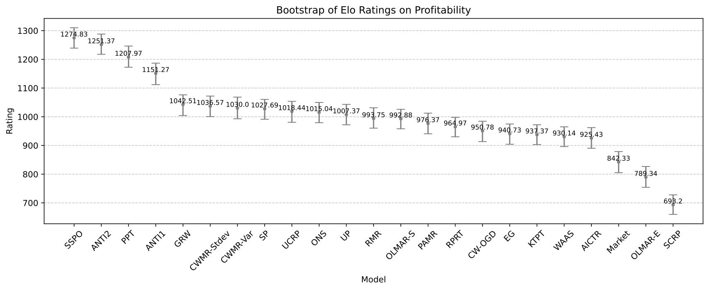
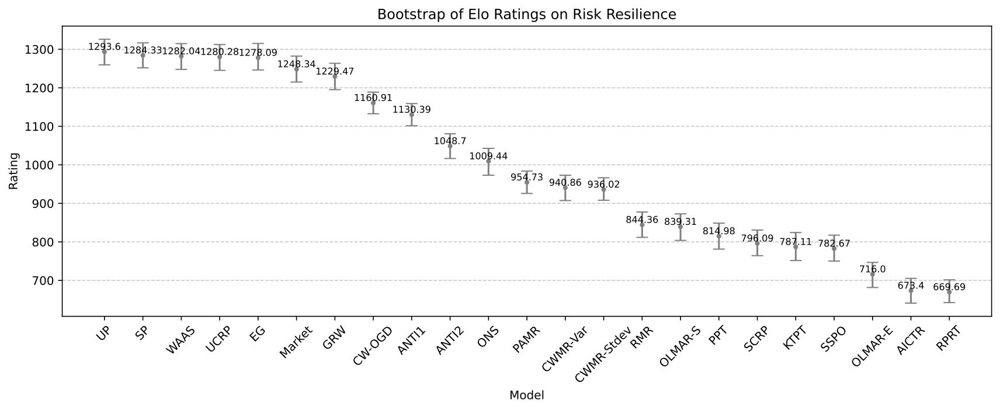
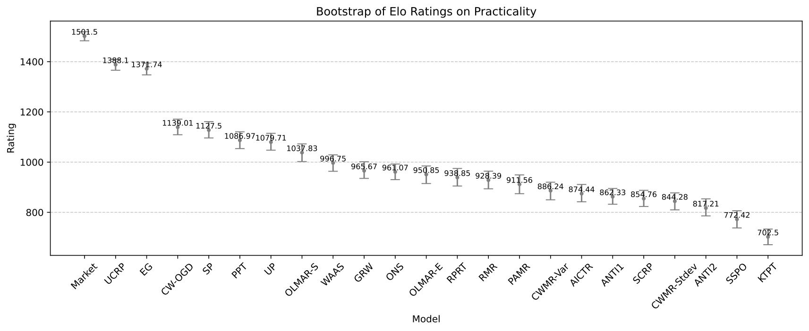

.. _supported_elo:

Elo Ranking System
==================

The Elo ranking system, originally developed for two-player games like chess, is designed to provide a dynamic and
quantitative measure of player (or model) skill levels based on their performance in head-to-head matches.
By continuously updating ratings after each competition, the Elo system reflects the most current abilities of models,
allowing for more accurate comparisons.

In the context of OLPS, comparing the performance of different methods across various datasets can be challenging.
Given that a method may excel in one dataset but underperform in another,
it becomes crucial to establish a ranking method for comparing methods across different datasets.

Initially, we created a simple linear updating version of the Elo ranking system.
The core formula for updating the ratings of two competing models, :math:`a` and :math:`b`, is as follows:

1. Initialize ratings:

.. math::
   R_i = 1000 \quad \text{for all models } i

2. Allow each method, excluding the BEST and BCRP hindsight methods, to compete against each other in a pairwise manner on the same dataset and metric:

.. code-block:: python3

    >>> print(battles)

          model_a  model_b  dataset  metric   winner
    0      Market     UCRP  NYSE(O)      CW  model_b
    1      Market     UCRP  NYSE(O)     APY  model_b
    2      Market     UCRP  NYSE(O)      SR  model_b
    3      Market       UP  NYSE(O)      CW  model_b
    4      Market       UP  NYSE(O)     APY  model_b
    ...       ...      ...      ...     ...      ...
    13657  CW-OGD      GRW   CRYPTO     APY  model_b
    13658  CW-OGD      GRW   CRYPTO      SR  model_b
    13659  CW-OGD     WAAS   CRYPTO      CW  model_b
    13660  CW-OGD     WAAS   CRYPTO     APY  model_b
    13661  CW-OGD     WAAS   CRYPTO      SR  model_b

    [13662 rows x 5 columns]

3. For each battle between models :math:`a` and :math:`b`, calculate expected scores:

.. math::

    E_a = \frac{1}{1 + 10^{\frac{R_b - R_a}{S}}}  \quad \text{and}  \quad E_b = \frac{1}{1 + 10^{\frac{R_a - R_b}{S}}},

where :math:`R_a` and :math:`R_b` are the current ratings of models :math:`a` and :math:`b`,
respectively, and :math:`S=400` is the scaling factor we set.

3. Determine actual scores:

   - If model :math:`a` wins: :math:`S_a = 1`
   - If model :math:`b` wins: :math:`S_a = 0`
   - If it's a tie: :math:`S_a = 0.5`

4. Update ratings based on the battle outcome:

.. math::

    R_a' = R_a + K \times (S_a - E_a)

.. math::

    R_b' = R_b + K \times (S_b - E_b)

where :math:`K` is the Elo update factor, :math:`R'_a` and :math:`R'_b` are the updated ratings after the battle.

The initial implementation is detailed in the following code:

.. code-block:: python3

    >>> def compute_elo(battles, K=4, SCALE=400, BASE=10, INIT_RATING=1000):
    >>>     rating = defaultdict(lambda: INIT_RATING)

    >>>     for rd, model_a, model_b, winner in battles[['model_a', 'model_b', 'winner']].itertuples():
    >>>     ra = rating[model_a]
    >>>     rb = rating[model_b]
    >>>     ea = 1 / (1 + BASE ** ((rb - ra) / SCALE))
    >>>     eb = 1 / (1 + BASE ** ((ra - rb) / SCALE))
    >>>     if winner == "model_a":
    >>>         sa = 1
    >>>     elif winner == "model_b":
    >>>         sa = 0
    >>>     elif winner == "tie" or winner == "tie (bothbad)":
    >>>         sa = 0.5
    >>>     else:
    >>>         raise Exception(f"unexpected vote {winner}")
    >>>     rating[model_a] += K * (sa - ea)
    >>>     rating[model_b] += K * (1 - sa - eb)

    >>> return rating

However, we observed that even with a small Elo update factor (:math:`K`),
the ranking system was sensitive to the order of battles. To mitigate this,
we employed a bootstrap method to enhance the Elo ranking system,
allowing us to obtain confidence intervals for the ratings. The key steps are as follows:

1.  We run the `compute_elo` function multiple times (e.g., 1,000 times) on bootstrap samples of the battle data.
2.  This gives us a distribution of Elo ratings for each model, which we can then use to compute robust statistics like the median and confidence intervals.
3.  The final Elo rankings are based on the median Elo ratings across the bootstrap samples.

This process is implemented in the following code:

.. code-block:: python3

    >>> def get_bootstrap_result(battles, func_compute_elo, num_round):
    >>>     rows = []
    >>>     for i in tqdm(range(num_round), desc="bootstrap"):
    >>>         rows.append(func_compute_elo(battles.sample(frac=1.0, replace=True)))
    >>>     df = pd.DataFrame(rows)
    >>>     return df[df.median().sort_values(ascending=False).index]

    >>> BOOTSTRAP_ROUNDS = 1000
    >>> np.random.seed(config["MANUAL_SEED"])
    >>> bootstrap_elo_lu = get_bootstrap_result(battles, compute_elo, BOOTSTRAP_ROUNDS)
    >>> bootstrap_lu_median = bootstrap_elo_lu.median().reset_index().set_axis(["model", "Elo rating"], axis=1)
    >>> bootstrap_lu_median["Elo rating"] = (bootstrap_lu_median["Elo rating"] + 0.5).astype(int)

This approach provides a principle of comparing different OLPS methods.

Elo Ranking Results on Profitability
------------------------------------

   Bootstrap Estimates of Elo Ratings on Profitability

.. table:: Elo Ranking Results on Profitability
   :class: ghost
   :widths: auto

   +-------------------+-------------+-------------+
   | Model             | Elo Rating  | Rank        |
   +===================+=============+=============+
   | SSPO              | 1275        | 1           |
   +-------------------+-------------+-------------+
   | ANTI\ :sup:`2`\   | 1251        | 2           |
   +-------------------+-------------+-------------+
   | PPT               | 1208        | 3           |
   +-------------------+-------------+-------------+
   | ANTI\ :sup:`1`\   | 1151        | 4           |
   +-------------------+-------------+-------------+
   | GRW               | 1043        | 5           |
   +-------------------+-------------+-------------+
   | CWMR-Stdev        | 1037        | 6           |
   +-------------------+-------------+-------------+
   | CWMR-Var          | 1030        | 7           |
   +-------------------+-------------+-------------+
   | SP                | 1028        | 8           |
   +-------------------+-------------+-------------+
   | UCRP              | 1018        | 9           |
   +-------------------+-------------+-------------+
   | ONS               | 1015        | 10          |
   +-------------------+-------------+-------------+
   | UP                | 1007        | 11          |
   +-------------------+-------------+-------------+
   | RMR               | 994         | 12          |
   +-------------------+-------------+-------------+
   | OLMAR-S           | 993         | 13          |
   +-------------------+-------------+-------------+
   | PAMR              | 976         | 14          |
   +-------------------+-------------+-------------+
   | RPRT              | 965         | 15          |
   +-------------------+-------------+-------------+
   | CW-OGD            | 951         | 16          |
   +-------------------+-------------+-------------+
   | EG                | 941         | 17          |
   +-------------------+-------------+-------------+
   | KTPT              | 937         | 18          |
   +-------------------+-------------+-------------+
   | WAAS              | 930         | 19          |
   +-------------------+-------------+-------------+
   | AICTR             | 925         | 20          |
   +-------------------+-------------+-------------+
   | Market            | 842         | 21          |
   +-------------------+-------------+-------------+
   | OLMAR-E           | 789         | 22          |
   +-------------------+-------------+-------------+
   | SCRP              | 693         | 23          |
   +-------------------+-------------+-------------+

Elo Ranking Results on Risk Resilience
--------------------------------------

   Bootstrap Estimates of Elo Ratings on Risk Resilience

.. table:: Elo Ranking Results on Risk Resilience
   :class: ghost
   :widths: auto

   +-------------------+-------------+-------------+
   | Model             | Elo Rating  | Rank        |
   +===================+=============+=============+
   | UP                | 1294        | 1           |
   +-------------------+-------------+-------------+
   | SP                | 1284        | 2           |
   +-------------------+-------------+-------------+
   | WAAS              | 1282        | 3           |
   +-------------------+-------------+-------------+
   | UCRP              | 1280        | 4           |
   +-------------------+-------------+-------------+
   | EG                | 1278        | 5           |
   +-------------------+-------------+-------------+
   | Market            | 1248        | 6           |
   +-------------------+-------------+-------------+
   | GRW               | 1229        | 7           |
   +-------------------+-------------+-------------+
   | CW-OGD            | 1161        | 8           |
   +-------------------+-------------+-------------+
   | ANTI\ :sup:`1`\   | 1130        | 9           |
   +-------------------+-------------+-------------+
   | ANTI\ :sup:`2`\   | 1049        | 10          |
   +-------------------+-------------+-------------+
   | ONS               | 1009        | 11          |
   +-------------------+-------------+-------------+
   | PAMR              | 955         | 12          |
   +-------------------+-------------+-------------+
   | CWMR-Var          | 941         | 13          |
   +-------------------+-------------+-------------+
   | CWMR-Stdev        | 936         | 14          |
   +-------------------+-------------+-------------+
   | RMR               | 844         | 15          |
   +-------------------+-------------+-------------+
   | OLMAR-S           | 839         | 16          |
   +-------------------+-------------+-------------+
   | PPT               | 815         | 17          |
   +-------------------+-------------+-------------+
   | SCRP              | 796         | 18          |
   +-------------------+-------------+-------------+
   | KTPT              | 787         | 19          |
   +-------------------+-------------+-------------+
   | SSPO              | 783         | 20          |
   +-------------------+-------------+-------------+
   | OLMAR-E           | 716         | 21          |
   +-------------------+-------------+-------------+
   | AICTR             | 673         | 22          |
   +-------------------+-------------+-------------+
   | RPRT              | 670         | 23          |
   +-------------------+-------------+-------------+

Elo Ranking Results on Practicality
-----------------------------------

   Bootstrap Estimates of Elo Ratings on Profitability

.. table:: Elo Ranking Results on Practicality
   :class: ghost
   :widths: auto

   +-------------------+-------------+-------------+
   | Model             | Elo Rating  | Rank        |
   +===================+=============+=============+
   | Market            | 1502        | 1           |
   +-------------------+-------------+-------------+
   | UCRP              | 1388        | 2           |
   +-------------------+-------------+-------------+
   | EG                | 1372        | 3           |
   +-------------------+-------------+-------------+
   | CW-OGD            | 1139        | 4           |
   +-------------------+-------------+-------------+
   | SP                | 1128        | 5           |
   +-------------------+-------------+-------------+
   | PPT               | 1087        | 6           |
   +-------------------+-------------+-------------+
   | UP                | 1080        | 7           |
   +-------------------+-------------+-------------+
   | OLMAR-S           | 1038        | 8           |
   +-------------------+-------------+-------------+
   | WAAS              | 997         | 9           |
   +-------------------+-------------+-------------+
   | GRW               | 966         | 10          |
   +-------------------+-------------+-------------+
   | ONS               | 961         | 11          |
   +-------------------+-------------+-------------+
   | OLMAR-E           | 951         | 12          |
   +-------------------+-------------+-------------+
   | RPRT              | 939         | 13          |
   +-------------------+-------------+-------------+
   | RMR               | 928         | 14          |
   +-------------------+-------------+-------------+
   | PAMR              | 912         | 15          |
   +-------------------+-------------+-------------+
   | CWMR-Var          | 886         | 16          |
   +-------------------+-------------+-------------+
   | AICTR             | 874         | 17          |
   +-------------------+-------------+-------------+
   | ANTI\ :sup:`1`\   | 862         | 18          |
   +-------------------+-------------+-------------+
   | SCRP              | 855         | 19          |
   +-------------------+-------------+-------------+
   | CWMR-Stdev        | 844         | 20          |
   +-------------------+-------------+-------------+
   | ANTI\ :sup:`2`\   | 817         | 21          |
   +-------------------+-------------+-------------+
   | SSPO              | 772         | 22          |
   +-------------------+-------------+-------------+
   | KTPT              | 703         | 23          |
   +-------------------+-------------+-------------+