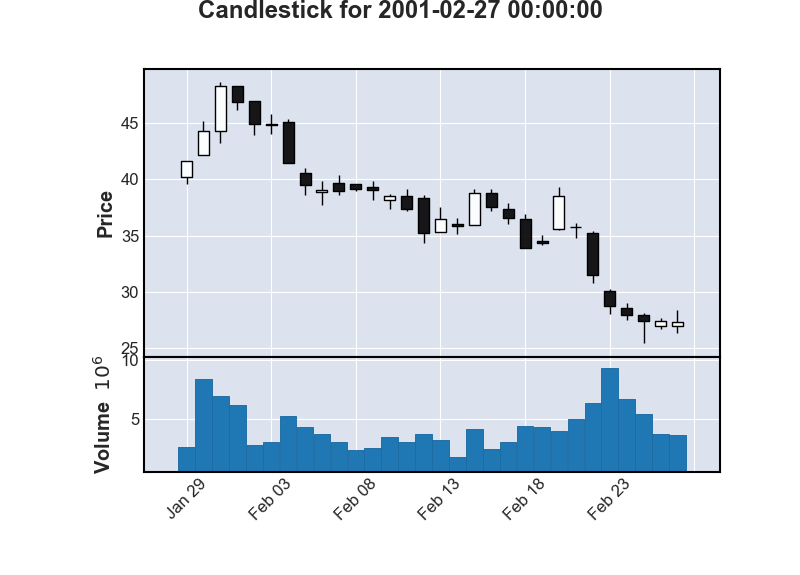

.. _supported_images:

Image Data Input
================

    Why is it beneficial to encode market data as an image rather than in the
    more standard time-series numerical format? The first reason is that the leading
    CNN architectures are custom crafted for image analysis. Therefore, to
    enjoy the CNN's benefits of automated signal generation, it is useful to represent
    price data in the format naturally ingested by the CNN, that is, as an
    image. Second, representing time-series as an image allows the model to focus
    on relational attributes of the data that would be difficult to tease out with time-series methods.
    This is the same basic rationale for why humans illustrate
    patterns graphically rather than with lists of numbers. If a human can
    more readily detect patterns in images by consuming an entire data matrix
    through a single visualization, a statistical pattern recognition algorithm may
    benefit from doing so as well. Third, the process of imaging price and volume
    data converts all assets' data histories into a comparable scale. We show that
    this particular rescaling choice has large benefits for prediction in the panel
    of stocks. Fourth, technical trading hinges on the presence of geometric shapes
    visually defined and observed by human cognition. Technical traders have long
    used price charts as an information source to predict returns and make investment
    decisions.

    -- Jiang J, Kelly B, Xiu D. (Re-)Imag(in)ing Price Trends[J]. The Journal of Finance, 2023, 78(6): 3193-3249.

Getting Started with Image Data
--------------------------------

To begin using image data, we employ the ``mplfinance`` library.
For installation instructions, refer to :ref:`installation`.
We've made minor modifications to ``FinOL``,
enabling the transformation of raw data into images and allowing users to resize these images based on configurations
specified in a configuration file.

The following figures provide examples of stock charts generated by ``FinOL`` at different window sizes (10, 30, 60):

   10-day Candlestick Chart

   30-day Candlestick Chart

   60-day Candlestick Chart

Again, we are committed to ensuring that the process of using ``FinOL`` is as easy as possible.
To get started, users simply need to configure their ``config.json`` file as follows:

.. code-block:: json
    :caption: config.json

    "DATA_AUGMENTATION_CONFIG": {
        // ...
        "IMAGE_DATA": {
            "INCLUDE_IMAGE_DATA": true,
            "SIDE_LENGTH": 224
        }
    }

By selecting a model such as CNN, CNN-JF, or a custom image-processing model in the ``config.json``:

.. code-block:: json
    :caption: config.json

    "MODEL_NAME": "CNN"

Users can then execute the complete ``FinOL`` pipeline with ease.

This approach not only streamlines the process of incorporating image data into data-driven OLPS
but also opens up new avenues for predictive modeling and pattern recognition in this field.
By leveraging the power of CNNs and the intuitive nature of image data,
``FinOL`` empowers users to uncover insights that may not be apparent through conventional numerical analysis.

The Development is Ongoing
----------------------------

We want to note that development of ``FinOL``'s image processing capabilities is ongoing,
with future plans to explore and develop features including but not limited to:

- Data augmentation techniques for time series images such as cropping, flipping, resizing to enhance model generalizability;
- Explainability tools based on image recognition to help users understand the rationale behind model decisions.
- Integration of more advanced deep learning models to improve the accuracy and efficiency of image processing.
- Development of a user-friendly interface to make the configuration and execution process more intuitive.

.. seealso::
   See :ref:`image_representation` for more details.