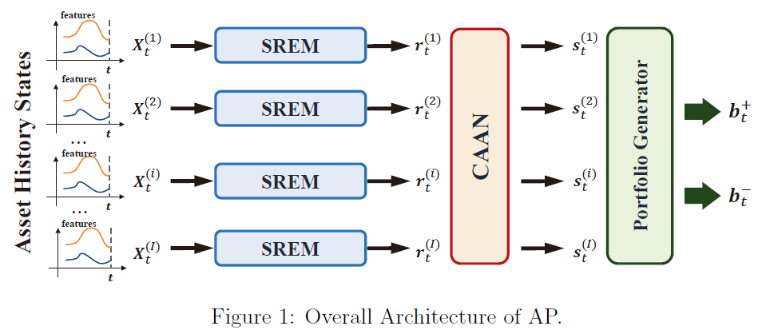
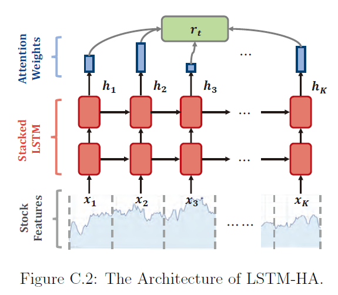
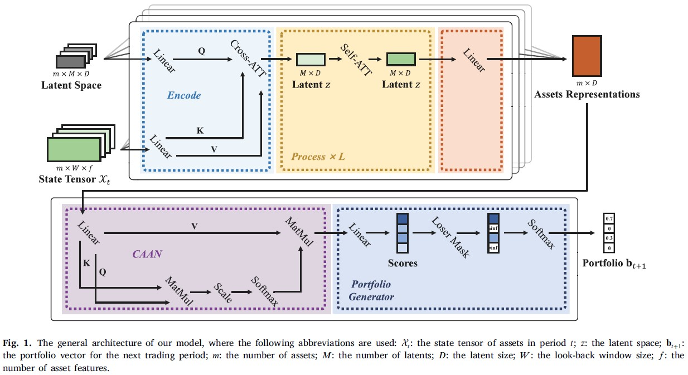
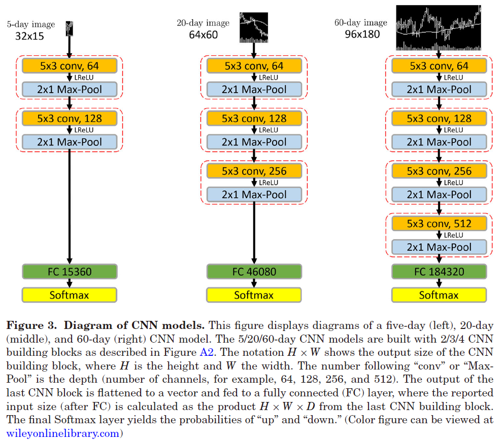

.. _supported_models:

Pre-built Models
================

.. seealso::
   See :mod:`~finol.model_layer` for more details.

As a software package, part of the innovation of ``FinOL`` is the pre-implemented models in its model layer.
These pre-built models serve as a significant advantage for researchers in the data-driven OLPS domain,
offering them a solid foundation to build upon.
By leveraging these models, researchers can streamline the initial phases of their projects,
circumventing the need to build complex models from scratch and thereby conserving valuable time and resources.

Time Series Representation Models
---------------------------------

The time series representation models within ``FinOL`` are implemented to address the unique challenges of
sequential data in data-driven OLPS. These models are specifically designed to handle sequential inputs,
ensuring that the temporal dependencies inherent in financial time series data are accurately captured and analyzed.
By leveraging these models, researchers can gain deeper insights into market trends, price movements,
and other critical factors that influence data-driven OLPS task.

AlphaPortfolio
~~~~~~~~~~~~~~

   Overall Framework of AlphaPortfolio

:Description: The AlphaPortfolio model is a Transformer-based model for asset scoring and portfolio selection.
:Basic Idea: Leverages attention mechanisms to score assets based on their historical performance.
:Construction: `Source code for AlphaPortfolio <https://finol.readthedocs.io/en/latest/_modules/finol/model_layer/AlphaPortfolio.html#AlphaPortfolio>`_
:Pros: High accuracy in scoring assets; interpretable results through economic distillation.
:Cons: Computationally intensive; requires careful tuning of hyperparameters.
:Details: The AlphaPortfolio model takes an input tensor ``x`` of shape ``(batch_size, num_assets, num_features_augmented)``, where ``num_features_augmented`` represents the number of features (including any preprocessed or augmented features) for each asset. The final output of the AlphaPortfolio model is a tensor of shape ``(batch_size, num_assets)``, where each element represents the predicted score for the corresponding asset.

For more details, please refer to the paper `AlphaPortfolio: Direct Construction through Reinforcement Learning
and Interpretable AI <https://papers.ssrn.com/sol3/papers.cfm?abstract_id=3698800>`__.

.. table:: Table C.1: Hyperparameters of TE-CAAN-Based AP.
    :class: ghost

    +----------------------+--------+-----------------+--------+
    | Hyper-parameter      | Choice | Hyper-parameter | Choice |
    +======================+========+=================+========+
    | Embedding dimension  | 256    | Optimizer       | SGD    |
    +----------------------+--------+-----------------+--------+
    | Feed-forward network | 1021   | Learning rate   | 0.0001 |
    +----------------------+--------+-----------------+--------+
    | Number of multi-head | 4      | Dropout ratio   | 0.2    |
    +----------------------+--------+-----------------+--------+
    | Number of TE layer   | 1      | Training epochs | 30     |
    +----------------------+--------+-----------------+--------+

AlphaStock
~~~~~~~~~~~~~~~~~~~~

   Key Component of AlphaStock

:Description: The AlphaStock model is a LSTM-based model for asset scoring and portfolio selection.
:Basic Idea: Utilizes LSTM to capture both sequential and global dependencies in asset data.
:Construction: `Source code for AlphaStock <https://finol.readthedocs.io/en/latest/_modules/finol/model_layer/AlphaStock.html#AlphaStock>`_
:Pros: Effective for time series data; can learn complex patterns over time.
:Cons: May suffer from overfitting.
:Details: The AlphaStock model takes an input tensor ``x`` of shape ``(batch_size, num_assets, num_features_augmented)``, where ``num_features_augmented`` represents the number of features (including any preprocessed or augmented features) for each asset. The final output of the AlphaStock model is a tensor of shape ``(batch_size, num_assets)``, where each element represents the predicted score for the corresponding asset.

For more details, please refer to the paper `AlphaStock: A Buying-Winners-and-Selling-Losers Investment
Strategy using Interpretable Deep Reinforcement Attention Networks <https://dl.acm.org/doi/abs/10.1145/3292500.3330647>`__.

DNN
~~~~~~~~~~~~~~~~~~~~

:Description: A Deep Neural Network model for asset scoring and portfolio selection.
:Basic Idea: Implements multiple fully connected layers to learn representations from input features.
:Construction: `Source code for DNN <https://finol.readthedocs.io/en/latest/_modules/finol/model_layer/DNN.html#DNN>`_
:Pros: Flexible architecture.
:Cons: Risk of overfitting without regularization.
:Details: The DNN model takes an input tensor ``x`` of shape ``(batch_size, num_assets, num_features_augmented)``, where ``num_features_augmented`` represents the number of features (including any preprocessed or augmented features) for each asset. The final output of the model is a tensor of shape ``(batch_size, num_assets)``, where each element represents the predicted score for the corresponding asset.

GRU
~~~

:Description: A Gated Recurrent Unit model for asset scoring and portfolio selection.
:Basic Idea: Similar to LSTM but with a simpler architecture, focusing on capturing sequential dependencies.
:Construction: `Source code for GRU <https://finol.readthedocs.io/en/latest/_modules/finol/model_layer/GRU.html#GRU>`_
:Pros: Less computationally intensive than LSTM; faster training times.
:Cons: May not capture long-term dependencies as effectively as LSTM.
:Details: The GRU model takes an input tensor ``x`` of shape ``(batch_size, num_assets, num_features_augmented)``, where ``num_features_augmented`` represents the number of features (including any preprocessed or augmented features) for each asset. The final output of the model is a tensor of shape ``(batch_size, num_assets)``, where each element represents the predicted score for the corresponding asset.

LSRE-CAAN
~~~~~~~~~

   Overall Framework of LSRE-CAAN

:Description: The LSRE-CAAN model is a Transformer-based model for asset scoring and portfolio selection.
:Basic Idea: Combines long sequence representations with attention mechanisms to address efficiency issues in AlphaPortfolio.
:Construction: `Source code for LSRE_CAAN <https://finol.readthedocs.io/en/latest/_modules/finol/model_layer/LSRE_CAAN.html#LSRE_CAAN>`_
:Pros: Efficient in processing long sequences; powerful attention mechanisms.
:Cons: Lacks theoretical guarantees.
:Details: The LSRE-CAAN model takes an input tensor ``x`` of shape ``(batch_size, num_assets, num_features_augmented)``, where ``num_features_augmented`` represents the number of features (including any preprocessed or augmented features) for each asset. The final output of the LSRE-CAAN model is a tensor of shape ``(batch_size, num_assets)``, where each element represents the predicted score for the corresponding asset.

For more details, please refer to the paper `Online portfolio management via deep reinforcement learning with high-frequency data
<https://www.sciencedirect.com/science/article/abs/pii/S030645732200348X>`__.

.. table:: Table 7: Hyper-parameters of the LSRE-CAAN framework.
    :class: ghost

    +---------------------------+---------------+------------------------------------------------------------------+
    | Hyper-parameter           | Choice        | Description                                                      |
    +===========================+===============+==================================================================+
    | Depth of net (L)          | 1             | The number of process layers in LSRE.                            |
    +---------------------------+---------------+------------------------------------------------------------------+
    | Number of latents (M)     | 1             | The number of latents.                                           |
    +---------------------------+---------------+------------------------------------------------------------------+
    | Latent dimension (D)      | 32            | The size of the latent space.                                    |
    +---------------------------+---------------+------------------------------------------------------------------+
    | Number of cross-heads     | 1             | The number of heads for cross-attention.                         |
    +---------------------------+---------------+------------------------------------------------------------------+
    | Number of latent-heads    | 1             | The number of heads for latent self-attention.                   |
    +---------------------------+---------------+------------------------------------------------------------------+
    | Cross-attention dimension | 64            | The number of dimensions per cross-attention head.               |
    +---------------------------+---------------+------------------------------------------------------------------+
    | Self-attention dimension  | 32            | The number of dimensions per latent self-attention head.         |
    +---------------------------+---------------+------------------------------------------------------------------+
    | Dropout ratio             | None          | No dropout is used following Jaegle et al. (2022).               |
    +---------------------------+---------------+------------------------------------------------------------------+
    | Embedding dimension       | None          | No Embedding layer is used, as illustrated in Section 4.1.       |
    +---------------------------+---------------+------------------------------------------------------------------+
    | Optimizer                 | LAMB          | An optimizer specifically designed for Transformer-based models. |
    +---------------------------+---------------+------------------------------------------------------------------+
    | Learning rate             | 0.001         | Parameter of the LAMB optimizer.                                 |
    +---------------------------+---------------+------------------------------------------------------------------+
    | Weight decay rate         | 0.01          | Parameter of the LAMB optimizer.                                 |
    +---------------------------+---------------+------------------------------------------------------------------+
    | Training steps            | 10\ :sup:`4`\ | Training times.                                                  |
    +---------------------------+---------------+------------------------------------------------------------------+
    | Episode length (T)        | 50            | The length of an episode.                                        |
    +---------------------------+---------------+------------------------------------------------------------------+
    | G                         | m/2           | Half of the assets are identified as winners.                    |
    +---------------------------+---------------+------------------------------------------------------------------+
    | W                         | 100           | The look-back window size.                                       |
    +---------------------------+---------------+------------------------------------------------------------------+

LSTM
~~~~

:Description: Long Short-Term Memory model for asset scoring and portfolio selection.
:Basic Idea: Designed to remember information for long periods, ideal for time series data.
:Construction: `Source code for LSTM <https://finol.readthedocs.io/en/latest/_modules/finol/model_layer/LSTM.html#LSTM>`_
:Pros: Excellent for capturing temporal dependencies; widely used in time series field.
:Cons: More complex than traditional RNNs; can be computationally expensive.
:Details: The LSTM model takes an input tensor ``x`` of shape ``(batch_size, num_assets, num_features_augmented)``, where ``num_features_augmented`` represents the number of features (including any preprocessed or augmented features) for each asset. The final output of the model is a tensor of shape ``(batch_size, num_assets)``, where each element represents the predicted score for the corresponding asset.

RNN
~~~

:Description: Recurrent Neural Network model for asset scoring and portfolio selection.
:Basic Idea: Processes sequences of data by maintaining a hidden state that captures information from previous inputs.
:Construction: `Source code for RNN <https://finol.readthedocs.io/en/latest/_modules/finol/model_layer/RNN.html#RNN>`_
:Pros: Simple architecture; effective for short-term dependencies.
:Cons: Struggles with long-term dependencies; can suffer from vanishing gradients.
:Details: The RNN model takes an input tensor ``x`` of shape ``(batch_size, num_assets, num_features_augmented)``, where ``num_features_augmented`` represents the number of features (including any preprocessed or augmented features) for each asset. The final output of the model is a tensor of shape ``(batch_size, num_assets)``, where each element represents the predicted score for the corresponding asset.

TCN
~~~

:Description: Temporal Convolutional Network model for asset scoring and portfolio selection.
:Basic Idea: Utilizes convolutional layers to capture temporal dependencies across sequences.
:Construction: `Source code for TCN <https://finol.readthedocs.io/en/latest/_modules/finol/model_layer/TCN.html#TCN>`_
:Pros: Can handle long-range dependencies; parallelizable training.
:Cons: May require careful design of the network architecture; less interpretable than RNNs.
:Details: The TCN model takes an input tensor ``x`` of shape ``(batch_size, num_assets, num_features_augmented)``, where ``num_features_augmented`` represents the number of features (including any preprocessed or augmented features) for each asset. The final output of the model is a tensor of shape ``(batch_size, num_assets)``, where each element represents the predicted score for the corresponding asset.

Transformer
~~~~~~~~~~~

:Description: Transformer model for asset scoring and portfolio selection.
:Basic Idea: Employs self-attention mechanisms to process sequences in parallel.
:Construction: `Source code for Transformer <https://finol.readthedocs.io/en/latest/_modules/finol/model_layer/Transformer.html#Transformer>`_
:Pros: Highly effective for a wide range of tasks; captures complex relationships.
:Cons: Requires significant computational resources.
:Details: The Transformer model takes an input tensor ``x`` of shape ``(batch_size, num_assets, num_features_augmented)``, where ``num_features_augmented`` represents the number of features (including any preprocessed or augmented features) for each asset. The final output of the model is a tensor of shape ``(batch_size, num_assets)``, where each element represents the predicted score for the corresponding asset.

.. _image_representation:

Image Representation Models
-------------------------------
In addition to time series data, ``FinOL`` also provides image representation models.
These models are designed to extract meaningful representations from financial images,
such as charts, graphs, and other visual data. By doing so, it enables researchers to harness the wealth of
information contained in visual formats, which can be crucial for tasks like pattern recognition,
trend analysis, etc. The inclusion of this model in ``FinOL`` further solidifies its position as a versatile tool for
data-driven OLPS research.

CNN
~~~~

:Description: Convolutional Neural Network model for asset scoring and portfolio selection.
:Basic Idea:  Applies convolutional layers to extract features from images of assets.
:Construction: `Source code for CNN <https://finol.readthedocs.io/en/latest/_modules/finol/model_layer/CNN.html#CNN>`_
:Pros: Effective for image classification and feature extraction.
:Cons: Requires significant computational resources.
:Details: The CNN model takes an input tensor ``x`` of shape ``(batch_size, num_assets, height, width)``, where ``height`` and ``width`` are the dimensions of the image for each asset. The final output of the model is a tensor of shape ``(batch_size, num_assets)``, where each element represents the predicted score for the corresponding asset.

CNN-JF
~~~~~~

   Overall Framework of CNN-JF

:Description: The CNN-JF model is a CNN-based model for asset scoring and portfolio selection. It leverages CNN to analyze historical stock price data represented as images.
:Basic Idea: Leverages CNN architecture to capture patterns in financial time series represented visually.
:Construction: `Source code for finol.model_layer.CNN_JF <https://finol.readthedocs.io/en/latest/_modules/finol/model_layer/CNN_JF.html#CNN_JF>`_
:Pros: Combines advantages of visual data analysis with financial modeling.
:Cons: Requires significant computational resources.
:Details: The CNN-JF model takes an input tensor ``x`` of shape ``(batch_size, num_assets, height, width)``, where ``height`` and ``width`` are the dimensions of the image for each asset. The final output of the model is a tensor of shape ``(batch_size, num_assets)``, where each element represents the predicted score for the corresponding asset.

For more details, please refer to the paper `(Re-)Imag(in)ing Price Trends <https://onlinelibrary.wiley.com/doi/epdf/10.1111/jofi.13268>`__.

.. table:: Hyper-parameters of (Re-)Imag(in)ing Price Trends.
    :class: ghost

    +----------------------+--------+-------------------+--------+
    | Hyper-parameter      | Choice | Hyper-parameter   | Choice |
    +======================+========+===================+========+
    | Kernel Size Height   | 5      | Kernel Size Width | 3      |
    +----------------------+--------+-------------------+--------+
    | Stride Height        | 3      | Stride Width      | 1      |
    +----------------------+--------+-------------------+--------+
    | Dilation Height      | 2      | Dilation Width    | 1      |
    +----------------------+--------+-------------------+--------+
    | Padding Height       | 12     | Padding Width     | 1      |
    +----------------------+--------+-------------------+--------+
    | Dropout Rate         | 0.5    |                   |        |
    +----------------------+--------+-------------------+--------+

