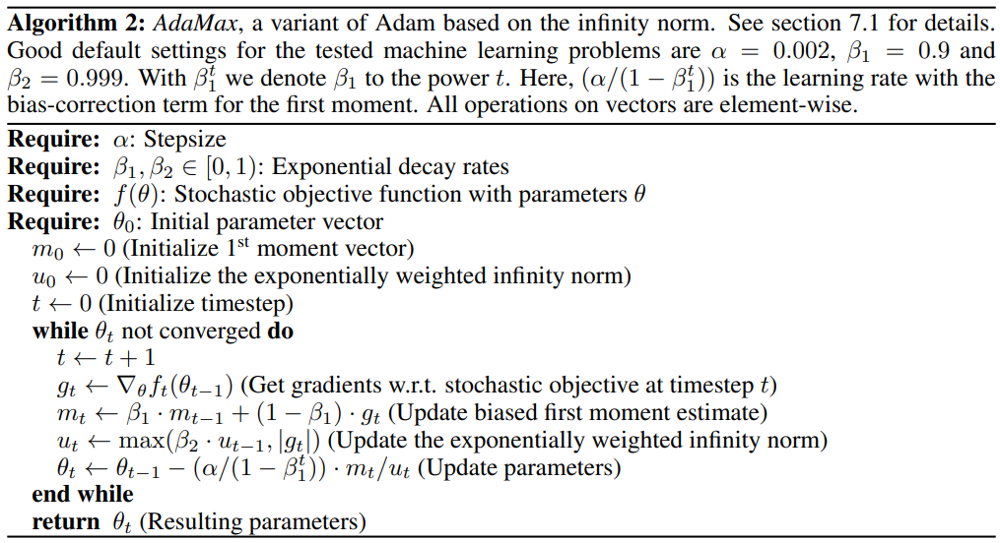
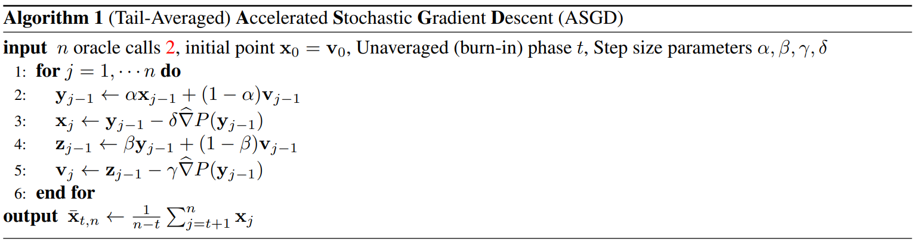
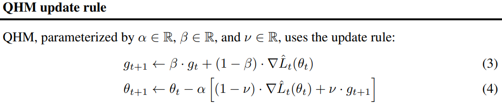

Optimizer Collection
==========================

Official PyTorch Optimizers
-------------------------------

``Adadelta``
~~~~~~~~~~~~

:Description: Adadelta is a robust learning rate method that can be applied in a variety of situations. This method has trivial computational overhead compared to SGD while providing a per-dimension learning rate, and shows promising result on MNIST and a large scale Speech recognition dataset.
:Source: `An Adaptive Learning Rate Method <https://arxiv.org/abs/1212.5701>`__.
:Pseudo-Code:

``Adagrad``
~~~~~~~~~~~~

:Description: AdaGrad is a family of sub-gradient algorithms for stochastic optimization. The algorithms belonging to that family are similar to second-order stochastic gradient descend with an approximation for the Hessian of the optimized function. AdaGrad's name comes from Adaptative Gradient. Intuitively, it adapts the learning rate for each feature depending on the estimated geometry of the problem; particularly, it tends to assign higher learning rates to infrequent features, which ensures that the parameter updates rely less on frequency and more on relevance.
:Source: `Adaptive Subgradient Methods for Online Learning and Stochastic Optimization <http://jmlr.org/papers/v12/duchi11a.html>`__.
:Pseudo-Code:

``Adam``
~~~~~~~~~~~~

:Description:  Adam is a method for efficient stochastic optimization that only requires first-order gradients with little memory requirement. The method computes individual adaptive learning rates for different parameters from estimates of first and second moments of the gradients.
:Source: `Adam: A Method for Stochastic Optimization <https://arxiv.org/abs/1412.6980>`__.
:Pseudo-Code:

``AdamW``
~~~~~~~~~~~~

:Description: Adam with decoupled weight decay. This simple modification substantially improves Adam’s generalization performance, allowing it to compete with SGD with momentum on image classification datasets (on which it was previously typically outperformed by the latter).
:Source: `Decoupled Weight Decay Regularization <https://arxiv.org/abs/1711.05101>`__.
:Pseudo-Code:

``SparseAdam``
~~~~~~~~~~~~~~~~~

:Description: SparseAdam implements a masked version of the Adam algorithm suitable for sparse gradients. SparseAdam approximates the Adam algorithm by masking out the parameter and moment updates corresponding to the zero values in the gradients.
:Source: `A Method for Stochastic Optimization <https://arxiv.org/abs/1412.6980>`__.

``Adamax``
~~~~~~~~~~~~

:Description: AdamW is a variant of Adam based on the infinity norm.
:Source: `Adam: A Method for Stochastic Optimization <https://arxiv.org/abs/1412.6980>`__.
:Pseudo-Code:

``ASGD``
~~~~~~~~~~~~

:Description: Averaged Stochastic Gradient Descent, suitable for large datasets.
:Source: `Averaged Stochastic Gradient Descent <https://epubs.siam.org/doi/abs/10.1137/0330046>`__.

``SGD``
~~~~~~~~~~~~

:Description: Stochastic gradient descent (abbreviated as SGD) is an iterative method often used for machine learning, optimizing the gradient descent during each search once a random weight vector is picked.
:Source: `Stochastic Gradient Descent <http://www.cs.toronto.edu/%7Ehinton/absps/momentum.pdf>`__.
:Pseudo-Code:

``RAdam``
~~~~~~~~~~~~

:Description: RAdam is a rectified version of Adam, which which not only explicitly rectifies the variance and is theoretically sound, but also compares favorably with the heuristic warmup.
:Source: `On the Variance of the Adaptive Learning Rate and Beyond <https://arxiv.org/abs/1908.03265>`__.
:Pseudo-Code:

``Rprop``
~~~~~~~~~~~~

:Description: RProp, or we call Resilient Back Propagation, is the widely used algorithm for supervised learning with multi-layered feed-forward networks. The basic concept of the backpropagation learning algorithm is the repeated application of the chain rule to compute the influence of each weight in the network with respect to an arbitrary error.
:Source: `A Direct Adaptive Method for Faster Backpropagation Learning: The RPROP Algorithm <https://ieeexplore.ieee.org/abstract/document/298623>`__.
:Pseudo-Code:
.. figure:: ../../images/optimizers/Rprop.png
   :align: center
   :width: 450px

``RMSprop``
~~~~~~~~~~~~

:Description: RProp algorithm is not function well when we have very large datasets and need to perform mini-batch weights updates. Therefore, scientist proposal a novel algorithm, RMSProp, which can cover more scenarios than RProp.
:Source: `Generating Sequences With Recurrent Neural Networks <https://arxiv.org/pdf/1308.0850v5.pdf>`__.
:Pseudo-Code:

``NAdam``
~~~~~~~~~~~~

:Description: Much like Adam is essentially RMSprop with momentum, Nadam is Adam with Nesterov momentum. Empirically, Nadam clearly outperforms the other algorithms–including its parent algorithm Adam–in reducing training and validation loss.
:Source: `Incorporating Nesterov Momentum into Adam <https://openreview.net/forum?id=OM0jvwB8jIp57ZJjtNEZ>`__.
:Pseudo-Code:

``LBFGS``
~~~~~~~~~~~~

:Description: LBFGS is an optimizer that implements the Limited-memory Broyden-Fletcher-Goldfarb-Shanno (LBFGS) algorithm, which is particularly useful for dealing with problems where the number of parameters is relatively low compared to the number of data points.
:Source: `minFunc Mark Schmidt (2005) <https://www.cs.ubc.ca/~schmidtm/Software/minFunc.html>`__.
:Pseudo-Code:

Custom Optimizers
-------------------------------

``A2GradExp``
~~~~~~~~~~~~

:Description: Adaptive ASGD with exponential moving average.
:Source: `Optimal Adaptive and Accelerated Stochastic Gradient Descent <https://arxiv.org/abs/1810.00553>`__.
:Pseudo-Code:

``A2GradInc``
~~~~~~~~~~~~

:Description: Adaptive ASGD with incremental moving average (quadratic weight).
:Source: `Optimal Adaptive and Accelerated Stochastic Gradient Descent <https://arxiv.org/abs/1810.00553>`__.
:Pseudo-Code:

``A2GradUni``
~~~~~~~~~~~~

:Description: Adaptive ASGD with uniform moving average.
:Source: `Optimal Adaptive and Accelerated Stochastic Gradient Descent <https://arxiv.org/abs/1810.00553>`__.
:Pseudo-Code:

``AccSGD``
~~~~~~~~~~~~

:Description: An an accelerated stochastic gradient method, which presents the first improvement in achieving minimax rates faster than veraged SGD for the stochastic approximation problem of least squares regression.
:Source: `On the insufficiency of existing momentum schemes for Stochastic Optimization <https://arxiv.org/abs/1704.08227>`__.
:Pseudo-Code:

``AdaBelief``
~~~~~~~~~~~~~~~

:Description: AdaBelief is the first optimizer to achieve three goals simultaneously: fast convergence as in adaptive methods, good generalization as in SGD, and training stability in complex settings such as GANs.
:Source: `AdaBelief Optimizer, adapting stepsizes by the belief in observed gradients <https://arxiv.org/abs/2010.07468>`__.
:Pseudo-Code:

``AdaBound``
~~~~~~~~~~~~

:Description: Motivated by the strong generalization ability of SGD, AdaBound is an optimizer that combines the advantages of Adam and SGD with dynamically bounded learning rates. It shows great efficacy on several standard benchmarks while maintaining advantageous properties of adaptive methods such as rapid initial progress and hyper-parameter insensitivity.
:Source: `Adaptive Gradient Methods with Dynamic Bound of Learning Rate <https://arxiv.org/abs/1902.09843>`__.
:Pseudo-Code:

``AdaMod``
~~~~~~~~~~~~

:Description: AdaMod is designed to address the non-convergence issue often associated with the Adam optimizer. By imposing adaptive upper bounds on individual learning rates, AdaMod ensures that they do not exceed levels that are historically supported by the data, which contributes to enhanced performance. This approach has been validated through robust empirical testing across a variety of deep learning applications, particularly showing significant effectiveness on intricate network architectures such as DenseNet and Transformer.
:Source: `Adaptive and Momental Bounds for Adaptive Learning Rate Methods <https://arxiv.org/abs/1910.12249>`__.
:Pseudo-Code:

``Adafactor``
~~~~~~~~~~~~~~~~~

:Description: Adafactor is a highly efficient optimization algorithm designed to address the memory constraints often encountered in training large neural networks.  It achieves comparable performance to Adam on popular tasks such as machine translation while requiring a sublinear amount of extra space for accumulators. This makes it possible to train significantly larger models on hardware with memory limitations.
:Source: `Adafactor: Adaptive Learning Rates with Sublinear Memory Cost <https://arxiv.org/abs/1804.04235>`__.
:Pseudo-Code:
.. figure:: ../../images/optimizers/Adafactor.png
   :align: center
   :width: 450px

``Adahessian``
~~~~~~~~~~~~~~~~~

:Description: AdaHessian incorporates an approximate Hessian diagonal, with spatial averaging and momentum to precondition the gradient vector.  This automatically rescales the gradient vector resulting in better descent directions.  One of the key novelties in AdaHessian is the incorporation spatial averaging for Hessian diagonal along with an exponential moving average in time.    These enable us to smooth noisy local Hessian information which could be highly misleading.
:Source: `ADAHESSIAN: An Adaptive Second Order Optimizer for Machine Learning <https://arxiv.org/abs/2006.00719>`__.
:Pseudo-Code:

``AdamP``
~~~~~~~~~~~~

:Description: AdamP addresses the issue of excessive growth in scale-invariant weight norms, a phenomenon that can lead to sub-optimal performance.  This issue is particularly prevalent when using momentum-based optimizers like SGD and Adam, which are widely employed for training a majority of deep learning models.  Networks that incorporate normalization layers, such as ResNet, often exhibit a large proportion of scale-invariant weights.
:Source: `Slowing Down the Weight Norm Increase in Momentum-based Optimizers <https://arxiv.org/abs/2006.08217>`__.
:Pseudo-Code:
.. figure:: ../../images/optimizers/AdamP.png
   :align: center
   :width: 450px

``AggMo``
~~~~~~~~~~~~

:Description: AggMo is a simple extension to classical momentum which is easy to implement and has negligible computational overhead on modern deep learning tasks. Empirically, AggMo is able to remain stable even with large damping coefficients and enjoys faster convergence rates as a consequence of this.
:Source: `Aggregated Momentum: Stability Through Passive Damping <https://arxiv.org/abs/1804.00325>`__.
:Pseudo-Code:

``Apollo``
~~~~~~~~~~~~

:Description: Apollo is a simple and computationally efficient quasi-Newton algorithm for nonconvex stochastic optimization. This method is aimed towards large-scale optimization problems in the sense of large datasets and/or high-dimensional parameter spaces such as machine learning with deep neural networks.
:Source: `Apollo: An Adaptive Parameter-wise Diagonal Quasi-Newton Method for Nonconvex Stochastic Optimization <https://arxiv.org/abs/2009.13586>`__.
:Pseudo-Code:

``DiffGrad``
~~~~~~~~~~~~

:Description: DiffGrad incorporates the difference of gradients of current and immediate past iteration (i.e., short term gradient change information) with Adam optimization techniques to control the learning rate based on the optimization stage.
:Source: `DiffGrad: An Optimization Method for Convolutional Neural Networks <https://arxiv.org/abs/1909.11015>`__.
:Pseudo-Code:

``LARS``
~~~~~~~~~~~~

:Description: LARS, an optimizer that tailors the learning rate for each layer, is instrumental in scaling up the training of convolutional networks with large batch sizes.  It overcomes the divergence issues associated with traditional large learning rate approaches, especially during the initial training phase.  LARS has been effectively utilized to scale the training of AlexNet and ResNet-50 to batch sizes of 32K without loss of accuracy.
:Source: `Large batch training of Convolutional Networks <https://arxiv.org/pdf/1708.03888.pdf>`__.
:Pseudo-Code:

``Lamb``
~~~~~~~~~~~~

:Description: LAMB supports adaptive elementwise updating and layerwise learning rates. LAMB is a general purpose optimizer that works for both small and large batches. LAMB is also the first large batch adaptive solver that can achieve state-of-the-art accuracy on ImageNet training with RESNET-50.
:Source: `Large Batch Optimization for Deep Learning: Training BERT in 76 minutes <https://arxiv.org/abs/1904.00962>`__.
:Pseudo-Code:

``MADGRAD``
~~~~~~~~~~~~

:Description: MADGRAD is a novel optimization method in the family of AdaGrad adaptive gradient methods. MADGRAD shows excellent performance on deep learning optimization problems from multiple fields, including classification and image-to-image tasks in vision, and recurrent and bidirectionally-masked models in natural language processing.
:Source: `Adaptivity without Compromise: A Momentumized, Adaptive, Dual Averaged Gradient Method for Stochastic Optimization <https://arxiv.org/abs/2101.11075>`__.
:Pseudo-Code:

``NovoGrad``
~~~~~~~~~~~~

:Description: NovoGrad is an adaptive SGD method with gradients normalized by the layer-wise second moment and with decoupled weight decay. Empirically, NovoGrad performs exceptionally well for large batch training, and requires only half the memory compared to Adam.
:Source: `Stochastic Gradient Methods with Layer-wise Adaptive Moments for Training of Deep Networks <https://arxiv.org/abs/1905.11286>`__.
:Pseudo-Code:

``PID``
~~~~~~~~~~~~

:Description: PID optimizer exploits the present, past and change information of gradients to update the network parameters, reducing greatly the overshoot problem of SGD-momentum and accelerating the learning process of DNNs.
:Source: `A PID Controller Approach for Stochastic Optimization of Deep Networks <http://www4.comp.polyu.edu.hk/~cslzhang/paper/CVPR18_PID.pdf>`__.
:Pseudo-Code:

``QHAdam``
~~~~~~~~~~~~

:Description: QHM and QHAdam are computationally cheap, intuitive to interpret, and simple to implement. They can serve as excellent replacements for momentum/NAG and Adam in a variety of settings. QHM recovers numerous other algorithms in an efficient and accessible manner. Parameter sweep experiments and case studies demonstrate that the QH algorithms can handily outpace their vanilla counterparts.
:Source: `Quasi-hyperbolic momentum and Adam for deep learning <https://arxiv.org/abs/1810.06801>`__.
:Pseudo-Code:

``QHM``
~~~~~~~~~~~~

:Description: QHM and QHAdam are computationally cheap, intuitive to interpret, and simple to implement. They can serve as excellent replacements for momentum/NAG and Adam in a variety of settings. QHM recovers numerous other algorithms in an efficient and accessible manner. Parameter sweep experiments and case studies demonstrate that the QH algorithms can handily outpace their vanilla counterparts.
:Source: `Quasi-hyperbolic momentum and Adam for deep learning <https://arxiv.org/abs/1810.06801>`__.
:Pseudo-Code:

``Ranger``
~~~~~~~~~~~~

:Description: Ranger is able to train models that other optimizers simply fail to train, like a Normalizer-Free Resnet50. For a given model, Ranger is usually able to both accelerate the learning and achieve a net higher validation accuracy without compromising generalization.
:Source: `Ranger optimization algorithm <https://medium.com/@lessw/new-deep-learning-optimizer-ranger-synergistic-combination-of-radam-lookahead-for-the-best-of-2dc83f79a48d>`__.
:Pseudo-Code:

``RangerQH``
~~~~~~~~~~~~

:Description: Combines Quasi Hyperbolic momentum with Hinton Lookahead.
:Source: `Quasi-hyperbolic momentum and Adam for deep learning <https://arxiv.org/abs/1810.06801>`__.

``RangerVA``
~~~~~~~~~~~~

:Description: Ranger deep learning optimizer - RAdam + Lookahead + calibrated adaptive LR combined.
:Source: `Calibrating the Adaptive Learning Rate to Improve Convergence of ADAM <https://arxiv.org/abs/1908.00700v2>`__.

``SGDP``
~~~~~~~~~~~~

:Description: SGDP addresses the issue of excessive growth in scale-invariant weight norms, a phenomenon that can lead to sub-optimal performance.  This issue is particularly prevalent when using momentum-based optimizers like SGD and Adam, which are widely employed for training a majority of deep learning models.  Networks that incorporate normalization layers, such as ResNet, often exhibit a large proportion of scale-invariant weights.
:Source: `AdamP: Slowing Down the Slowdown for Momentum Optimizers on Scale-invariant Weights <https://arxiv.org/abs/2006.08217>`__.
:Pseudo-Code:

``SGDW``
~~~~~~~~~~~~

:Description: SGD with momentum using decoupled weight decay. This simple modification explicitly decouples the optimal choice of weight decay factor from the setting of the learning rate for standard SGD.
:Source: `Decoupled Weight Decay Regularization <https://arxiv.org/abs/1711.05101>`__.
:Pseudo-Code:

``SWATS``
~~~~~~~~~~~~

:Description: SWATS is a simple strategy which Switches from Adam to SGD when a triggering condition is satisfied. The switch is designed to be automatic and one that does not introduce any more hyper-parameters.
:Source: `Improving Generalization Performance by Switching from Adam to SGD <https://arxiv.org/pdf/1712.07628.pdf>`__.
:Pseudo-Code:

``Shampoo``
~~~~~~~~~~~~

:Description: Shampoo is a new structure-aware preconditioning algorithm for stochastic optimization over tensor spaces. Shampoo maintains a set of preconditioning matrices, each of which operates on a single dimension, contracting over the remaining dimensions.
:Source: `Shampoo: Preconditioned Stochastic Tensor Optimization <https://arxiv.org/abs/1802.09568>`__.
:Pseudo-Code:

``Yogi``
~~~~~~~~~~~~

:Description: Yogi is developed for achieving adaptivity in SGD. Yogi controls the increase in effective learning rate, leading to even better performance with similar theoretical guarantees on convergence.
:Source: `Adaptive methods for Nonconvex Optimization <https://papers.nips.cc/paper/8186-adaptive-methods-for-nonconvex-optimization>`__.
:Pseudo-Code:

