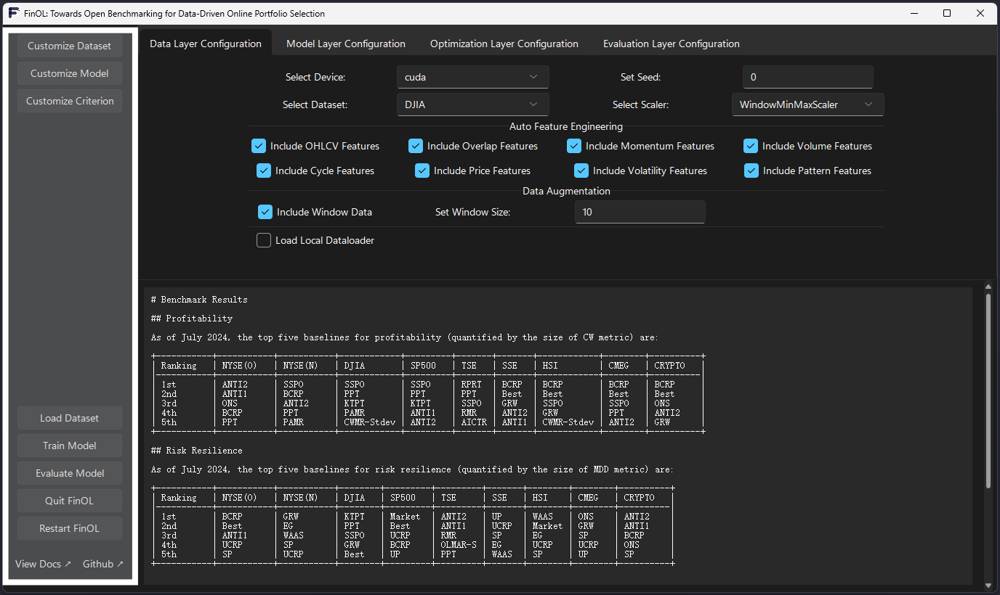
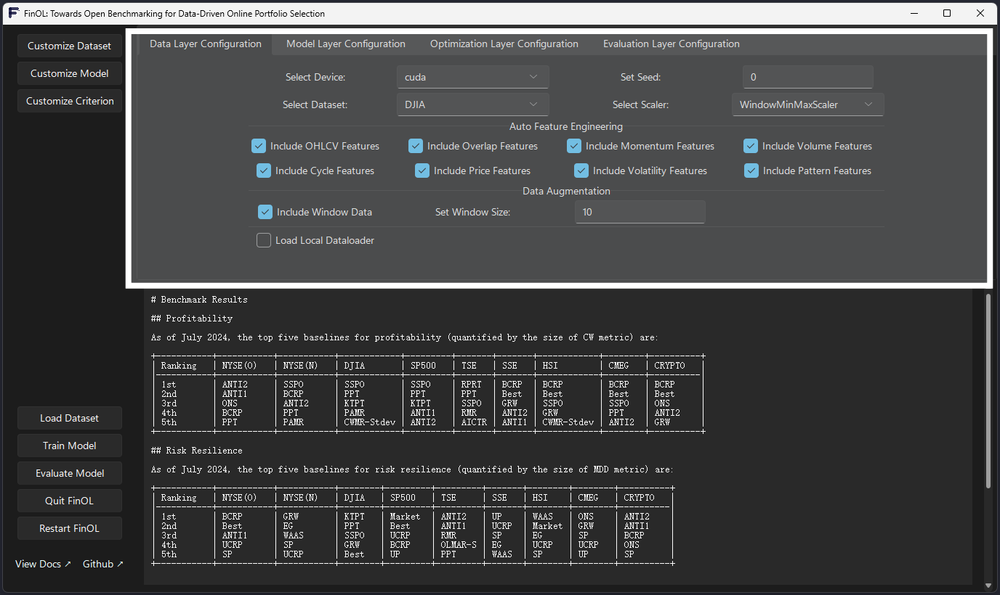
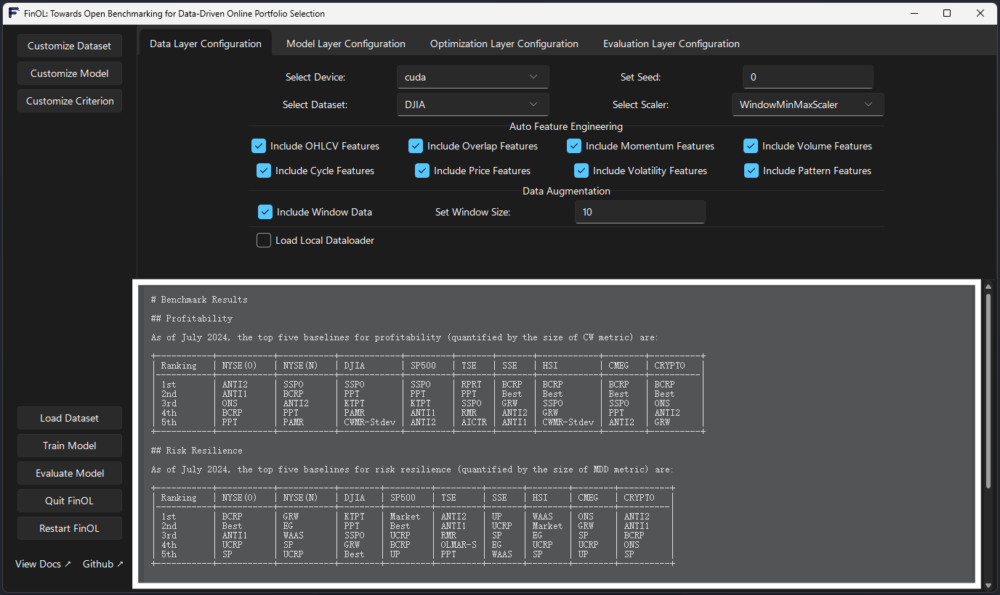

Quickstart
==========

This guide will help you get started with ``FinOL``.

Command Line Usage
------------------

To lower the barriers for the research community,
``FinOL`` provides a complete data-training-testing suite
with just three lines of command.

.. code:: python3

    >>> from finol.data_layer.dataset_loader import DatasetLoader
    >>> from finol.optimization_layer.model_trainer import ModelTrainer
    >>> from finol.evaluation_layer.model_evaluator import ModelEvaluator

    >>> load_dataset_output = DatasetLoader().load_dataset()
    >>> train_model_output = ModelTrainer(load_dataset_output).train_model()
    >>> evaluate_model_output = ModelEvaluator(load_dataset_output, train_model_output).evaluate_model()

Before running the above commands, users can first
configure some parameters through the config file
to customize the usage according to their needs.
For example, setting the device, selecting a dataset,
adjusting the data pre-processing parameters, and choosing
a model, etc. The specific configuration method is as follows:

.. code:: python3

    >>> from finol.utils import load_config, update_config

    >>> config = load_config()
    >>> config["DEVICE"] = "auto"
    >>> config["DATASET_NAME"] = "DJIA"
    >>> config["DATA_AUGMENTATION_CONFIG"]["WINDOW_DATA"]["WINDOW_SIZE"] = 15
    >>> config["SCALER"] = "WindowMinMaxScaler"
    >>> config["MODEL_NAME"] = "DNN"
    >>> config["TUNE_PARAMETERS"] = True  # False
    >>> update_config(config)
    >>> config

|Open in Colab|    |Open in kaggle|    |Open in Azure|

GUI Usage
---------

In addition to the command line usage, ``FinOL`` also providesp a GUI
interface that allows users to achieve the same functionality
as the command line usage in a more intuitive and visual way.
The GUI interace includes options for dataset selection,
model configuration, training, and evaluation,
allowing users to easily customize the parameters and run the
exeriments without the need to write any code.

To access the ``FinOL`` GUI, you can run the following command in your terminal:

.. code-block:: bash

   $ python -m finol.APP.FinOLAPP

   Overall Framework of FinOL GUI

The GUI is divided into three main sections:

1. Sidebar

Located on the left, it contains various buttons for actions such as customizing datasets, models,
and criteria. It also includes options to load datasets, train models, evaluate models, quit the application,
and restart it.

   The Sidebar of FinOL GUI

2. Tab View

Positioned at the top right, this section allows users to switch between different configuration layers,
such as Data Layer, Model Layer, Optimization Layer, and Evaluation Layer.
Each tab provides specific settings and options for configuring the respective layer,
including device and dataset selection, feature inclusion, and data augmentation parameters.

   The Tab View of FinOL GUI

3. Output Display

Found at the bottom right, this area is dedicated to displaying internal outputs,
such as benchmark results.

   The Output Display of FinOL GUI

By using the ``FinOL`` GUI, users can quickly and easily configure, train, and
evaluate financial models without the need to write complex code.
The intuitive interface make the process more accessible and user-friendly for researchers.

Unique Features of the FinOL GUI
---------------------------------

In addition to the above functionalities,
the ``FinOL`` GUI interface also features some unique interactive capabilities that enhance the user experience.

1. Dynamic Window Layout

The ``FinOL`` GUI employs a dynamic layout design, where the corresponding configuration panels automatically change
based on the user's selections and settings.

   The Dynamic Window Layout of FinOL GUI

For example, when the user selects different model architectures in the "Model Layer" panel,
the configuration options will dynamically update to display the specific parameters for that model.
This dynamic layout allows users to focus on configuring the model without the need to switch between
different tabs or windows.

2. Real-time Configuration File Update

The ``FinOL`` GUI not only provides a visual interface for configuration settings,
but also automatically updates the config. json file in the root directory with the user's changes.

Whenever the user modifies any parameter in the GUI,
the configuration file is instantly updated to reflect the latest settings.
This real-time read-write functionality of the configuration file provides a seamless workflow,
allowing users to switch between the GUI and the command-line interface without any inconsistencies.

   Real-time Configuration File Update of FinOL GUI

Regardless of the approach, users can always maintain a consistent running environment and parameter settings,
significantly enhancing the flexibility and maintainability of the system.

.. |Open in Colab| image:: https://img.shields.io/badge/Open%20in-Colab-FF9000?style=flat&logo=googlecolab
  :target: https://colab.research.google.com/github/jiahaoli57/FinOL/blob/main/finol/tutorials/tutorial_quickstart.ipynb

.. |Open in kaggle| image:: https://img.shields.io/badge/Open%20in-Kaggle-blue?style=flat&logo=kaggle
  :target: https://www.kaggle.com/code/jiahaoli57/tutorial-quickstart

.. |Open in Azure| image:: https://img.shields.io/badge/Open%20in-Azure-0053BF?style=flat&logo=Azure
  :target: https://ml.azure.com/fileexplorerAzNB?wsid=/subscriptions/ab6c0911-44dd-4b20-a137-e120cee05b9b/resourceGroups/jli857-c-rg/providers/Microsoft.MachineLearningServices/workspaces/FinOL&tid=2109ce83-7de4-4471-91ff-2053f90a1fd9&activeFilePath=Users/jli857-c/tutorial_quickstart.ipynb
