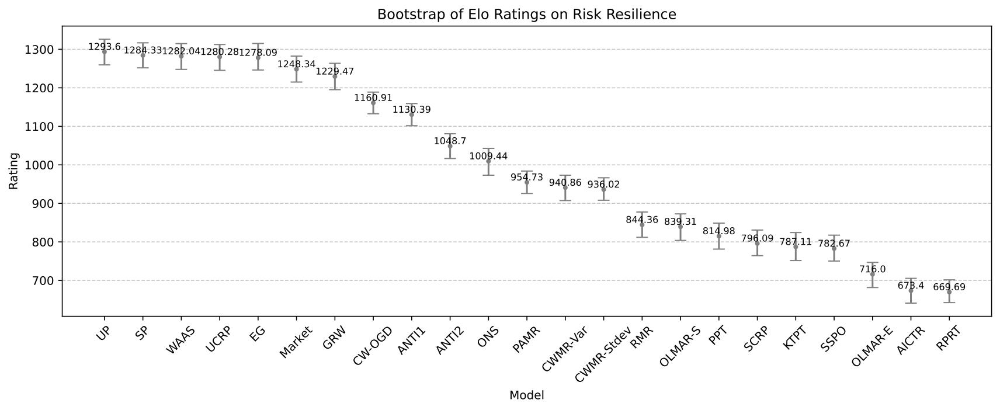
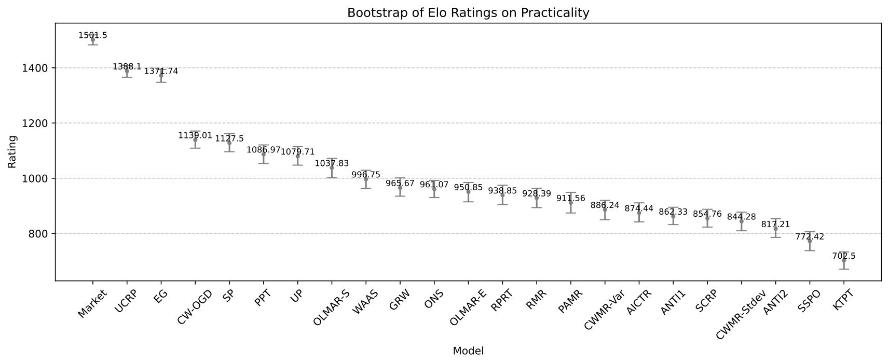

.. _supported_elo:

Elo Ranking System
==================

Elo Ranking Results on Profitability
------------------------------------

.. figure:: ../../images/exps/Bootstrap_of_Elo_Ratings_on_Profitability.jpg
   :align: center
   :width: 700px

   Bootstrap Estimates of Elo Ratings on Profitability

.. table:: Elo Ranking Results on Profitability
   :class: ghost
   :widths: auto

   +-------------------+-------------+-------------+
   | Model/Paper       | Elo Rating  | Rank        |
   +===================+=============+=============+
   | SSPO              | 1275        | 1           |
   +-------------------+-------------+-------------+
   | ANTI\ :sup:`2`\   | 1251        | 2           |
   +-------------------+-------------+-------------+
   | PPT               | 1208        | 3           |
   +-------------------+-------------+-------------+
   | ANTI\ :sup:`1`\   | 1151        | 4           |
   +-------------------+-------------+-------------+
   | GRW               | 1043        | 5           |
   +-------------------+-------------+-------------+
   | CWMR-Stdev        | 1037        | 6           |
   +-------------------+-------------+-------------+
   | CWMR-Var          | 1030        | 7           |
   +-------------------+-------------+-------------+
   | SP                | 1028        | 8           |
   +-------------------+-------------+-------------+
   | UCRP              | 1018        | 9           |
   +-------------------+-------------+-------------+
   | ONS               | 1015        | 10          |
   +-------------------+-------------+-------------+
   | UP                | 1007        | 11          |
   +-------------------+-------------+-------------+
   | RMR               | 994         | 12          |
   +-------------------+-------------+-------------+
   | OLMAR-S           | 993         | 13          |
   +-------------------+-------------+-------------+
   | PAMR              | 976         | 14          |
   +-------------------+-------------+-------------+
   | RPRT              | 965         | 15          |
   +-------------------+-------------+-------------+
   | CW-OGD            | 951         | 16          |
   +-------------------+-------------+-------------+
   | EG                | 941         | 17          |
   +-------------------+-------------+-------------+
   | KTPT              | 937         | 18          |
   +-------------------+-------------+-------------+
   | WAAS              | 930         | 19          |
   +-------------------+-------------+-------------+
   | AICTR             | 925         | 20          |
   +-------------------+-------------+-------------+
   | Market            | 842         | 21          |
   +-------------------+-------------+-------------+
   | OLMAR-E           | 789         | 22          |
   +-------------------+-------------+-------------+
   | SCRP              | 693         | 23          |
   +-------------------+-------------+-------------+

Elo Ranking Results on Risk Resilience
--------------------------------------

   Bootstrap Estimates of Elo Ratings on Risk Resilience

.. table:: Elo Ranking Results on Risk Resilience
   :class: ghost
   :widths: auto

   +-------------------+-------------+-------------+
   | Model/Paper       | Elo Rating  | Rank        |
   +===================+=============+=============+
   | UP                | 1294        | 1           |
   +-------------------+-------------+-------------+
   | SP                | 1284        | 2           |
   +-------------------+-------------+-------------+
   | WAAS              | 1282        | 3           |
   +-------------------+-------------+-------------+
   | UCRP              | 1280        | 4           |
   +-------------------+-------------+-------------+
   | EG                | 1278        | 5           |
   +-------------------+-------------+-------------+
   | Market            | 1248        | 6           |
   +-------------------+-------------+-------------+
   | GRW               | 1229        | 7           |
   +-------------------+-------------+-------------+
   | CW-OGD            | 1161        | 8           |
   +-------------------+-------------+-------------+
   | ANTI\ :sup:`1`\   | 1130        | 9           |
   +-------------------+-------------+-------------+
   | ANTI\ :sup:`2`\   | 1049        | 10          |
   +-------------------+-------------+-------------+
   | ONS               | 1009        | 11          |
   +-------------------+-------------+-------------+
   | PAMR              | 955         | 12          |
   +-------------------+-------------+-------------+
   | CWMR-Var          | 941         | 13          |
   +-------------------+-------------+-------------+
   | CWMR-Stdev        | 936         | 14          |
   +-------------------+-------------+-------------+
   | RMR               | 844         | 15          |
   +-------------------+-------------+-------------+
   | OLMAR-S           | 839         | 16          |
   +-------------------+-------------+-------------+
   | PPT               | 815         | 17          |
   +-------------------+-------------+-------------+
   | SCRP              | 796         | 18          |
   +-------------------+-------------+-------------+
   | KTPT              | 787         | 19          |
   +-------------------+-------------+-------------+
   | SSPO              | 783         | 20          |
   +-------------------+-------------+-------------+
   | OLMAR-E           | 716         | 21          |
   +-------------------+-------------+-------------+
   | AICTR             | 673         | 22          |
   +-------------------+-------------+-------------+
   | RPRT              | 670         | 23          |
   +-------------------+-------------+-------------+

Elo Ranking Results on Practicality
-----------------------------------

   Bootstrap Estimates of Elo Ratings on Profitability

.. table:: Elo Ranking Results on Practicality
   :class: ghost
   :widths: auto

   +-------------------+-------------+-------------+
   | Model/Paper       | Elo Rating  | Rank        |
   +===================+=============+=============+
   | Market            | 1502        | 1           |
   +-------------------+-------------+-------------+
   | UCRP              | 1388        | 2           |
   +-------------------+-------------+-------------+
   | EG                | 1372        | 3           |
   +-------------------+-------------+-------------+
   | CW-OGD            | 1139        | 4           |
   +-------------------+-------------+-------------+
   | SP                | 1128        | 5           |
   +-------------------+-------------+-------------+
   | PPT               | 1087        | 6           |
   +-------------------+-------------+-------------+
   | UP                | 1080        | 7           |
   +-------------------+-------------+-------------+
   | OLMAR-S           | 1038        | 8           |
   +-------------------+-------------+-------------+
   | WAAS              | 997         | 9           |
   +-------------------+-------------+-------------+
   | GRW               | 966         | 10          |
   +-------------------+-------------+-------------+
   | ONS               | 961         | 11          |
   +-------------------+-------------+-------------+
   | OLMAR-E           | 951         | 12          |
   +-------------------+-------------+-------------+
   | RPRT              | 939         | 13          |
   +-------------------+-------------+-------------+
   | RMR               | 928         | 14          |
   +-------------------+-------------+-------------+
   | PAMR              | 912         | 15          |
   +-------------------+-------------+-------------+
   | CWMR-Var          | 886         | 16          |
   +-------------------+-------------+-------------+
   | AICTR             | 874         | 17          |
   +-------------------+-------------+-------------+
   | ANTI\ :sup:`1`\   | 862         | 18          |
   +-------------------+-------------+-------------+
   | SCRP              | 855         | 19          |
   +-------------------+-------------+-------------+
   | CWMR-Stdev        | 844         | 20          |
   +-------------------+-------------+-------------+
   | ANTI\ :sup:`2`\   | 817         | 21          |
   +-------------------+-------------+-------------+
   | SSPO              | 772         | 22          |
   +-------------------+-------------+-------------+
   | KTPT              | 703         | 23          |
   +-------------------+-------------+-------------+