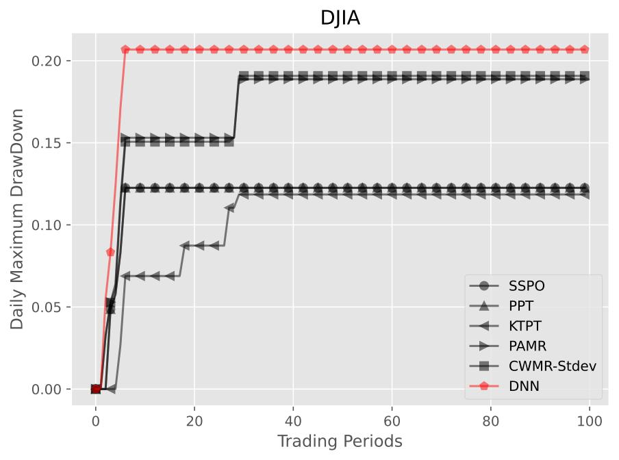

.. _supported_visualization:

Multiple Visual Tools
====================================

The ``FinOL`` provides a suite of visualization tools to facilitate
a comprehensive evaluation of data-driven OLPS research. Here are some
examples:

1. Loss Visualization

Loss visualization is crucial for understanding model performance during training and validation.
It helps identify overfitting and underfitting issues, allowing for better hyper-parameters tuning.

   Training and Validation Loss Trends

2. Hyper-parameters Tuning Process Visualization

Visualizing the hyper-parameters tuning process can provide insights into how different parameters affect model performance.
This helps in selecting the most effective parameters for improved results.

   Hyper-parameters Tuning Contour Plot

   Empirical Distribution Function of Hyper-parameters

.. figure:: ../../images/exps/DJIA_DNN_plot_optimization_history.jpg
   :align: center
   :width: 350px

   Optimization History of Hyper-parameters Search

   Parallel Coordinate Plot of Hyper-parameters Importance

   Hyper-parameters Importance Analysis

   Ranking of Hyper-parameters Based on Performance

   Slicing Through Hyper-parameters Space

3. Daily Cumulative Wealth (DCW) Visualization

As profitability is the ultimate goal of trading, the DCW trajectories directly showcase the
cumulative returns of methods over time. Higher and more stable DCW curves indicate stronger capability
to steadily accumulate profits in the long run.

   Example Results of Daily Cumulative Wealth on DJIA

4. Daily Maximum DrawDown (DMDD) Visualization

The DMDD visualization illustrates the largest peak-to-trough decline in portfolio value over a specified period.
This metric is essential for assessing the risk associated with OLPS methods, as it highlights the potential for
significant losses. By analyzing DMDD trajectories, researchers can better understand the downside risks of different
OLPS methods, enabling them to make more informed decisions regarding risk management and capital allocation.

   Example Results of Daily Maximum DrawDown on DJIA

5. Transaction Cost-Adjusted Cumulative Wealth (TCW) Visualization

The TCW metric evaluates profitability under realistic transaction costs.
It penalizes portfolio rebalancing by deducting proportional costs based on the turnover amount each period.
Lower TCW indicates greater performance deterioration from increased rebalancing amounts. By accounting for real-world frictions,
TCW provides a practical assessment complementing the raw profitability metrics of data-driven OLPS methods.

   Example Results of Transaction Cost-Adjusted Cumulative Wealth on DJIA

6. Comprehensive Radar Chart

The comprehensive radar chart provides a visual representation of multiple performance metrics for OLPS methods.
By displaying these metrics in a single view, it allows for easy comparison of strengths and weaknesses across different methods.
This visualization helps researchers quickly assess which methods excel in specific dimensions.

   Example Results of Radar Chart on DJIA