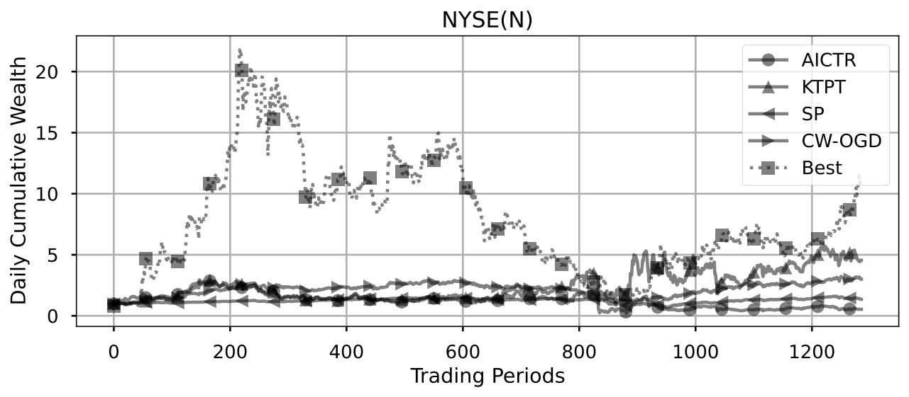
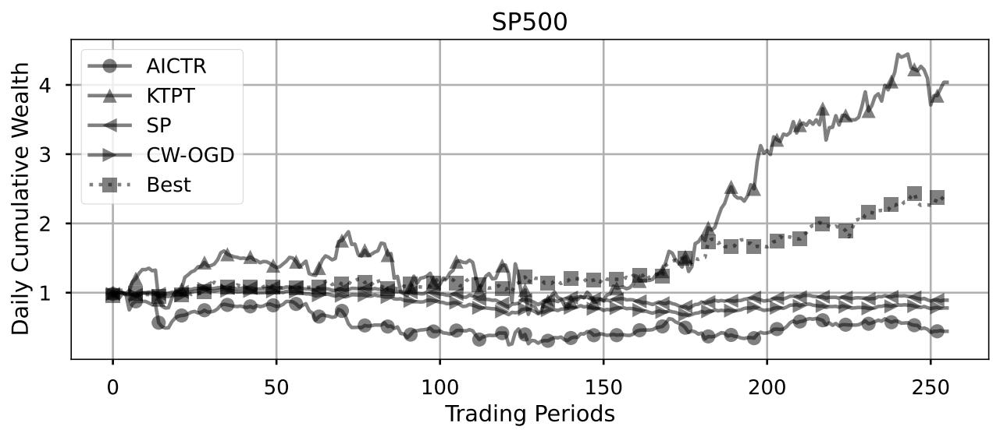

.. _supported_visualization:

Multiple visual tools
====================================

The ``FinOL`` provides a suite of visualization tools to facilitate
a comprehensive evaluation of data-driven OLPS research. Here are some
examples:

1. Loss Visualization

1. Daily Cumulative Wealth Visualization

As profitability is the ultimate goal of trading, the daily cumulative wealth trajectories directly showcase the
cumulative returns of methods over time. Higher and more stable cumulative wealth curves indicate stronger capability
to steadily accumulate profits in the long run.

.. table:: Representative Benchmark Results of Daily Cumulative Wealth on NYSE(O)
   :class: ghost
   :align: center

   +---------------------------------------+---------------------------------------+
   | |DCW_1|                               | |DCW_2|                               |
   | Follow-the-winner & Follow-the-loser  | Pattern-matching & Meta-learning      |
   +---------------------------------------+---------------------------------------+

.. table:: Representative Benchmark Results of Daily Cumulative Wealth on NYSE(N)
   :class: ghost
   :align: center

   +---------------------------------------+---------------------------------------+
   | |DCW_3|                               | |DCW_4|                               |
   | Follow-the-winner & Follow-the-loser  | Pattern-matching & Meta-learning      |
   +---------------------------------------+---------------------------------------+

.. table:: Representative Benchmark Results of Daily Cumulative Wealth on DJIA
   :class: ghost
   :align: center

   +---------------------------------------+---------------------------------------+
   | |DCW_5|                               | |DCW_6|                               |
   | Follow-the-winner & Follow-the-loser  | Pattern-matching & Meta-learning      |
   +---------------------------------------+---------------------------------------+

.. table:: Representative Benchmark Results of Daily Cumulative Wealth on SP500
   :class: ghost
   :align: center

   +---------------------------------------+---------------------------------------+
   | |DCW_7|                               | |DCW_8|                               |
   | Follow-the-winner & Follow-the-loser  | Pattern-matching & Meta-learning      |
   +---------------------------------------+---------------------------------------+

.. table:: Representative Benchmark Results of Daily Cumulative Wealth on TSE
   :class: ghost
   :align: center

   +---------------------------------------+---------------------------------------+
   | |DCW_9|                               | |DCW_10|                              |
   | Follow-the-winner & Follow-the-loser  | Pattern-matching & Meta-learning      |
   +---------------------------------------+---------------------------------------+

.. table:: Representative Benchmark Results of Daily Cumulative Wealth on SSE
   :class: ghost
   :align: center

   +---------------------------------------+---------------------------------------+
   | |DCW_11|                              | |DCW_12|                              |
   | Follow-the-winner & Follow-the-loser  | Pattern-matching & Meta-learning      |
   +---------------------------------------+---------------------------------------+

.. table:: Representative Benchmark Results of Daily Cumulative Wealth on HSI
   :class: ghost
   :align: center

   +---------------------------------------+---------------------------------------+
   | |DCW_13|                              | |DCW_14|                              |
   | Follow-the-winner & Follow-the-loser  | Pattern-matching & Meta-learning      |
   +---------------------------------------+---------------------------------------+

.. table:: Representative Benchmark Results of Daily Cumulative Wealth on CMEG
   :class: ghost
   :align: center

   +---------------------------------------+---------------------------------------+
   | |DCW_15|                              | |DCW_16|                              |
   | Follow-the-winner & Follow-the-loser  | Pattern-matching & Meta-learning      |
   +---------------------------------------+---------------------------------------+

.. table:: Representative Benchmark Results of Daily Cumulative Wealth on CRYPTO
   :class: ghost
   :align: center

   +---------------------------------------+---------------------------------------+
   | |DCW_17|                              | |DCW_18|                              |
   | Follow-the-winner & Follow-the-loser  | Pattern-matching & Meta-learning      |
   +---------------------------------------+---------------------------------------+

2. Daily DrawDown Comparison Plots

.. |DDD_4| image:: ../../images/experiments/NYSE(N)_PLOT_ALL_2_DDD.jpg

.. |DDD_17| image:: ../../images/experiments/CRYPTO_PLOT_ALL_1_DDD.jpg

.. table:: Representative Benchmark Results of Daily DrawDown on NYSE(O)
   :class: ghost
   :align: center

   +---------------------------------------+---------------------------------------+
   | |DDD_1|                               | |DDD_2|                               |
   | Follow-the-winner & Follow-the-loser  | Pattern-matching & Meta-learning      |
   +---------------------------------------+---------------------------------------+

.. table:: Representative Benchmark Results of Daily DrawDown on NYSE(N)
   :class: ghost
   :align: center

   +---------------------------------------+---------------------------------------+
   | |DDD_3|                               | |DDD_4|                               |
   | Follow-the-winner & Follow-the-loser  | Pattern-matching & Meta-learning      |
   +---------------------------------------+---------------------------------------+

.. table:: Representative Benchmark Results of Daily DrawDown on DJIA
   :class: ghost
   :align: center

   +---------------------------------------+---------------------------------------+
   | |DDD_5|                               | |DDD_6|                               |
   | Follow-the-winner & Follow-the-loser  | Pattern-matching & Meta-learning      |
   +---------------------------------------+---------------------------------------+

.. table:: Representative Benchmark Results of Daily DrawDown on SP500
   :class: ghost
   :align: center

   +---------------------------------------+---------------------------------------+
   | |DDD_7|                               | |DDD_8|                               |
   | Follow-the-winner & Follow-the-loser  | Pattern-matching & Meta-learning      |
   +---------------------------------------+---------------------------------------+

.. table:: Representative Benchmark Results of Daily DrawDown on TSE
   :class: ghost
   :align: center

   +---------------------------------------+---------------------------------------+
   | |DDD_9|                               | |DDD_10|                              |
   | Follow-the-winner & Follow-the-loser  | Pattern-matching & Meta-learning      |
   +---------------------------------------+---------------------------------------+

.. table:: Representative Benchmark Results of Daily DrawDown on SSE
   :class: ghost
   :align: center

   +---------------------------------------+---------------------------------------+
   | |DDD_11|                              | |DDD_12|                              |
   | Follow-the-winner & Follow-the-loser  | Pattern-matching & Meta-learning      |
   +---------------------------------------+---------------------------------------+

.. table:: Representative Benchmark Results of Daily DrawDown on HSI
   :class: ghost
   :align: center

   +---------------------------------------+---------------------------------------+
   | |DDD_13|                              | |DDD_14|                              |
   | Follow-the-winner & Follow-the-loser  | Pattern-matching & Meta-learning      |
   +---------------------------------------+---------------------------------------+

.. table:: Representative Benchmark Results of Daily DrawDown on CMEG
   :class: ghost
   :align: center

   +---------------------------------------+---------------------------------------+
   | |DDD_15|                              | |DDD_16|                              |
   | Follow-the-winner & Follow-the-loser  | Pattern-matching & Meta-learning      |
   +---------------------------------------+---------------------------------------+

.. table:: Representative Benchmark Results of Daily DrawDown on CRYPTO
   :class: ghost
   :align: center

   +---------------------------------------+---------------------------------------+
   | |DDD_17|                              | |DDD_18|                              |
   | Follow-the-winner & Follow-the-loser  | Pattern-matching & Meta-learning      |
   +---------------------------------------+---------------------------------------+

4. Transaction Cost-Adjusted Cumulative Wealth

   .. raw:: html

      

5. Comprehensive Radar Chart

   .. raw:: html

      
